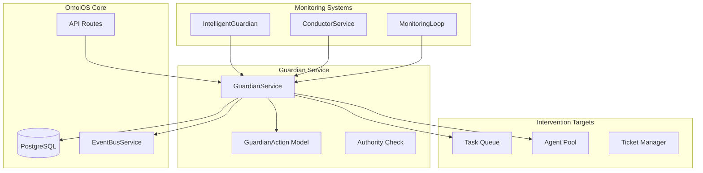
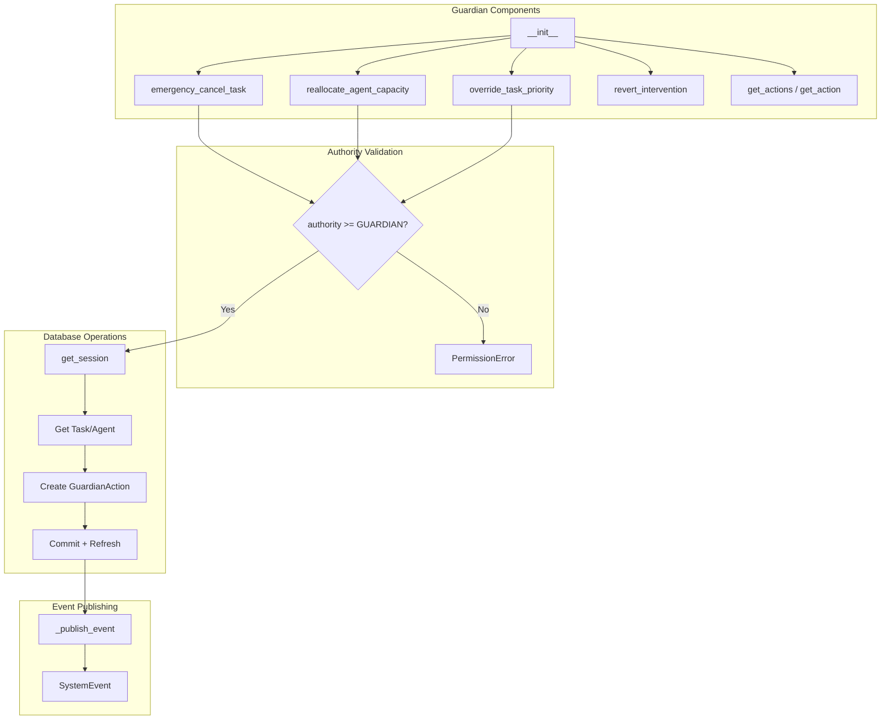
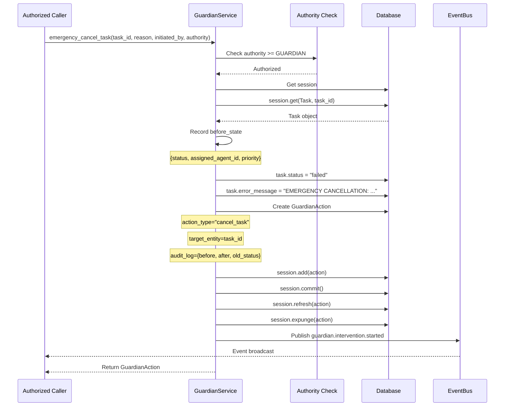
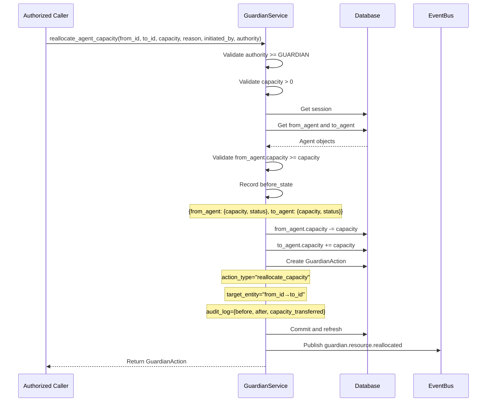
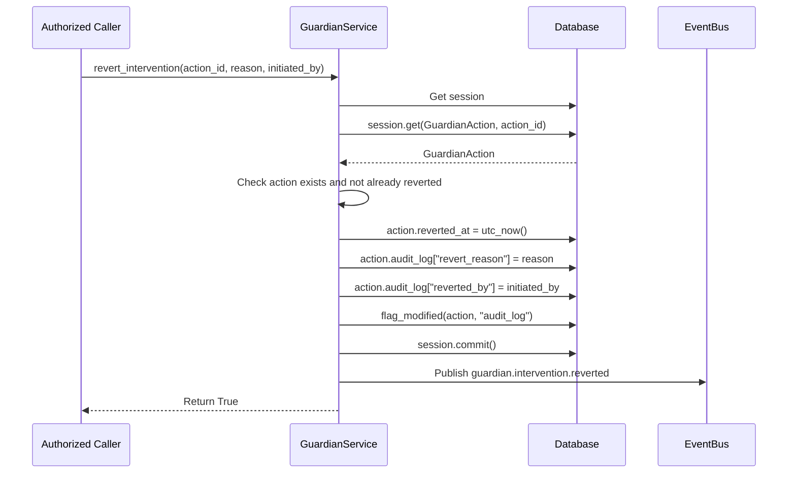

# Guardian Monitoring Service Design Document

**Date:** 2026-04-22  
**Status:** Active  
**Purpose:** Design documentation for the Guardian service providing emergency intervention and resource reallocation capabilities in OmoiOS.  
**Related Docs:** [Orchestrator Service](./orchestrator_service.md), [Discovery Service](./discovery_service.md), [Conductor Coherence](./conductor_coherence.md), [Phase Manager](./phase_manager.md)

---

## 1. Overview

The Guardian Service is OmoiOS's emergency intervention system, providing authority-based capabilities for critical failure management and resource reallocation. It operates with a hierarchical authority model that ensures only appropriately authorized agents can perform high-impact operations.

### Key Responsibilities

- **Emergency Task Cancellation**: Force-cancel running tasks in critical situations
- **Agent Capacity Reallocation**: Steal resources from low-priority work for critical failures
- **Priority Queue Override**: Boost critical tasks ahead of normal queue order
- **Audit Trail**: Complete logging of all interventions for accountability
- **Automatic Rollback**: Revert interventions after crisis resolution

### Authority Hierarchy

```
GUARDIAN (4) > MONITOR (3) > WATCHDOG (2) > WORKER (1)
```

All emergency operations require `GUARDIAN` authority (level 4) or higher.

---

## 2. Architecture

### System Context



### Component Diagram



---

## 3. Public API Surface

### Core Intervention Methods

#### `emergency_cancel_task()`

```python
def emergency_cancel_task(
    self,
    task_id: str,
    reason: str,
    initiated_by: str,
    authority: AuthorityLevel = AuthorityLevel.GUARDIAN,
) -> Optional[GuardianAction]
```

Cancel a running task in emergency situations.

**Parameters:**
- `task_id`: ID of task to cancel
- `reason`: Explanation for emergency cancellation
- `initiated_by`: Agent/user ID initiating the action
- `authority`: Authority level (must be GUARDIAN or higher)

**Returns:** GuardianAction audit record if successful, None if task not found

**Raises:** PermissionError if authority level insufficient

**Audit Log:**
```python
{
    "before": {"status": "running", "assigned_agent_id": "...", "priority": "HIGH"},
    "after": {"status": "failed", "error_message": "EMERGENCY CANCELLATION: ..."},
    "old_status": "running",
    "intervention_type": "emergency",
}
```

---

#### `reallocate_agent_capacity()`

```python
def reallocate_agent_capacity(
    self,
    from_agent_id: str,
    to_agent_id: str,
    capacity: int,
    reason: str,
    initiated_by: str,
    authority: AuthorityLevel = AuthorityLevel.GUARDIAN,
) -> Optional[GuardianAction]
```

Reallocate capacity from one agent to another.

**Use Case:** Steal resources from low-priority work to handle critical failures.

**Parameters:**
- `from_agent_id`: Source agent to take capacity from
- `to_agent_id`: Target agent to give capacity to
- `capacity`: Amount of capacity to transfer
- `reason`: Explanation for reallocation
- `initiated_by`: Agent/user ID initiating the action
- `authority`: Authority level (must be GUARDIAN or higher)

**Returns:** GuardianAction audit record if successful, None if agents not found

**Raises:**
- PermissionError: If authority level insufficient
- ValueError: If capacity invalid or insufficient

---

#### `override_task_priority()`

```python
def override_task_priority(
    self,
    task_id: str,
    new_priority: str,
    reason: str,
    initiated_by: str,
    authority: AuthorityLevel = AuthorityLevel.GUARDIAN,
) -> Optional[GuardianAction]
```

Override task priority in the queue.

**Use Case:** Boost critical tasks ahead of normal queue order.

**Parameters:**
- `task_id`: ID of task to boost
- `new_priority`: New priority level (CRITICAL, HIGH, MEDIUM, LOW)
- `reason`: Explanation for priority override
- `initiated_by`: Agent/user ID initiating the action
- `authority`: Authority level (must be GUARDIAN or higher)

**Valid Priorities:** `{"CRITICAL", "HIGH", "MEDIUM", "LOW"}`

---

### Rollback and Audit Methods

#### `revert_intervention()`

```python
def revert_intervention(
    self,
    action_id: str,
    reason: str,
    initiated_by: str,
) -> bool
```

Revert a previous guardian intervention.

**Parameters:**
- `action_id`: ID of the GuardianAction to revert
- `reason`: Explanation for reversion
- `initiated_by`: Agent/user ID initiating the reversion

**Returns:** True if reverted successfully, False if action not found or already reverted

**Behavior:**
- Marks action as reverted with timestamp
- Records revert reason and initiator in audit_log
- Publishes `guardian.intervention.reverted` event

---

#### `get_actions()`

```python
def get_actions(
    self,
    limit: int = 100,
    action_type: Optional[str] = None,
    target_entity: Optional[str] = None,
) -> List[GuardianAction]
```

Get guardian action audit trail.

**Parameters:**
- `limit`: Maximum number of actions to return (default: 100)
- `action_type`: Optional filter by action type (e.g., "cancel_task", "reallocate_capacity")
- `target_entity`: Optional filter by target entity (task_id, agent_id, etc.)

**Returns:** List of GuardianAction records, most recent first

---

#### `get_action()`

```python
def get_action(self, action_id: str) -> Optional[GuardianAction]
```

Get a specific guardian action by ID.

---

## 4. Data Flow

### Emergency Cancellation Sequence



### Capacity Reallocation Sequence



### Intervention Reversion Sequence



---

## 5. Integration Points

### Database Models

#### GuardianAction Model

```python
class GuardianAction(Base):
    """Audit record for guardian interventions."""
    
    id: Mapped[str] = mapped_column(primary_key=True)
    action_type: Mapped[str]  # cancel_task, reallocate_capacity, override_priority
    target_entity: Mapped[str]  # task_id, agent_id pair, etc.
    authority_level: Mapped[AuthorityLevel]  # GUARDIAN, MONITOR, WATCHDOG, WORKER
    reason: Mapped[str]
    initiated_by: Mapped[str]
    approved_by: Mapped[Optional[str]]  # Emergency actions auto-approved
    executed_at: Mapped[datetime]
    reverted_at: Mapped[Optional[datetime]]
    audit_log: Mapped[dict] = mapped_column(JSONB)  # Before/after states
    created_at: Mapped[datetime]
```

#### AuthorityLevel Enum

```python
class AuthorityLevel(IntEnum):
    WORKER = 1
    WATCHDOG = 2
    MONITOR = 3
    GUARDIAN = 4
```

### Service Dependencies

| Service | Purpose |
|---------|---------|
| DatabaseService | Persistence for GuardianAction records |
| EventBusService | Publish intervention events |

### Event Types

| Event Type | Payload | Description |
|------------|---------|-------------|
| `guardian.intervention.started` | {action_type, task_id, reason, authority} | Emergency cancellation started |
| `guardian.resource.reallocated` | {from_agent_id, to_agent_id, capacity, reason} | Capacity transferred |
| `guardian.intervention.completed` | {action_type, task_id, old_priority, new_priority} | Priority override completed |
| `guardian.intervention.reverted` | {action_type, target_entity, reason, reverted_by} | Intervention rolled back |

---

## 6. Error Handling

### Authority Validation

```python
if authority < AuthorityLevel.GUARDIAN:
    raise PermissionError(
        f"Emergency cancellation requires GUARDIAN authority (level {AuthorityLevel.GUARDIAN}), "
        f"but got {authority.name} (level {authority})"
    )
```

### Capacity Validation

```python
if capacity <= 0:
    raise ValueError(f"Capacity must be positive, got {capacity}")

if from_agent.capacity < capacity:
    raise ValueError(
        f"Agent {from_agent_id} has insufficient capacity "
        f"(has {from_agent.capacity}, requested {capacity})"
    )
```

### Priority Validation

```python
valid_priorities = {"CRITICAL", "HIGH", "MEDIUM", "LOW"}
if new_priority not in valid_priorities:
    raise ValueError(
        f"Invalid priority '{new_priority}'. Must be one of {valid_priorities}"
    )
```

### Not Found Handling

All intervention methods return `None` when target entities (tasks, agents, actions) are not found, allowing callers to handle missing entities gracefully.

---

## 7. Configuration

### Authority Levels

| Level | Value | Use Case |
|-------|-------|----------|
| WORKER | 1 | Standard agent operations |
| WATCHDOG | 2 | Basic monitoring and alerts |
| MONITOR | 3 | System health monitoring |
| GUARDIAN | 4 | Emergency interventions |

### Action Types

| Type | Description | Reversible |
|------|-------------|------------|
| cancel_task | Emergency task termination | Yes (via revert) |
| reallocate_capacity | Transfer agent capacity | Yes (manual reallocation) |
| override_priority | Force priority change | Yes (manual override) |

---

## 8. Related Documentation

- [Orchestrator Service](./orchestrator_service.md) - Task execution and sandbox management
- [Discovery Service](./discovery_service.md) - Adaptive workflow branching
- [Conductor Coherence](./conductor_coherence.md) - System-wide coherence analysis
- [Phase Manager](./phase_manager.md) - Phase transition orchestration
- [ARCHITECTURE.md](../../../ARCHITECTURE.md) - System architecture overview
- [backend/CLAUDE.md](../../../backend/CLAUDE.md) - Backend development guide

---

## Appendix: File Reference

**Source File:** `backend/omoi_os/services/guardian.py`  
**Lines:** 448  
**Key Classes:** GuardianService  
**Key Models:** GuardianAction, AuthorityLevel  
**Key Functions:** emergency_cancel_task, reallocate_agent_capacity, override_task_priority, revert_intervention, get_actions
