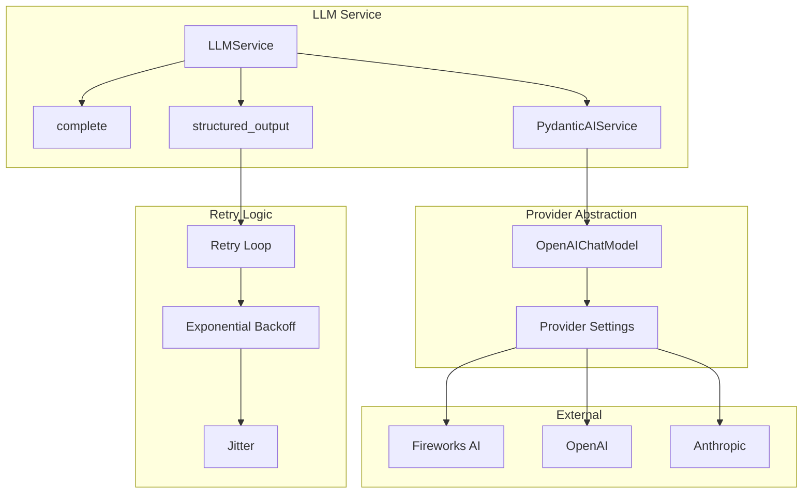
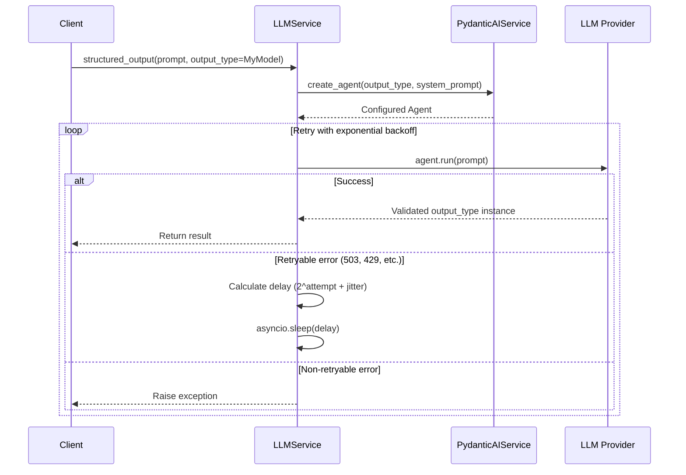
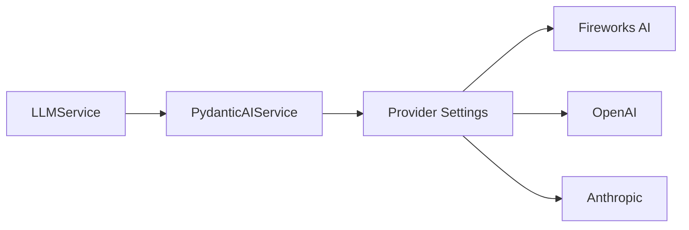

# LLM Service Guide

> **Date**: 2025-07-20 | **Status**: Active | **Version**: 1.0 | **Owner**: Deep Docs Pipeline
> **Source**: Generated from codebase analysis | **Cross-links**: See Related Documents section

## Overview

The LLM Service provides a unified, production-ready interface for interacting with Large Language Models. It supports both simple text completion and structured output generation using Pydantic models. The service implements robust retry logic with exponential backoff for transient errors, handles multiple LLM providers through a provider-agnostic interface, and enforces type-safe structured outputs for reliable data extraction.

## Architecture



## Key Components

### LLMService Class

`backend/omoi_os/services/llm_service.py:27-219`

```python
class LLMService:
    """Simple service for LLM text completion and structured outputs."""
    
    def __init__(self, settings: Optional[LLMSettings] = None):
        self.settings = settings or load_llm_settings()
        self._pydantic_ai_service: Optional[PydanticAIService] = None
    
    @property
    def _pydantic_ai(self) -> PydanticAIService:
        """Get or create PydanticAI service instance."""
        if self._pydantic_ai_service is None:
            self._pydantic_ai_service = PydanticAIService(settings=self.settings)
        return self._pydantic_ai_service
```

**Core Methods:**

| Method | Line | Purpose |
|--------|------|---------|
| `complete` | 56-90 | Simple text completion |
| `structured_output` | 92-184 | Type-safe structured output generation |

**Singleton Access:**

| Function | Line | Purpose |
|----------|------|---------|
| `get_llm_service` | 191-213 | Global singleton accessor |
| `reset_llm_service` | 216-219 | Reset for testing |

## Text Completion

### Simple Completion

`backend/omoi_os/services/llm_service.py:56-90`

```python
async def complete(
    self, 
    prompt: str, 
    system_prompt: Optional[str] = None, 
    **kwargs
) -> str:
    """Simple text completion - just get text back from the LLM."""
    
    from pydantic_ai import Agent
    from pydantic_ai.models.openai import OpenAIChatModel
    
    # Create model with provider settings
    model = OpenAIChatModel(
        self._pydantic_ai.model_string,
        provider=self._pydantic_ai.provider,
        settings=self._pydantic_ai.model_settings,
    )
    
    # Build agent kwargs
    agent_kwargs = {"model": model}
    if system_prompt:
        agent_kwargs["system_prompt"] = system_prompt
    
    agent = Agent(**agent_kwargs)
    result = await agent.run(prompt)
    return result.output
```

### Usage Example

```python
from omoi_os.services.llm_service import get_llm_service

llm = get_llm_service()
result = await llm.complete("What is the capital of France?")
print(result)  # "The capital of France is Paris."
```

## Structured Output

### Type-Safe Generation

`backend/omoi_os/services/llm_service.py:92-184`



```python
async def structured_output(
    self,
    prompt: str,
    output_type: type[T],
    system_prompt: Optional[str] = None,
    output_retries: int = 5,
    http_retries: int = 3,
    **kwargs,
) -> T:
    """Get structured output matching a Pydantic model."""
    
    # Create agent with structured output type
    agent = self._pydantic_ai.create_agent(
        output_type=output_type,
        system_prompt=system_prompt,
        output_retries=output_retries,
    )
    
    last_error = None
    for attempt in range(http_retries + 1):
        try:
            result = await agent.run(prompt)
            return result.output
        except Exception as e:
            error_str = str(e).lower()
            
            # Check if retryable HTTP error
            is_retryable = any(
                indicator in error_str
                for indicator in [
                    "503", "502", "500", "504", "429",
                    "service unavailable", "bad gateway",
                    "gateway timeout", "rate limit",
                ]
            )
            
            if is_retryable and attempt < http_retries:
                # Exponential backoff with jitter
                base_delay = 2**attempt
                jitter = random.uniform(0, 0.5 * base_delay)
                delay = base_delay + jitter
                
                logger.warning(
                    f"LLM HTTP error (attempt {attempt + 1}), "
                    f"retrying in {delay:.1f}s"
                )
                
                await asyncio.sleep(delay)
                last_error = e
            else:
                raise
```

### Usage Example

```python
from pydantic import BaseModel, Field
from omoi_os.services.llm_service import get_llm_service

class AnalysisResult(BaseModel):
    """LLM analysis result structure."""
    score: float = Field(..., ge=0.0, le=1.0)
    summary: str
    needs_action: bool = Field(default=False)
    details: dict = Field(default_factory=dict)

llm = get_llm_service()
result = await llm.structured_output(
    prompt="Analyze this agent trajectory...",
    output_type=AnalysisResult,
    system_prompt="You are an expert analyzer.",
    output_retries=3,
)

# result is a validated AnalysisResult instance
print(result.score)  # 0.85
print(result.summary)  # "Agent is making good progress..."
```

## Retry Logic

### Exponential Backoff with Jitter

`backend/omoi_os/services/llm_service.py:160-175`


```python
# Exponential backoff with jitter: 1s, 2s, 4s + random
base_delay = 2**attempt  # 1, 2, 4, 8...
jitter = random.uniform(0, 0.5 * base_delay)
delay = base_delay + jitter

logger.warning(
    f"LLM HTTP error (attempt {attempt + 1}/{http_retries + 1}), "
    f"retrying in {delay:.1f}s",
    extra={
        "error": str(e)[:200],
        "attempt": attempt + 1,
        "max_attempts": http_retries + 1,
        "delay_seconds": delay,
    },
)

await asyncio.sleep(delay)
```

### Retryable Error Detection

`backend/omoi_os/services/llm_service.py:144-158`

| Error Pattern | Retryable | Notes |
|--------------|-----------|-------|
| 503, 502, 500, 504 | Yes | Server errors |
| 429 | Yes | Rate limit |
| "service unavailable" | Yes | Temporary outage |
| "bad gateway" | Yes | Gateway issues |
| "gateway timeout" | Yes | Timeout |
| "rate limit" | Yes | Throttling |
| Other errors | No | Likely client/data errors |

## PydanticAI Integration

### Service Creation

`backend/omoi_os/services/pydantic_ai_service.py`

```python
class PydanticAIService:
    """Service for structured LLM outputs using PydanticAI."""
    
    def create_agent(
        self,
        output_type: type[T],
        system_prompt: Optional[str] = None,
        output_retries: int = 5,
    ) -> Agent:
        """Create a PydanticAI agent for structured output."""
        
        model = OpenAIChatModel(
            self.model_string,
            provider=self.provider,
            settings=self.model_settings,
        )
        
        agent_kwargs = {
            "model": model,
            "output_type": output_type,
            "output_retries": output_retries,
        }
        
        if system_prompt:
            agent_kwargs["system_prompt"] = system_prompt
        
        return Agent(**agent_kwargs)
```

### Provider Configuration

From `LLMSettings`:

```python
class LLMSettings(OmoiBaseSettings):
    """LLM configuration settings."""
    
    yaml_section = "llm"
    
    # Provider selection
    provider: str = "fireworks"  # fireworks, openai, anthropic
    
    # Model configuration
    model: str = "accounts/fireworks/models/llama-v3p1-70b-instruct"
    
    # API configuration
    api_key: Optional[str] = None
    base_url: Optional[str] = None
    
    # Request settings
    temperature: float = 0.0
    max_tokens: int = 4096
    timeout_seconds: int = 120
```

## Configuration

### YAML Configuration

`config/base.yaml`:

```yaml
llm:
  provider: fireworks
  model: accounts/fireworks/models/llama-v3p1-70b-instruct
  temperature: 0.0
  max_tokens: 4096
  timeout_seconds: 120
```

### Environment Variables

| Variable | Purpose | Example |
|----------|---------|---------|
| `LLM_PROVIDER` | Provider selection | `fireworks`, `openai`, `anthropic` |
| `LLM_API_KEY` | API authentication | `sk-ant-...` |
| `LLM_BASE_URL` | Custom endpoint | `https://api.fireworks.ai/inference/v1` |
| `LLM_MODEL` | Model identifier | `accounts/fireworks/models/llama-v3p1-70b-instruct` |
| `LLM_TEMPERATURE` | Sampling temperature | `0.0` |
| `LLM_MAX_TOKENS` | Max response tokens | `4096` |

## Best Practices

### Use Structured Output for Data Extraction

```python
# ✅ GOOD: Type-safe structured output
class TaskRequirements(BaseModel):
    execution_mode: Literal["exploration", "implementation", "validation"]
    requires_code_changes: bool
    requires_pull_request: bool

result = await llm.structured_output(
    prompt="Analyze this task: ...",
    output_type=TaskRequirements,
)

# Use the typed result
if result.requires_code_changes:
    await spawn_implementation_sandbox()
```

### Handle Retries Appropriately

```python
# ✅ GOOD: Set appropriate retry counts
result = await llm.structured_output(
    prompt="...",
    output_type=MyModel,
    output_retries=5,    # Retries for validation failures
    http_retries=3,      # Retries for HTTP errors
)
```

### Use System Prompts for Consistency

```python
# ✅ GOOD: System prompt sets context
system_prompt = """You are an expert code reviewer. 
Analyze the provided code changes and provide structured feedback."""

result = await llm.structured_output(
    prompt=code_diff,
    output_type=CodeReviewResult,
    system_prompt=system_prompt,
)
```

## Error Handling

### Common Error Scenarios

| Scenario | Error Type | Handling |
|----------|------------|----------|
| Rate limit (429) | Retryable | Exponential backoff |
| Server error (5xx) | Retryable | Exponential backoff |
| Validation failure | Retryable | PydanticAI handles internally |
| Authentication error | Non-retryable | Raise immediately |
| Invalid request | Non-retryable | Raise immediately |
| Timeout | Retryable | Exponential backoff |

### Logging

All retry attempts are logged with structured context:

```python
logger.warning(
    f"LLM HTTP error (attempt {attempt + 1}/{http_retries + 1}), "
    f"retrying in {delay:.1f}s",
    extra={
        "error": str(e)[:200],
        "attempt": attempt + 1,
        "max_attempts": http_retries + 1,
        "delay_seconds": delay,
    },
)
```

## Integration Points

### Service Dependencies



### Consumers

| Service | Usage |
|---------|-------|
| DiagnosticService | Generate hypotheses |
| SpecTaskExecutionService | Analyze task requirements |
| TitleGenerationService | Generate task titles |
| TemplateService | Render structured prompts |
| Various agents | Decision making, analysis |

## Testing Considerations

### Unit Test Areas

1. **Completion** - Verify text generation
2. **Structured output** - Verify Pydantic model validation
3. **Retry logic** - Test exponential backoff
4. **Error classification** - Verify retryable vs non-retryable
5. **Singleton pattern** - Verify get_llm_service caching

### Mocking Strategy

```python
# Mock PydanticAI agent for testing
@pytest.fixture
def mock_llm_service():
    service = LLMService(settings=test_settings)
    service._pydantic_ai_service = MockPydanticAIService()
    return service

async def test_structured_output(mock_llm_service):
    result = await mock_llm_service.structured_output(
        prompt="test",
        output_type=TestModel,
    )
    assert isinstance(result, TestModel)
```

## Related Documents

- [PydanticAI Documentation](https://ai.pydantic.dev/) - External library docs
- [Diagnostic Service](./diagnostic_service.md) - Uses LLM for hypothesis generation
- [Spec Task Execution](./spec_task_execution.md) - Uses LLM for task analysis
- [Architecture Overview](../../../ARCHITECTURE.md) - System-wide context
- [Backend CLAUDE.md](../../CLAUDE.md) - Backend development guide
