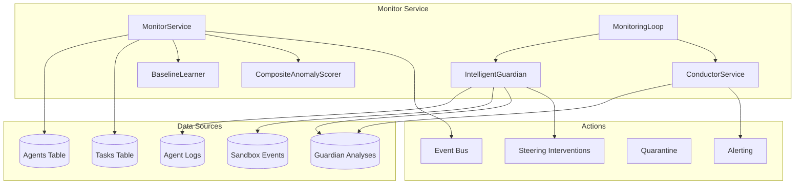
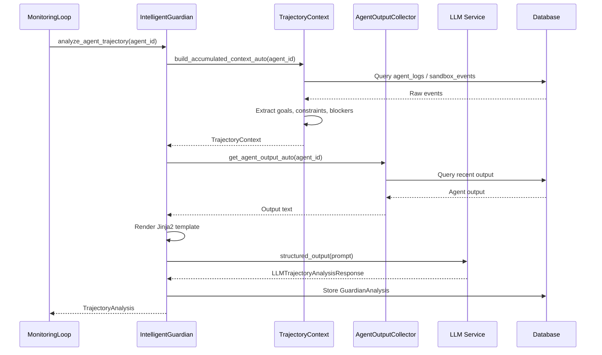
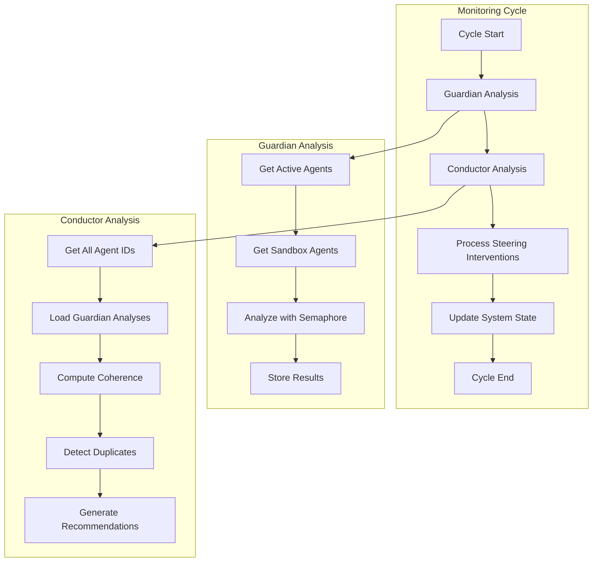

# Monitor Service Design

> **Date**: 2025-07-20 | **Status**: Active | **Version**: 1.0 | **Owner**: Deep Docs Pipeline
> **Source**: Generated from codebase analysis | **Cross-links**: See Related Documents section

## Overview

The Monitor Service provides comprehensive monitoring capabilities for the OmoiOS platform, including metrics collection, anomaly detection, agent trajectory analysis, and system health monitoring. It integrates with the Intelligent Guardian and Conductor services to provide real-time oversight of agent swarms and task execution.

## Architecture



## Key Components

### MonitorService

`backend/omoi_os/services/monitor.py:23-609`

Core monitoring service providing:
- Metrics collection (tasks, agents, locks)
- Anomaly detection with rolling statistics
- Agent-level composite anomaly scoring
- Baseline learning for agent behavior

### IntelligentGuardian

`backend/omoi_os/services/intelligent_guardian.py:45-1121`

LLM-powered trajectory analysis:
- Agent behavior analysis
- Trajectory alignment scoring
- Steering intervention detection
- Sandbox and legacy agent support

### ConductorService

`backend/omoi_os/services/conductor.py:107-922`

System coherence analysis:
- Duplicate work detection
- System-wide coherence scoring
- Coordination recommendations
- Cross-agent analysis

### MonitoringLoop

`backend/omoi_os/services/monitoring_loop.py:62-697`

Orchestration layer:
- Periodic analysis cycles
- Guardian loop (60s interval)
- Conductor loop (300s interval)
- Health check loop (30s interval)

## Agent Trajectory Monitoring

### Trajectory Analysis Pipeline



### TrajectoryContext

`backend/omoi_os/services/trajectory_context.py:32-1013`

Accumulated context building:

```python
class TrajectoryContext:
    """Manages accumulated context for agents using trajectory thinking."""
    
    def build_accumulated_context_auto(
        self, 
        agent_id: str, 
        include_full_history: bool = True
    ) -> Dict[str, Any]:
        """
        Automatically detect if agent is in sandbox and build appropriate context.
        Routes to either:
        - build_sandbox_context() for sandbox agents
        - build_accumulated_context() for legacy agents
        """
```

### Context Elements

`backend/omoi_os/services/trajectory_context.py:109-135`

```python
context = {
    # Core trajectory elements
    "overall_goal": self._extract_overall_goal(conversation, task),
    "evolved_goals": self._track_goal_evolution(conversation),
    "constraints": self._extract_persistent_constraints(conversation),
    "lifted_constraints": self._identify_lifted_constraints(conversation),
    "standing_instructions": self._extract_standing_instructions(conversation),
    
    # Reference resolution
    "references": self._resolve_references(conversation),
    "context_markers": self._extract_context_markers(conversation),
    
    # Journey tracking
    "phases_completed": self._identify_completed_phases(conversation),
    "current_focus": self._determine_current_focus(conversation),
    "attempted_approaches": self._extract_attempted_approaches(conversation),
    "discovered_blockers": self._find_discovered_blockers(conversation),
    
    # Meta information
    "conversation_length": len(conversation),
    "session_duration": self._calculate_session_duration(logs),
    "last_activity": logs[-1].created_at if logs else utc_now(),
}
```

## Anomaly Detection

### Rolling Statistics Detection

`backend/omoi_os/services/monitor.py:232-300`

```python
def detect_anomalies(
    self,
    metric_samples: Dict[str, MetricSample],
    sensitivity: float = 2.0,
) -> List[MonitorAnomaly]:
    """
    Detect anomalies using rolling statistics.
    
    Args:
        metric_samples: Current metric samples
        sensitivity: Standard deviations for anomaly threshold (default: 2.0)
    
    Returns:
        List of detected anomalies
    """
    # Calculate baseline statistics
    mean = sum(history) / len(history)
    variance = sum((x - mean) ** 2 for x in history) / len(history)
    std_dev = variance**0.5
    
    # Detect anomalies
    deviation = abs(sample.value - mean)
    if std_dev > 0 and deviation > (sensitivity * std_dev):
        # Anomaly detected
        if deviation > (3 * std_dev):
            severity = "critical"
        elif deviation > (2.5 * std_dev):
            severity = "error"
        elif deviation > (2 * std_dev):
            severity = "warning"
```

### Composite Anomaly Scoring

`backend/omoi_os/services/monitor.py:403-518`

```python
def compute_agent_anomaly_scores(
    self,
    agent_ids: Optional[List[str]] = None,
    anomaly_threshold: float = 0.8,
    consecutive_threshold: int = 3,
) -> List[Dict[str, Any]]:
    """
    Compute composite anomaly scores for agents per REQ-FT-AN-001.
    
    Factors:
    - Latency (task completion time)
    - Error rate (failed vs completed tasks)
    - Resource usage (CPU, memory from heartbeats)
    - Queue impact (tasks waiting)
    
    Returns agents with anomaly_score >= threshold for consecutive readings.
    """
```

### Baseline Learning

`backend/omoi_os/services/baseline_learner.py`

```python
class BaselineLearner:
    """Learns normal behavior baselines for anomaly detection."""
    
    def learn_baseline(
        self,
        agent_type: str,
        phase_id: Optional[str],
        metrics: Dict[str, float],
    ) -> None:
        """Update baseline with new metrics observation."""
```

## Guardian Integration

### Trajectory Analysis Response

`backend/omoi_os/services/intelligent_guardian.py:45-79`

```python
class TrajectoryAnalysis:
    """Container for trajectory analysis results."""
    
    def __init__(
        self,
        agent_id: str,
        current_phase: str,
        trajectory_aligned: bool,
        alignment_score: float,
        needs_steering: bool,
        steering_type: Optional[str],
        steering_recommendation: Optional[str],
        trajectory_summary: str,
        last_claude_message_marker: Optional[str],
        accumulated_goal: Optional[str],
        current_focus: str,
        session_duration: Optional[timedelta],
        conversation_length: int,
        details: Dict[str, Any],
    ):
```

### Steering Interventions

`backend/omoi_os/services/intelligent_guardian.py:81-101`

```python
class SteeringIntervention:
    """Container for steering intervention decisions."""
    
    def __init__(
        self,
        agent_id: str,
        steering_type: str,  # "guidance", "refocus", "stop", "escalate"
        message: str,
        actor_type: str,
        actor_id: str,
        reason: str,
        confidence: float,
    ):
```

### Intervention Routing

`backend/omoi_os/services/intelligent_guardian.py:759-897`

```python
def _is_sandbox_task(self, task: Task) -> bool:
    """Check if a task is running in a sandbox."""
    return bool(task.sandbox_id)

async def _sandbox_intervention(
    self, 
    intervention: SteeringIntervention, 
    task: Task
) -> bool:
    """Send intervention to sandbox via message injection API."""
    # POST /api/v1/sandboxes/{sandbox_id}/messages
    
async def _legacy_intervention(
    self, 
    intervention: SteeringIntervention, 
    task: Task
) -> bool:
    """Send intervention via direct OpenHands conversation access."""
```

## Real-Time Analysis Pipeline

### MonitoringLoop Configuration

`backend/omoi_os/services/monitoring_loop.py:33-46`

```python
@dataclass
class MonitoringConfig:
    """Configuration for monitoring loop behavior."""
    
    guardian_interval_seconds: int = 60      # Analyze agents every minute
    conductor_interval_seconds: int = 300      # System coherence every 5 minutes
    health_check_interval_seconds: int = 30      # Health checks every 30 seconds
    auto_steering_enabled: bool = False        # Auto-execute steering interventions
    max_concurrent_analyses: int = 5           # Limit concurrent analyses
    workspace_root: Optional[str] = None       # Root directory for agent workspaces
    llm_analysis_enabled: bool = True          # Enable LLM-based trajectory analysis
```

### Analysis Cycle Flow



## Alerting Thresholds

### System Health Levels

`backend/omoi_os/services/intelligent_guardian.py:437-455`

```python
def _determine_system_status(
    self, 
    coherence_score: float, 
    num_agents: int, 
    duplicates: List
) -> str:
    """Determine system health status."""
    if average_alignment > 0.8 and agents_need_steering == 0:
        system_health = "optimal"
    elif average_alignment > 0.6 and agents_need_steering < active_agents * 0.3:
        system_health = "good"
    elif average_alignment > 0.4:
        system_health = "warning"
    else:
        system_health = "critical"
```

### Anomaly Severity Levels

`backend/omoi_os/services/monitor.py:280-287`

| Deviation | Severity | Action |
|-----------|----------|--------|
| > 3σ | Critical | Immediate alert |
| > 2.5σ | Error | High priority alert |
| > 2σ | Warning | Standard alert |
| < 2σ | Info | Log only |

### Health Score Calculation

`backend/omoi_os/services/intelligent_guardian.py:1078-1098`

```python
def _calculate_health_score(
    self,
    analysis: TrajectoryAnalysis,
    recent_interventions: List[Dict[str, Any]],
) -> float:
    """Calculate overall health score for an agent."""
    base_score = analysis.alignment_score
    
    # Penalty for needing steering
    if analysis.needs_steering:
        base_score *= 0.7
    
    # Penalty for recent interventions
    intervention_penalty = min(0.3, len(recent_interventions) * 0.1)
    base_score -= intervention_penalty
    
    # Penalty for trajectory misalignment
    if not analysis.trajectory_aligned:
        base_score *= 0.8
    
    return max(0.0, min(1.0, base_score))
```

## Metrics Collection

### Task Metrics

`backend/omoi_os/services/monitor.py:50-129`

```python
def collect_task_metrics(
    self, 
    phase_id: Optional[str] = None
) -> Dict[str, MetricSample]:
    """
    Collect task-related metrics:
    - Queue depth by phase and priority
    - Completed tasks count
    - Task duration (average)
    """
```

### Agent Metrics

`backend/omoi_os/services/monitor.py:131-180`

```python
def collect_agent_metrics(self) -> Dict[str, MetricSample]:
    """
    Collect agent-related metrics:
    - Active agents by type
    - Heartbeat age per agent
    - Status distribution
    """
```

### Lock Metrics

`backend/omoi_os/services/monitor.py:182-207`

```python
def collect_lock_metrics(self) -> Dict[str, MetricSample]:
    """
    Collect resource lock metrics:
    - Active locks by type and mode
    - Lock contention indicators
    """
```

## Configuration

### Environment Variables

| Variable | Description | Default |
|----------|-------------|---------|
| `MONITORING_GUARDIAN_INTERVAL` | Guardian analysis interval (seconds) | 60 |
| `MONITORING_CONDUCTOR_INTERVAL` | Conductor analysis interval (seconds) | 300 |
| `MONITORING_HEALTH_CHECK_INTERVAL` | Health check interval (seconds) | 30 |
| `MONITORING_AUTO_STEERING` | Auto-execute steering interventions | false |
| `MONITORING_LLM_ANALYSIS` | Enable LLM-based analysis | true |
| `MONITORING_MAX_CONCURRENT` | Max concurrent analyses | 5 |

### YAML Configuration

```yaml
# config/base.yaml
monitoring:
  guardian_interval_seconds: 60
  conductor_interval_seconds: 300
  health_check_interval_seconds: 30
  auto_steering_enabled: false
  max_concurrent_analyses: 5
  llm_analysis_enabled: true
```

## API Reference

### MonitorService Methods

#### collect_all_metrics

`backend/omoi_os/services/monitor.py:210-226`

```python
def collect_all_metrics(
    self, 
    phase_id: Optional[str] = None
) -> Dict[str, MetricSample]:
    """Collect all system metrics (tasks, agents, locks)."""
```

#### detect_anomalies

`backend/omoi_os/services/monitor.py:232-300`

```python
def detect_anomalies(
    self,
    metric_samples: Dict[str, MetricSample],
    sensitivity: float = 2.0,
) -> List[MonitorAnomaly]:
    """Detect anomalies using rolling statistics."""
```

#### compute_agent_anomaly_scores

`backend/omoi_os/services/monitor.py:403-518`

```python
def compute_agent_anomaly_scores(
    self,
    agent_ids: Optional[List[str]] = None,
    anomaly_threshold: float = 0.8,
    consecutive_threshold: int = 3,
) -> List[Dict[str, Any]]:
    """Compute composite anomaly scores for agents."""
```

### IntelligentGuardian Methods

#### analyze_agent_trajectory

`backend/omoi_os/services/intelligent_guardian.py:141-243`

```python
async def analyze_agent_trajectory(
    self,
    agent_id: str,
    force_analysis: bool = False,
) -> Optional[TrajectoryAnalysis]:
    """Analyze an agent's trajectory for alignment and steering needs."""
```

#### detect_steering_interventions

`backend/omoi_os/services/intelligent_guardian.py:311-341`

```python
async def detect_steering_interventions(
    self,
    analyses: Optional[List[TrajectoryAnalysis]] = None,
) -> List[SteeringIntervention]:
    """Detect agents that need steering interventions."""
```

### MonitoringLoop Methods

#### start / stop

`backend/omoi_os/services/monitoring_loop.py:121-171`

```python
async def start(self) -> None:
    """Start the monitoring loop with background tasks."""

async def stop(self) -> None:
    """Stop the monitoring loop and cancel background tasks."""
```

#### run_single_cycle

`backend/omoi_os/services/monitoring_loop.py:173-241`

```python
async def run_single_cycle(self) -> MonitoringCycle:
    """Run a single complete monitoring cycle."""
```

## Integration Patterns

### Event Bus Integration

```python
# Publish monitoring events
self.event_bus.publish(SystemEvent(
    event_type="monitoring.health.check",
    entity_type="monitoring_loop",
    entity_id="monitoring_loop",
    payload={
        "system_health": health_response.system_health,
        "active_agents": health_response.active_agents,
        "average_alignment": health_response.average_alignment,
        "alerts": alerts,
    },
))
```

### Database Schema

```sql
-- Guardian analyses table
CREATE TABLE guardian_analyses (
    id UUID PRIMARY KEY,
    agent_id VARCHAR NOT NULL,
    current_phase VARCHAR,
    trajectory_aligned BOOLEAN,
    alignment_score FLOAT,
    needs_steering BOOLEAN,
    steering_type VARCHAR,
    steering_recommendation TEXT,
    trajectory_summary TEXT,
    details JSONB,
    created_at TIMESTAMP WITH TIME ZONE
);

-- Steering interventions table
CREATE TABLE steering_interventions (
    id UUID PRIMARY KEY,
    agent_id VARCHAR NOT NULL,
    steering_type VARCHAR NOT NULL,
    message TEXT NOT NULL,
    actor_type VARCHAR,
    actor_id VARCHAR,
    reason TEXT,
    created_at TIMESTAMP WITH TIME ZONE
);

-- Monitor anomalies table
CREATE TABLE monitor_anomalies (
    id UUID PRIMARY KEY,
    metric_name VARCHAR NOT NULL,
    anomaly_type VARCHAR NOT NULL,
    severity VARCHAR NOT NULL,
    baseline_value FLOAT,
    observed_value FLOAT,
    deviation_percent FLOAT,
    description TEXT,
    labels JSONB,
    detected_at TIMESTAMP WITH TIME ZONE,
    acknowledged_at TIMESTAMP WITH TIME ZONE
);
```

## Testing Strategy

### Unit Tests

```python
# Test anomaly detection
def test_detect_anomalies():
    monitor = MonitorService(db)
    samples = {
        "metric1": MetricSample("test", 100.0, {}, utc_now()),
        "metric2": MetricSample("test", 200.0, {}, utc_now()),
    }
    # Add historical data
    monitor._metric_history["metric1"] = [50.0] * 20  # Baseline ~50
    
    anomalies = monitor.detect_anomalies(samples, sensitivity=2.0)
    assert len(anomalies) == 1  # metric1 should be anomalous
    assert anomalies[0].metric_name == "metric1"

# Test trajectory analysis
def test_trajectory_analysis():
    guardian = IntelligentGuardian(db, llm_service)
    analysis = asyncio.run(guardian.analyze_agent_trajectory("agent-123"))
    assert analysis is not None
    assert 0.0 <= analysis.alignment_score <= 1.0
```

### Integration Tests

```python
# Test monitoring loop cycle
def test_monitoring_cycle():
    loop = MonitoringLoop(db, event_bus)
    asyncio.run(loop.start())
    
    # Wait for one cycle
    time.sleep(65)
    
    status = loop.get_status()
    assert status["running"] is True
    assert status["metrics"]["total_cycles"] >= 1
    
    asyncio.run(loop.stop())
```

## Related Documents

- Guardian Service - Emergency intervention system
- Conductor Service - System coherence analysis
- [Agent Registry](./agent_registry.md) - Agent registration and discovery
- [Database Schema](../../architecture/11-database-schema.md) - Monitoring tables
- [Monitoring Architecture](../../requirements/monitoring/monitoring_architecture.md) - System design

## Future Enhancements

1. **Predictive Alerting**: ML-based prediction of anomalies before they occur
2. **Custom Metrics**: User-defined metrics and alerting rules
3. **Dashboard Integration**: Real-time WebSocket feeds for frontend dashboards
4. **Alert Routing**: PagerDuty/Slack integration for critical alerts
5. **Historical Analysis**: Long-term trend analysis and capacity planning
