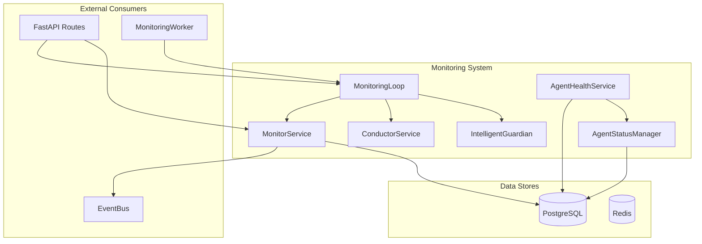
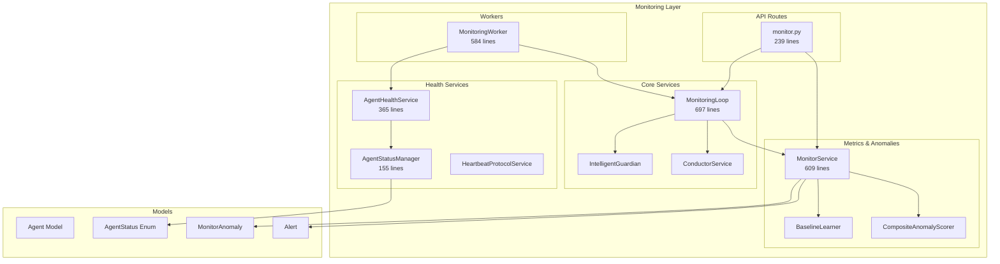
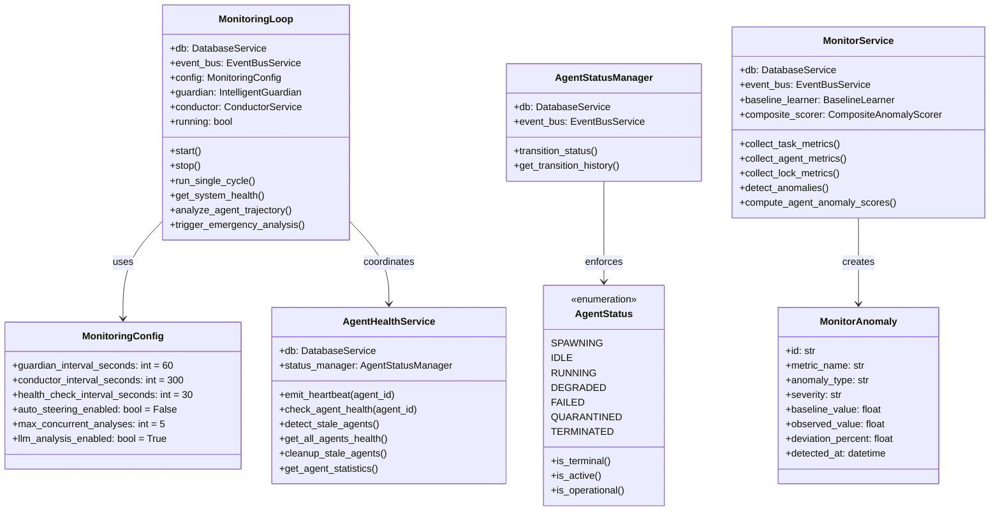
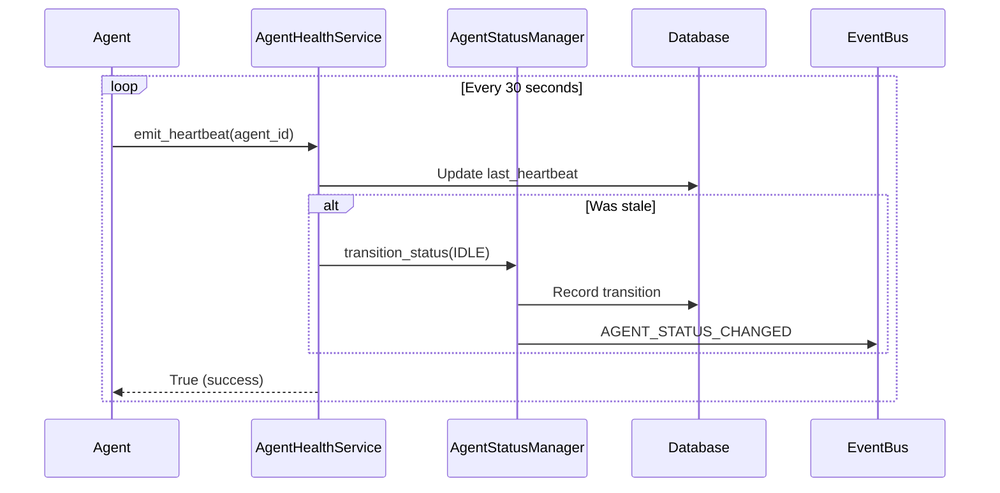

# Monitoring & Observability System

> **Date**: 2025-07-20 | **Status**: Active | **Version**: 1.0 | **Owner**: Deep Docs Pipeline
> **Source**: Generated from codebase analysis | **Cross-links**: See Related Documents section

## Table of Contents

1. [Overview](#overview)
2. [Architecture](#architecture)
3. [Core Components](#core-components)
4. [Health Monitoring](#health-monitoring)
5. [Status Tracking](#status-tracking)
6. [Observability Pipeline](#observability-pipeline)
7. [Alerting & Anomalies](#alerting--anomalies)
8. [Metrics Collection](#metrics-collection)
9. [API Surface](#api-surface)
10. [Related Documents](#related-documents)

---

## Overview

The Monitoring & Observability System provides comprehensive visibility into agent health, system metrics, and operational anomalies. It combines real-time health checks, intelligent trajectory analysis, and automated alerting to ensure system reliability.

### Key Capabilities

| Capability | Description | Implementation |
|------------|-------------|----------------|
| Heartbeat Monitoring | Track agent liveness via periodic heartbeats | `AgentHealthService` + `HeartbeatProtocolService` |
| Status State Machine | Enforce valid agent status transitions | `AgentStatusManager` with `VALID_TRANSITIONS` |
| Trajectory Analysis | LLM-powered agent behavior analysis | `IntelligentGuardian` |
| System Coherence | Detect duplicate work and system-wide issues | `ConductorService` |
| Anomaly Detection | Statistical and composite anomaly scoring | `MonitorService.compute_agent_anomaly_scores()` |
| Metrics Collection | Task, agent, and lock metrics | `MonitorService.collect_all_metrics()` |

### System Context



---

## Architecture

### Component Diagram



### Class Hierarchy



---

## Core Components

### 1. MonitoringLoop

`backend/omoi_os/services/monitoring_loop.py:62-697`

Orchestrates the complete intelligent monitoring workflow.

```python
class MonitoringLoop:
    """Orchestrates the complete intelligent monitoring workflow.
    
    Coordinates:
    - Trajectory analysis via IntelligentGuardian (60s interval)
    - System coherence analysis via Conductor (300s interval)
    - Health checks (30s interval)
    - Steering interventions
    """
    
    def __init__(
        self,
        db: DatabaseService,
        event_bus: Optional[EventBusService] = None,
        config: Optional[MonitoringConfig] = None,
    ):
        self.db = db
        self.event_bus = event_bus
        self.config = config or MonitoringConfig()
        
        # Initialize monitoring components
        self.guardian = IntelligentGuardian(
            db,
            workspace_root=self.config.workspace_root,
            event_bus=event_bus,
            llm_analysis_enabled=self.config.llm_analysis_enabled,
        )
        self.conductor = ConductorService(
            db,
            llm_analysis_enabled=self.config.llm_analysis_enabled,
        )
```

#### Background Loops

```python
# backend/omoi_os/services/monitoring_loop.py:322-359

async def _guardian_loop(self) -> None:
    """Background loop for Guardian trajectory analysis."""
    while self.running:
        try:
            await self._run_guardian_analysis()
            self.last_guardian_run = utc_now()
            await asyncio.sleep(self.config.guardian_interval_seconds)
        except asyncio.CancelledError:
            break
        except Exception as e:
            logger.error(f"Guardian loop error: {e}")
            await asyncio.sleep(5)

async def _conductor_loop(self) -> None:
    """Background loop for Conductor system coherence analysis."""
    while self.running:
        try:
            await self._run_conductor_analysis()
            self.last_conductor_run = utc_now()
            await asyncio.sleep(self.config.conductor_interval_seconds)
        except asyncio.CancelledError:
            break
        except Exception as e:
            logger.error(f"Conductor loop error: {e}")
            await asyncio.sleep(10)

async def _health_check_loop(self) -> None:
    """Background loop for system health checks."""
    while self.running:
        try:
            await self._run_health_check()
            self.last_health_check = utc_now()
            await asyncio.sleep(self.config.health_check_interval_seconds)
        except asyncio.CancelledError:
            break
        except Exception as e:
            logger.error(f"Health check loop error: {e}")
            await asyncio.sleep(5)
```

### 2. AgentHealthService

`backend/omoi_os/services/agent_health.py:15-365`

Manages agent heartbeats and health status.

```python
class AgentHealthService:
    """Service for monitoring agent health and managing heartbeats."""
    
    def emit_heartbeat(self, agent_id: str) -> bool:
        """Emit a heartbeat for an agent.
        
        Updates last_heartbeat timestamp and restores status
        if agent was stale or degraded.
        """
        with self.db.get_session() as session:
            agent = session.query(Agent).filter(Agent.id == agent_id).first()
            if not agent:
                return False
            
            # Update heartbeat
            agent.last_heartbeat = utc_now()
            
            # Restore status if stale
            if agent.status in ["stale", "STALE"]:
                if self.status_manager:
                    self.status_manager.transition_status(
                        agent_id,
                        to_status=AgentStatus.IDLE.value,
                        initiated_by="agent_health_service",
                        reason="Heartbeat received, recovering from stale state",
                    )
            else:
                agent.health_status = "healthy"
            
            session.commit()
            return True
```

#### Health Check Logic

```python
# backend/omoi_os/services/agent_health.py:80-147

def check_agent_health(
    self, agent_id: str, timeout_seconds: Optional[int] = None
) -> Dict[str, any]:
    """Check the health status of a specific agent."""
    if timeout_seconds is None:
        timeout_seconds = 90  # Default 90s timeout
    
    with self.db.get_session() as session:
        agent = session.query(Agent).filter(Agent.id == agent_id).first()
        if not agent:
            return {
                "agent_id": agent_id,
                "status": "not_found",
                "healthy": False,
                "health_status": "unknown",
            }
        
        now = utc_now()
        last_heartbeat = agent.last_heartbeat
        
        if not last_heartbeat:
            return {
                "agent_id": agent_id,
                "status": agent.status,
                "healthy": False,
                "message": "No heartbeat recorded",
                "health_status": agent.health_status or "unknown",
            }
        
        time_since_last_heartbeat = now - last_heartbeat
        is_stale = time_since_last_heartbeat > timedelta(seconds=timeout_seconds)
        
        # Update agent status if stale
        if is_stale and agent.status != "stale":
            agent.status = "stale"
            agent.health_status = "stale"
            session.commit()
        
        return {
            "agent_id": agent_id,
            "status": agent.status,
            "healthy": not is_stale,
            "last_heartbeat": last_heartbeat.isoformat(),
            "time_since_last_heartbeat": time_since_last_heartbeat.total_seconds(),
            "timeout_seconds": timeout_seconds,
            "health_status": agent.health_status,
        }
```

### 3. AgentStatusManager

`backend/omoi_os/services/agent_status_manager.py:17-155`

Enforces agent status state machine transitions.

```python
class AgentStatusManager:
    """Agent status manager per REQ-ALM-004.
    
    Enforces agent status state machine transitions, records audit logs,
    and emits AGENT_STATUS_CHANGED events.
    """
    
    def transition_status(
        self,
        agent_id: str,
        to_status: str,
        initiated_by: Optional[str] = None,
        reason: Optional[str] = None,
        task_id: Optional[str] = None,
        force: bool = False,
        metadata: Optional[dict] = None,
    ) -> Agent:
        """Transition agent to new status with validation."""
        # Validate to_status is a valid AgentStatus
        if to_status not in [status.value for status in AgentStatus]:
            raise ValueError(f"Invalid status: {to_status}")
        
        with self.db.get_session() as session:
            agent = session.get(Agent, agent_id)
            if not agent:
                raise ValueError(f"Agent {agent_id} not found")
            
            from_status = agent.status
            
            # Validate transition unless forced
            if not force:
                if not is_valid_transition(from_status, to_status):
                    raise InvalidTransitionError(
                        f"Invalid transition from {from_status} to {to_status}"
                    )
            
            # Update status
            agent.status = to_status
            agent.updated_at = utc_now()
            
            # Record transition in audit log
            transition = AgentStatusTransition(
                agent_id=agent.id,
                from_status=from_status,
                to_status=to_status,
                reason=reason,
                triggered_by=initiated_by,
                task_id=task_id,
                transition_metadata=metadata,
            )
            session.add(transition)
            session.commit()
            
            # Publish AGENT_STATUS_CHANGED event
            if self.event_bus:
                self.event_bus.publish(
                    SystemEvent(
                        event_type="AGENT_STATUS_CHANGED",
                        entity_type="agent",
                        entity_id=str(agent.id),
                        payload={
                            "agent_id": str(agent.id),
                            "previous_status": from_status,
                            "new_status": to_status,
                            "reason": reason,
                            "task_id": task_id,
                            "triggered_by": initiated_by,
                        },
                    )
                )
            
            return agent
```

### 4. AgentStatus State Machine

`backend/omoi_os/models/agent_status.py:6-91`

```python
class AgentStatus(StrEnum):
    """Agent status enumeration per REQ-ALM-004.
    
    States: SPAWNING → IDLE → RUNNING → (DEGRADED|FAILED|QUARANTINED|TERMINATED)
    """
    
    SPAWNING = "SPAWNING"
    IDLE = "IDLE"
    RUNNING = "RUNNING"
    DEGRADED = "DEGRADED"
    FAILED = "FAILED"
    QUARANTINED = "QUARANTINED"
    TERMINATED = "TERMINATED"

# Valid state transitions per REQ-ALM-004
VALID_TRANSITIONS: dict[str, list[str]] = {
    AgentStatus.SPAWNING.value: [
        AgentStatus.IDLE.value,
        AgentStatus.FAILED.value,
        AgentStatus.TERMINATED.value,
    ],
    AgentStatus.IDLE.value: [
        AgentStatus.RUNNING.value,
        AgentStatus.DEGRADED.value,
        AgentStatus.QUARANTINED.value,
        AgentStatus.TERMINATED.value,
    ],
    AgentStatus.RUNNING.value: [
        AgentStatus.IDLE.value,
        AgentStatus.FAILED.value,
        AgentStatus.DEGRADED.value,
        AgentStatus.QUARANTINED.value,
    ],
    # ... additional transitions
}
```

---

## Health Monitoring

### Heartbeat Protocol



### Stale Detection

```python
# backend/omoi_os/services/agent_health.py:149-184

def detect_stale_agents(self, timeout_seconds: Optional[int] = None) -> List[Agent]:
    """Detect agents that have not sent a heartbeat within the timeout period."""
    if timeout_seconds is None:
        timeout_seconds = 90
    
    cutoff_time = utc_now() - timedelta(seconds=timeout_seconds)
    
    with self.db.get_session() as session:
        # Find agents with no heartbeat or last heartbeat before cutoff
        stale_agents = (
            session.query(Agent)
            .filter(
                or_(
                    Agent.last_heartbeat.is_(None),
                    Agent.last_heartbeat < cutoff_time,
                )
            )
            .all()
        )
        
        # Update their status to stale
        for agent in stale_agents:
            if agent.status != "stale":
                agent.status = "stale"
            agent.health_status = "stale"
        
        session.commit()
        return stale_agents
```

---

## Status Tracking

### Agent Model

`backend/omoi_os/models/agent.py:20-134`

```python
class Agent(Base):
    """Agent represents a registered worker, monitor, watchdog, or guardian agent."""
    
    __tablename__ = "agents"
    
    id: Mapped[str] = mapped_column(String, primary_key=True, default=lambda: str(uuid4()))
    agent_name: Mapped[Optional[str]] = mapped_column(String(255), nullable=True, index=True)
    agent_type: Mapped[str] = mapped_column(String(50), nullable=False, index=True)
    phase_id: Mapped[Optional[str]] = mapped_column(String(50), nullable=True, index=True)
    status: Mapped[str] = mapped_column(String(50), nullable=False, index=True)
    
    # Health tracking
    health_status: Mapped[str] = mapped_column(String(50), nullable=False, default="unknown")
    last_heartbeat: Mapped[Optional[datetime]] = mapped_column(DateTime(timezone=True))
    
    # Enhanced heartbeat protocol
    sequence_number: Mapped[int] = mapped_column(Integer, nullable=False, default=0)
    consecutive_missed_heartbeats: Mapped[int] = mapped_column(Integer, nullable=False, default=0)
    
    # Anomaly detection
    anomaly_score: Mapped[Optional[float]] = mapped_column(Float, nullable=True, index=True)
    consecutive_anomalous_readings: Mapped[int] = mapped_column(Integer, nullable=False, default=0)
```

---

## Observability Pipeline

### Monitoring Worker

`backend/omoi_os/workers/monitoring_worker.py:1-584`

The Monitoring Worker is a standalone process that runs all monitoring loops:

```python
async def main():
    """Main entry point."""
    logger.info("OmoiOS Monitoring Worker starting")
    
    # Setup signal handlers
    loop = asyncio.get_event_loop()
    for sig in (signal.SIGTERM, signal.SIGINT):
        loop.add_signal_handler(sig, lambda s=sig: asyncio.create_task(shutdown()))
    
    await init_services()
    
    # Create all monitoring tasks
    tasks = [
        asyncio.create_task(heartbeat_monitoring_loop()),      # 10s interval
        asyncio.create_task(diagnostic_monitoring_loop()),       # 60s interval
        asyncio.create_task(anomaly_monitoring_loop()),          # 60s interval
        asyncio.create_task(blocking_detection_loop()),          # 300s interval
        asyncio.create_task(approval_timeout_loop()),            # 10s interval
    ]
    
    # Start intelligent monitoring loop
    if monitoring_loop:
        tasks.append(asyncio.create_task(monitoring_loop.start()))
    
    # Wait for shutdown
    await shutdown_event.wait()
```

### Monitoring Loops

| Loop | Interval | Purpose | Handler |
|------|----------|---------|---------|
| Heartbeat | 10s | Check missed heartbeats, trigger restarts | `heartbeat_monitoring_loop()` |
| Diagnostic | 60s | Find stuck workflows, spawn diagnostic agents | `diagnostic_monitoring_loop()` |
| Anomaly | 60s | Check agent anomalies, auto-spawn diagnostics | `anomaly_monitoring_loop()` |
| Blocking | 300s | Detect and mark blocked tickets | `blocking_detection_loop()` |
| Approval | 10s | Check ticket approval timeouts | `approval_timeout_loop()` |
| Guardian | 60s | Trajectory analysis | `MonitoringLoop._guardian_loop()` |
| Conductor | 300s | System coherence analysis | `MonitoringLoop._conductor_loop()` |
| Health Check | 30s | System health checks | `MonitoringLoop._health_check_loop()` |

---

## Alerting & Anomalies

### Anomaly Detection

```python
# backend/omoi_os/services/monitor.py:232-300

def detect_anomalies(
    self,
    metric_samples: Dict[str, MetricSample],
    sensitivity: float = 2.0,
) -> List[MonitorAnomaly]:
    """Detect anomalies using rolling statistics."""
    anomalies = []
    
    for metric_key, sample in metric_samples.items():
        # Update history (keep last 100 samples)
        self._metric_history[metric_key].append(sample.value)
        if len(self._metric_history[metric_key]) > 100:
            self._metric_history[metric_key] = self._metric_history[metric_key][-100:]
        
        # Need at least 10 samples for baseline
        if len(self._metric_history[metric_key]) < 10:
            continue
        
        # Calculate baseline statistics
        history = self._metric_history[metric_key]
        mean = sum(history) / len(history)
        variance = sum((x - mean) ** 2 for x in history) / len(history)
        std_dev = variance**0.5
        
        # Detect anomalies
        deviation = abs(sample.value - mean)
        
        if std_dev > 0 and deviation > (sensitivity * std_dev):
            anomaly_type = "spike" if sample.value > mean else "drop"
            
            # Determine severity
            if deviation > (3 * std_dev):
                severity = "critical"
            elif deviation > (2.5 * std_dev):
                severity = "error"
            elif deviation > (2 * std_dev):
                severity = "warning"
            else:
                severity = "info"
            
            anomaly = self._create_anomaly(
                metric_name=sample.metric_name,
                anomaly_type=anomaly_type,
                severity=severity,
                baseline_value=mean,
                observed_value=sample.value,
                deviation_percent=deviation_percent,
                labels=sample.labels,
            )
            anomalies.append(anomaly)
    
    return anomalies
```

### Composite Anomaly Scoring

```python
# backend/omoi_os/services/monitor.py:403-518

def compute_agent_anomaly_scores(
    self,
    agent_ids: Optional[List[str]] = None,
    anomaly_threshold: float = 0.8,
    consecutive_threshold: int = 3,
) -> List[Dict[str, Any]]:
    """Compute composite anomaly scores for agents per REQ-FT-AN-001."""
    results = []
    
    with self.db.get_session() as session:
        # Get agents to check
        query = session.query(Agent).filter(
            Agent.status.in_("idle", "running", "degraded")
        )
        if agent_ids:
            query = query.filter(Agent.id.in_(agent_ids))
        
        agents = query.all()
        
        for agent in agents:
            # Compute composite anomaly score
            anomaly_score = self.composite_scorer.compute_anomaly_score(
                agent.id,
                health_metrics=health_metrics,
            )
            
            # Update agent's anomaly_score
            agent.anomaly_score = anomaly_score
            
            # Check if above threshold
            if anomaly_score >= anomaly_threshold:
                agent.consecutive_anomalous_readings += 1
            else:
                agent.consecutive_anomalous_readings = 0
            
            # Check if should quarantine
            should_quarantine = (
                agent.consecutive_anomalous_readings >= consecutive_threshold
            )
            
            results.append({
                "agent_id": agent.id,
                "anomaly_score": anomaly_score,
                "consecutive_readings": agent.consecutive_anomalous_readings,
                "should_quarantine": should_quarantine,
            })
        
        session.commit()
    
    return results
```

---

## Metrics Collection

### Metric Types

```python
# backend/omoi_os/services/monitor.py:50-129

def collect_task_metrics(self, phase_id: Optional[str] = None) -> Dict[str, MetricSample]:
    """Collect task-related metrics."""
    now = utc_now()
    metrics = {}
    
    with self.db.get_session() as session:
        # Queue depth by phase
        query = session.query(
            Task.phase_id, Task.priority, func.count(Task.id).label("count")
        ).filter(Task.status == "pending")
        
        if phase_id:
            query = query.filter(Task.phase_id == phase_id)
        
        queue_stats = query.group_by(Task.phase_id, Task.priority).all()
        
        for phase, priority, count in queue_stats:
            metrics[f"tasks_queued_{phase}_{priority}"] = MetricSample(
                metric_name="tasks_queued_total",
                value=float(count),
                labels={"phase_id": phase, "priority": priority},
                timestamp=now,
            )
        
        # Completed tasks
        completed_query = session.query(
            Task.phase_id, func.count(Task.id).label("count")
        ).filter(Task.status == "completed")
        
        completed_stats = completed_query.group_by(Task.phase_id).all()
        
        for phase, count in completed_stats:
            metrics[f"tasks_completed_{phase}"] = MetricSample(
                metric_name="tasks_completed_total",
                value=float(count),
                labels={"phase_id": phase},
                timestamp=now,
            )
        
        # Task duration (completed in last hour)
        one_hour_ago = now - timedelta(hours=1)
        duration_query = session.query(
            Task.phase_id,
            func.avg(
                func.extract("epoch", Task.completed_at - Task.started_at)
            ).label("avg_duration"),
        ).filter(
            Task.status == "completed",
            Task.completed_at >= one_hour_ago,
            Task.started_at.isnot(None),
        )
        
        duration_stats = duration_query.group_by(Task.phase_id).all()
        
        for phase, avg_dur in duration_stats:
            if avg_dur:
                metrics[f"task_duration_{phase}"] = MetricSample(
                    metric_name="task_duration_seconds",
                    value=float(avg_dur),
                    labels={"phase_id": phase},
                    timestamp=now,
                )
    
    return metrics
```

### Agent Metrics

```python
# backend/omoi_os/services/monitor.py:131-180

def collect_agent_metrics(self) -> Dict[str, MetricSample]:
    """Collect agent-related metrics."""
    now = utc_now()
    metrics = {}
    
    with self.db.get_session() as session:
        # Active agents by type
        agent_stats = (
            session.query(
                Agent.agent_type, Agent.status, func.count(Agent.id).label("count")
            )
            .group_by(Agent.agent_type, Agent.status)
            .all()
        )
        
        # Aggregate active agents by type
        active_agents_by_type = {}
        for agent_type, status, count in agent_stats:
            if status in [AgentStatus.IDLE.value, AgentStatus.RUNNING.value]:
                if agent_type not in active_agents_by_type:
                    active_agents_by_type[agent_type] = 0
                active_agents_by_type[agent_type] += count
        
        # Create metrics for each agent type
        for agent_type, total_count in active_agents_by_type.items():
            metrics[f"agents_active_{agent_type}"] = MetricSample(
                metric_name="agents_active",
                value=float(total_count),
                labels={"agent_type": agent_type},
                timestamp=now,
            )
        
        # Heartbeat age
        agents = session.query(Agent).filter(Agent.last_heartbeat.isnot(None)).all()
        
        for agent in agents:
            age_seconds = (now - agent.last_heartbeat).total_seconds()
            metrics[f"heartbeat_age_{agent.id}"] = MetricSample(
                metric_name="agent_heartbeat_age_seconds",
                value=age_seconds,
                labels={"agent_id": agent.id, "agent_type": agent.agent_type},
                timestamp=now,
            )
    
    return metrics
```

---

## API Surface

### FastAPI Routes

`backend/omoi_os/api/routes/monitor.py:1-239`

| Endpoint | Method | Description |
|----------|--------|-------------|
| `/monitor/metrics` | GET | Get current system metrics |
| `/monitor/anomalies` | GET | Get recent anomalies |
| `/monitor/anomalies/{id}/acknowledge` | POST | Acknowledge an anomaly |
| `/monitor/dashboard` | GET | Get dashboard summary |
| `/monitor/intelligent/status` | GET | Get monitoring loop status |
| `/monitor/intelligent/health` | GET | Get system health |
| `/monitor/intelligent/analyze/{agent_id}` | POST | Analyze agent trajectory |
| `/monitor/intelligent/emergency` | POST | Trigger emergency analysis |

### Dashboard Summary

```python
class DashboardSummary(BaseModel):
    total_tasks_pending: int
    total_tasks_completed: int
    active_agents: int
    stale_agents: int
    active_locks: int
    recent_anomalies: int
    critical_alerts: int
```

---

## Related Documents

| Document | Path | Description |
|----------|------|-------------|
| Monitoring Architecture | `docs/requirements/monitoring/monitoring_architecture.md` | System monitoring requirements |
| Intelligent Monitoring | `docs/implementation/monitoring/intelligent_monitoring_enhancements.md` | Guardian + Conductor details |
| Service Catalog | `docs/architecture/16-service-catalog.md` | All backend services |
| Database Schema | `docs/architecture/11-database-schema.md` | Agent and anomaly models |

---

## Source Code References

| File | Lines | Description |
|------|-------|-------------|
| `backend/omoi_os/services/monitoring_loop.py` | 1-697 | Intelligent monitoring orchestration |
| `backend/omoi_os/services/agent_health.py` | 1-365 | Agent health and heartbeat management |
| `backend/omoi_os/services/agent_status_manager.py` | 1-155 | Status state machine enforcement |
| `backend/omoi_os/services/monitor.py` | 1-609 | Metrics and anomaly detection |
| `backend/omoi_os/workers/monitoring_worker.py` | 1-584 | Standalone monitoring process |
| `backend/omoi_os/api/routes/monitor.py` | 1-239 | FastAPI monitoring routes |
| `backend/omoi_os/models/agent.py` | 1-134 | Agent model definition |
| `backend/omoi_os/models/agent_status.py` | 1-91 | Agent status enumeration |
| `backend/omoi_os/models/monitor_anomaly.py` | 1-82 | Anomaly and alert models |
