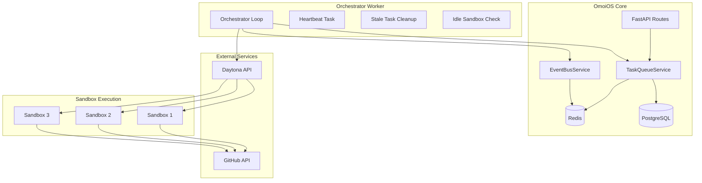
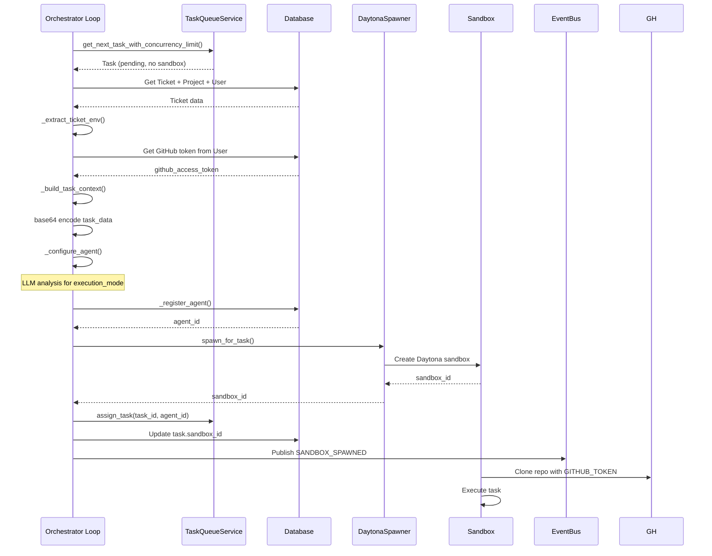
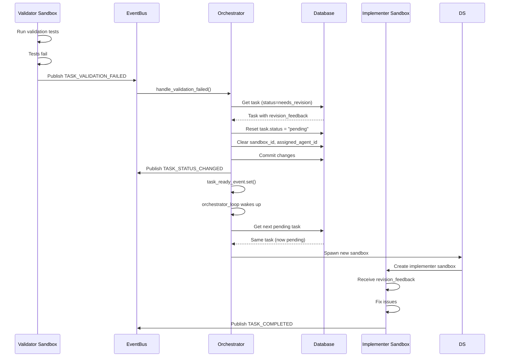

# Orchestrator Service Design Document

**Date:** 2026-04-22  
**Status:** Active  
**Purpose:** Design documentation for the Orchestrator Worker service that manages task execution, sandbox spawning, and agent coordination in OmoiOS.  
**Related Docs:** [Guardian Monitoring](./guardian_monitoring.md), [Discovery Service](./discovery_service.md), [Conductor Coherence](./conductor_coherence.md), [Phase Manager](./phase_manager.md)

---

## 1. Overview

The Orchestrator Service is the central execution engine of OmoiOS, responsible for polling task queues, spawning isolated sandboxes (Daytona), and coordinating agent execution. It operates as a standalone worker process that bridges the gap between task creation and actual code execution.

### Key Responsibilities

- **Task Queue Polling**: Continuously monitors for pending tasks across all phases
- **Sandbox Lifecycle**: Spawns, monitors, and terminates Daytona sandboxes per task
- **Agent Assignment**: Assigns tasks to available agents (legacy mode) or sandboxes (modern mode)
- **Event-Driven Coordination**: Responds to task events for immediate processing
- **Resource Management**: Enforces concurrency limits and cleans up stale resources
- **Validation Workflows**: Handles implementation-validation cycles for quality assurance

### Execution Modes

The orchestrator supports three distinct execution modes:

1. **Sandbox Mode** (default): Spawns isolated Daytona containers per task
2. **Legacy Mode**: Assigns tasks to registered agents that poll for work
3. **Dry-Run Mode**: Simulates decisions without spawning actual sandboxes

---

## 2. Architecture

### System Context



### Component Diagram

```mermaid
graph TB
    subgraph "Orchestrator Components"
        MAIN[main() Entry Point]
        INIT[init_services()]
        OL[orchestrator_loop()]
        SPAWN[_spawn_sandbox_for_task()]
        CONFIG[_configure_agent()]
        REG[_register_agent()]
    end
    
    subgraph "Context Building"
        EXTRACT[_extract_spawn_env_from_db()]
        BUILD_CTX[_build_task_context()]
        EXTRACT_GH[_extract_github_token()]
        EXTRACT_TICKET[_extract_ticket_env()]
    end
    
    subgraph "Event Handlers"
        HANDLE_TASK[handle_task_event()]
        HANDLE_VAL[handle_validation_failed()]
    end
    
    subgraph "Background Loops"
        HB[heartbeat_task()]
        STC[stale_task_cleanup_loop()]
        ISC[idle_sandbox_check_loop()]
    end
    
    MAIN --> INIT
    INIT --> OL
    OL --> SPAWN
    SPAWN --> EXTRACT
    SPAWN --> CONFIG
    SPAWN --> REG
    
    EXTRACT --> EXTRACT_TICKET
    EXTRACT --> EXTRACT_GH
    EXTRACT --> BUILD_CTX
    
    OL --> HANDLE_TASK
    OL --> HANDLE_VAL
    
    MAIN --> HB
    MAIN --> STC
    MAIN --> ISC
```

---

## 3. Public API Surface

### Core Functions

#### `orchestrator_loop()`

```python
async def orchestrator_loop() -> None
```

Main event loop that polls for tasks and spawns sandboxes. Supports hybrid event-driven + polling approach.

**Behavior:**
- Subscribes to TASK_CREATED, TICKET_CREATED, SANDBOX_agent.* events
- Polls every 1-5 seconds as fallback
- Enforces MAX_CONCURRENT_TASKS_PER_PROJECT limit
- Handles both implementation and validation task spawning

---

#### `_spawn_sandbox_for_task()`

```python
async def _spawn_sandbox_for_task(
    task: Task,
    spawn_mode: Literal["implementation", "validation"],
    daytona_spawner: DaytonaSpawner,
    log: structlog.BoundLogger,
) -> None
```

Unified sandbox spawn pipeline for both implementation and validation tasks.

**Pipeline Steps:**
1. Extract env vars from DB (ticket, project, user, GitHub token)
2. Configure agent type, capabilities, execution mode
3. Register agent in database
4. Spawn sandbox via Daytona API
5. Update task with sandbox_id
6. Publish SANDBOX_SPAWNED event

---

#### `analyze_task_requirements()`

```python
async def analyze_task_requirements(
    task_description: str,
    task_type: Optional[str] = None,
    ticket_title: Optional[str] = None,
    ticket_description: Optional[str] = None,
) -> TaskRequirements
```

Uses LLM to intelligently determine task execution requirements.

**Returns:**
- `execution_mode`: exploration, implementation, or validation
- `output_type`: analysis, documentation, code, tests, etc.
- `requires_code_changes`: bool
- `requires_pull_request`: bool
- `reasoning`: str (explanation for decisions)

---

#### `handle_validation_failed()`

```python
def handle_validation_failed(event_data: dict) -> None
```

Handles TASK_VALIDATION_FAILED events to reset tasks for re-implementation.

**Actions:**
1. Retrieves task from database
2. Resets status from "needs_revision" to "pending"
3. Clears sandbox_id and assigned_agent_id
4. Preserves revision_feedback in task.result
5. Publishes TASK_STATUS_CHANGED event
6. Wakes up orchestrator via task_ready_event

---

### Data Classes

#### `SandboxSpawnContext`

```python
@dataclass
class SandboxSpawnContext:
    task_id: str
    phase_id: str
    ticket_id: str
    task_type: str
    task_description: str
    task_priority: str
    task_result: Optional[dict] = None
    task_execution_config: Optional[dict] = None
    spawn_mode: Literal["implementation", "validation"] = "implementation"
    extra_env: dict[str, str] = field(default_factory=dict)
    user_id_for_token: Optional[str] = None
    agent_type: Optional[str] = None
    agent_capabilities: Optional[list[str]] = None
    execution_mode: Optional[str] = None
    task_requirements: Optional[TaskRequirements] = None
    require_spec_skill: bool = False
    project_id: Optional[str] = None
```

---

## 4. Data Flow

### Task Spawning Sequence



### Validation Failure Recovery



---

## 5. Integration Points

### Service Dependencies

| Service | Purpose | Initialization Location |
|---------|---------|------------------------|
| DatabaseService | Persistence layer | init_services() |
| TaskQueueService | Task lifecycle management | init_services() |
| EventBusService | Redis pub/sub events | init_services() |
| AgentRegistryService | Agent registration | init_services() |
| DaytonaSpawner | Sandbox lifecycle | Lazy in orchestrator_loop() |
| TaskRequirementsAnalyzer | LLM-based task analysis | init_services() |
| PhaseGateService | Phase validation | init_services() |
| TicketWorkflowOrchestrator | Ticket state management | init_services() |
| PhaseProgressionService | Auto-advancement hooks | init_services() |
| SynthesisService | Parallel result merging | init_services() |
| CoordinationService | Pattern-based coordination | init_services() |
| ConvergenceMergeService | Git branch merging | init_services() |
| OwnershipValidationService | File conflict prevention | init_services() |

### External APIs

| API | Usage | Environment Variables |
|-----|-------|----------------------|
| Daytona API | Sandbox spawn/terminate | DAYTONA_API_KEY, DAYTONA_SERVER_URL |
| GitHub API | Repo cloning, PR creation | GITHUB_TOKEN (from User attributes) |

### Event Subscriptions

```python
event_bus.subscribe("TASK_CREATED", handle_task_event)
event_bus.subscribe("TICKET_CREATED", handle_task_event)
event_bus.subscribe("SANDBOX_agent.completed", handle_task_event)
event_bus.subscribe("SANDBOX_agent.failed", handle_task_event)
event_bus.subscribe("SANDBOX_agent.error", handle_task_event)
event_bus.subscribe("TASK_VALIDATION_FAILED", handle_validation_failed)
event_bus.subscribe("TASK_VALIDATION_PASSED", handle_task_event)
```

---

## 6. Error Handling

### Sandbox Spawn Failures

```python
try:
    await _spawn_sandbox_for_task(task, "implementation", daytona_spawner, log)
except Exception as spawn_error:
    stats["tasks_failed"] += 1
    log.error("sandbox_spawn_failed", error=str(spawn_error))
    
    # Mark task as failed for retry
    queue.update_task_status(
        task.id,
        "failed",
        error_message=f"Sandbox spawn failed: {spawn_error}",
    )
```

### Stale Task Cleanup

Tasks stuck in "assigned" or "claiming" status are automatically cleaned up:

```python
# Reset claiming tasks (orchestrator crashed after claiming)
claiming_cleaned = queue.cleanup_stale_claiming_tasks(
    stale_threshold_seconds=60,
)

# Mark assigned tasks as failed (sandbox crashed)
cleaned_tasks = queue.cleanup_stale_assigned_tasks(
    stale_threshold_minutes=3,
    dry_run=False,
)
```

### Idle Sandbox Detection

Sandboxes with heartbeats but no work events are terminated:

```python
idle_monitor = IdleSandboxMonitor(
    db=db,
    daytona_spawner=daytona_spawner,
    event_bus=event_bus,
    idle_threshold=timedelta(minutes=10),
)
terminated = await idle_monitor.check_and_terminate_idle_sandboxes()
```

---

## 7. Configuration

### Environment Variables

| Variable | Default | Description |
|----------|---------|-------------|
| ORCHESTRATOR_ENABLED | true | Master switch to disable orchestrator |
| ORCHESTRATOR_DRY_RUN | false | Simulate without spawning sandboxes |
| SANDBOX_EXECUTION | true | Enable Daytona sandbox mode |
| MAX_CONCURRENT_TASKS_PER_PROJECT | 5 | Concurrency limit per project |
| STALE_TASK_CLEANUP_ENABLED | true | Enable stale task cleanup |
| STALE_TASK_THRESHOLD_MINUTES | 3 | Threshold for stale assigned tasks |
| STALE_CLAIMING_THRESHOLD_SECONDS | 60 | Threshold for stale claiming tasks |
| STALE_TASK_CHECK_INTERVAL_SECONDS | 15 | Cleanup check frequency |
| IDLE_DETECTION_ENABLED | true | Enable idle sandbox detection |
| IDLE_THRESHOLD_MINUTES | 10 | Idle sandbox threshold |
| IDLE_CHECK_INTERVAL_SECONDS | 30 | Idle check frequency |
| SANDBOX_RUNTIME | claude | Default sandbox runtime |

### Task Type Categories

```python
# Research/analysis tasks (no code changes)
EXPLORATION_TASK_TYPES = frozenset([
    "explore_codebase",
    "analyze_codebase",
    "analyze_requirements",
    "create_spec",
    "generate_prd",
    "research",
    "discover",
    "investigate",
])

# Validation tasks
VALIDATION_TASK_TYPES = frozenset([
    "validate",
    "validate_implementation",
    "review_code",
    "run_tests",
])

# Implementation tasks (default)
# implement_feature, fix_bug, write_tests, refactor, deploy
```

---

## 8. Related Documentation

- [Guardian Monitoring](./guardian_monitoring.md) - Agent health monitoring and intervention
- [Discovery Service](./discovery_service.md) - Adaptive workflow branching
- [Conductor Coherence](./conductor_coherence.md) - System-wide coherence analysis
- [Phase Manager](./phase_manager.md) - Phase transition orchestration
- [ARCHITECTURE.md](../../../ARCHITECTURE.md) - System architecture overview
- [backend/CLAUDE.md](../../../backend/CLAUDE.md) - Backend development guide

---

## Appendix: File Reference

**Source File:** `backend/omoi_os/workers/orchestrator_worker.py`  
**Lines:** 1617  
**Key Classes:** SandboxSpawnContext  
**Key Functions:** orchestrator_loop, _spawn_sandbox_for_task, analyze_task_requirements, handle_validation_failed
