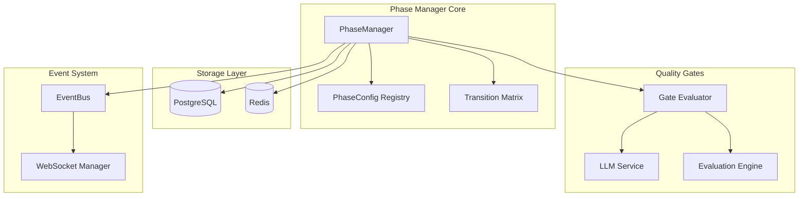
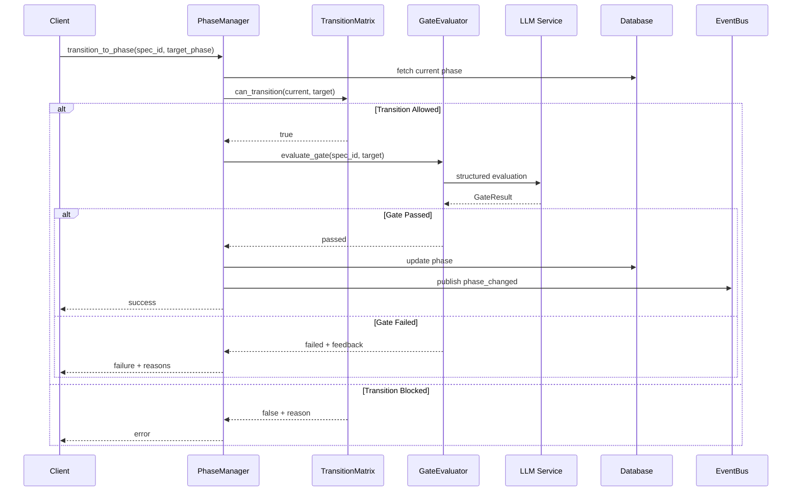
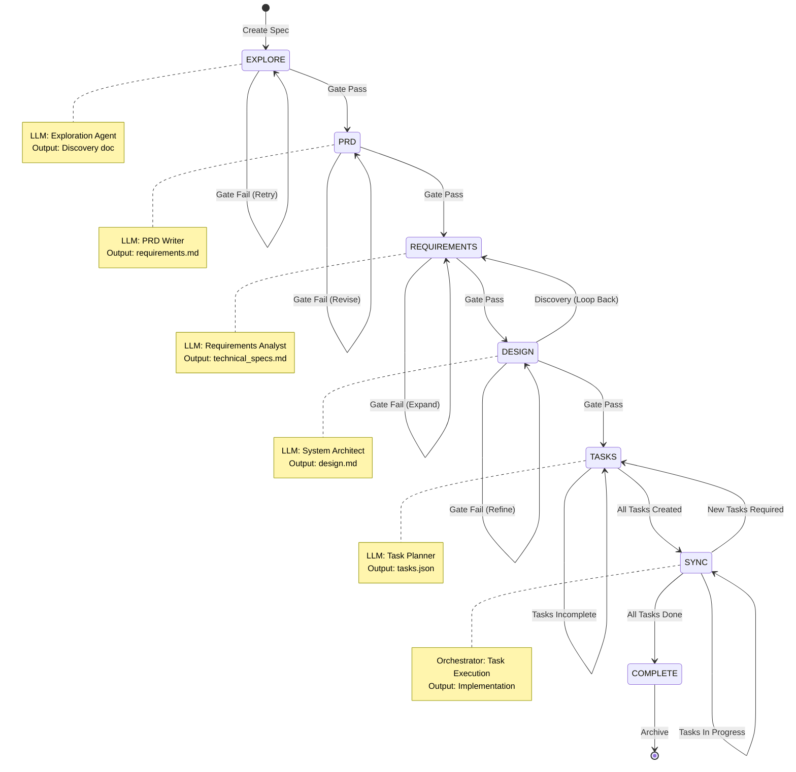
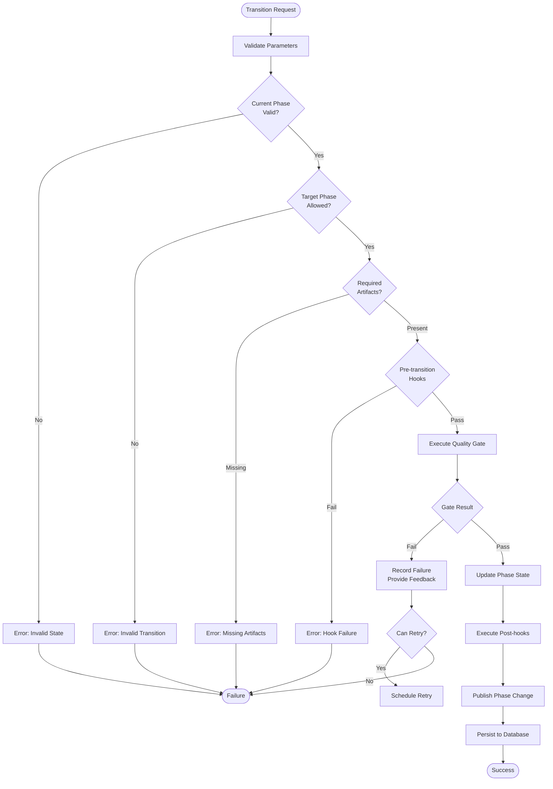
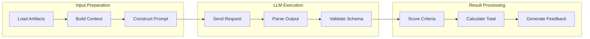

# Phase Manager Service Design

> **Date**: 2025-07-20 | **Status**: Active | **Version**: 1.0 | **Owner**: Deep Docs Pipeline
> **Source**: Generated from codebase analysis | **Cross-links**: See Related Documents section

## Table of Contents

1. [Overview](#overview)
2. [Architecture](#architecture)
3. [Core Components](#core-components)
4. [Phase State Machine](#phase-state-machine)
5. [Phase Transitions](#phase-transitions)
6. [Quality Gates](#quality-gates)
7. [LLM Evaluation](#llm-evaluation)
8. [Configuration](#configuration)
9. [Error Handling](#error-handling)
10. [Related Documents](#related-documents)

---

## Overview

The Phase Manager Service orchestrates the spec-driven development lifecycle through a finite state machine. It manages transitions between seven distinct phases (EXPLORE → PRD → REQUIREMENTS → DESIGN → TASKS → SYNC → COMPLETE), enforces quality gates at each transition, and coordinates LLM-based evaluations to ensure deliverables meet acceptance criteria before progression.

### Key Responsibilities

- **State Management**: Track and persist phase state for each spec
- **Transition Control**: Validate prerequisites before allowing phase changes
- **Quality Assurance**: Execute LLM evaluators to verify phase completion
- **Event Coordination**: Publish phase change events to the event bus
- **Auto-Advancement**: Automatically progress specs when quality gates pass

---

## Architecture



### Component Interaction Flow



---

## Core Components

### PhaseManager Class

**Location**: `backend/omoi_os/services/phase_manager.py`

```python
class PhaseManager:
    """
    Central coordinator for spec phase lifecycle management.
    
    Responsibilities:
    - Phase transition validation and execution
    - Quality gate orchestration
    - State persistence and caching
    - Event publication for phase changes
    """
    
    def __init__(
        self,
        db_session: AsyncSession,
        event_bus: EventBusService,
        llm_service: LLMService,
        cache: RedisCache
    ) -> None:
        self.db = db_session
        self.events = event_bus
        self.llm = llm_service
        self.cache = cache
        self._transition_matrix: TransitionMatrix
        self._gate_registry: GateRegistry
    
    async def transition_to_phase(
        self,
        spec_id: UUID,
        target_phase: SpecPhase,
        force: bool = False,
        context: dict[str, Any] | None = None
    ) -> PhaseTransitionResult:
        """
        Execute phase transition with full validation and gate checking.
        
        Args:
            spec_id: Target specification identifier
            target_phase: Desired phase state
            force: Bypass gate evaluation (admin only)
            context: Additional transition context
            
        Returns:
            PhaseTransitionResult with success status and metadata
        """
        ...
    
    async def can_transition(
        self,
        spec_id: UUID,
        target_phase: SpecPhase
    ) -> tuple[bool, str]:
        """
        Check if transition is allowed without executing.
        
        Returns:
            Tuple of (allowed: bool, reason: str)
        """
        ...
    
    async def check_and_advance(
        self,
        spec_id: UUID,
        auto_advance: bool = True
    ) -> PhaseAdvancementResult:
        """
        Evaluate current phase gates and optionally auto-advance.
        
        Called by:
        - OrchestratorWorker after task completion
        - Guardian monitoring loop
        - Manual advancement requests
        """
        ...
    
    async def get_phase_history(
        self,
        spec_id: UUID,
        limit: int = 50
    ) -> list[PhaseTransitionRecord]:
        """Retrieve phase transition audit trail."""
        ...
    
    async def rollback_to_phase(
        self,
        spec_id: UUID,
        target_phase: SpecPhase,
        preserve_outputs: bool = False
    ) -> RollbackResult:
        """
        Rollback spec to previous phase.
        
        Warning: Destructive operation. May delete phase outputs.
        """
        ...
```

### PhaseConfig Registry

```python
@dataclass(frozen=True)
class PhaseConfig:
    """
    Immutable configuration for a spec phase.
    
    Defines execution parameters, gate criteria, and
    auto-advancement rules for each phase in the lifecycle.
    """
    
    phase: SpecPhase
    display_name: str
    description: str
    
    # Execution configuration
    execution_mode: ExecutionMode
    timeout_seconds: int
    max_retries: int
    
    # Gate configuration
    gate_type: GateType
    gate_criteria: list[GateCriterion]
    auto_advance: bool
    
    # LLM evaluation settings
    evaluator_prompt: str
    output_schema: type[BaseModel]
    temperature: float = 0.2
    
    # Dependencies
    required_phases: list[SpecPhase]
    required_artifacts: list[str]
    
    # Hooks
    on_enter: list[PhaseHook]
    on_exit: list[PhaseHook]

class PhaseRegistry:
    """
    Registry of phase configurations.
    
    Provides phase lookup, validation, and configuration
    management for the state machine.
    """
    
    _configs: dict[SpecPhase, PhaseConfig]
    
    def register(self, config: PhaseConfig) -> None:
        """Register a phase configuration."""
        ...
    
    def get_config(self, phase: SpecPhase) -> PhaseConfig:
        """Retrieve configuration for a phase."""
        ...
    
    def validate_dependencies(
        self,
        phase: SpecPhase,
        completed_phases: set[SpecPhase]
    ) -> tuple[bool, list[str]]:
        """Check if phase dependencies are satisfied."""
        ...
```

---

## Phase State Machine

### Phase Definitions

```python
class SpecPhase(str, Enum):
    """
    Spec lifecycle phases in execution order.
    
    Each phase represents a distinct stage in the spec-driven
    development workflow with specific deliverables and gates.
    """
    
    # Phase 1: Discovery and exploration
    EXPLORE = "explore"
    
    # Phase 2: Product requirements document
    PRD = "prd"
    
    # Phase 3: Technical requirements
    REQUIREMENTS = "requirements"
    
    # Phase 4: Technical design
    DESIGN = "design"
    
    # Phase 5: Task breakdown
    TASKS = "tasks"
    
    # Phase 6: Execution synchronization
    SYNC = "sync"
    
    # Phase 7: Completion and review
    COMPLETE = "complete"

class PhaseState(str, Enum):
    """Internal phase execution states."""
    
    PENDING = "pending"           # Phase not yet started
    IN_PROGRESS = "in_progress"   # Phase currently executing
    AWAITING_GATE = "awaiting_gate"  # Waiting for quality gate
    COMPLETED = "completed"       # Phase finished successfully
    FAILED = "failed"             # Phase execution failed
    SKIPPED = "skipped"           # Phase bypassed (rare)
```

### State Machine Diagram



---

## Phase Transitions

### Transition Matrix

```python
class TransitionMatrix:
    """
    Defines valid phase transitions and prerequisites.
    
    Encodes the directed graph of allowed movements through
    the spec lifecycle, including special transitions like
    discovery loops and rollback paths.
    """
    
    # Valid forward transitions
    VALID_TRANSITIONS: dict[SpecPhase, set[SpecPhase]] = {
        SpecPhase.EXPLORE: {SpecPhase.PRD},
        SpecPhase.PRD: {SpecPhase.REQUIREMENTS},
        SpecPhase.REQUIREMENTS: {SpecPhase.DESIGN},
        SpecPhase.DESIGN: {SpecPhase.TASKS, SpecPhase.REQUIREMENTS},  # Can loop back
        SpecPhase.TASKS: {SpecPhase.SYNC, SpecPhase.DESIGN},  # Can expand design
        SpecPhase.SYNC: {SpecPhase.COMPLETE, SpecPhase.TASKS},  # Can add tasks
        SpecPhase.COMPLETE: set(),  # Terminal state
    }
    
    # Required artifacts per phase entry
    REQUIRED_ARTIFACTS: dict[SpecPhase, list[str]] = {
        SpecPhase.EXPLORE: [],
        SpecPhase.PRD: ["discovery.md"],
        SpecPhase.REQUIREMENTS: ["prd.md"],
        SpecPhase.DESIGN: ["technical_requirements.md"],
        SpecPhase.TASKS: ["design.md"],
        SpecPhase.SYNC: ["tasks.json"],
        SpecPhase.COMPLETE: ["implementation_complete"],
    }
    
    @classmethod
    def can_transition(
        cls,
        from_phase: SpecPhase,
        to_phase: SpecPhase,
        artifacts: list[str]
    ) -> tuple[bool, str]:
        """
        Validate transition feasibility.
        
        Checks:
        1. Transition exists in valid set
        2. Required artifacts present
        3. No blocking conditions
        """
        ...
```

### Transition Execution Flow



---

## Quality Gates

### Gate Architecture

```python
class GateType(str, Enum):
    """Types of quality gates for phase transitions."""
    
    LLM_EVALUATION = "llm_evaluation"      # LLM-based quality check
    ARTIFACT_VALIDATION = "artifact_validation"  # File/content check
    MANUAL_APPROVAL = "manual_approval"   # Human review required
    AUTOMATED_TEST = "automated_test"      # Test suite execution
    COMPOSITE = "composite"                # Multiple gates combined

@dataclass
class GateCriterion:
    """Individual criterion within a quality gate."""
    
    name: str
    description: str
    weight: float  # 0.0-1.0, contribution to overall score
    evaluator: GateEvaluator
    min_score: float  # Minimum to pass
    required: bool  # Must pass or can fail?

class GateEvaluator(ABC):
    """
    Abstract base for gate evaluation implementations.
    
    Implementations:
    - LLMGateEvaluator: Uses LLM for qualitative assessment
    - ArtifactGateEvaluator: Validates file existence/content
    - TestGateEvaluator: Runs test suites
    - CompositeGateEvaluator: Combines multiple evaluators
    """
    
    @abstractmethod
    async def evaluate(
        self,
        spec_id: UUID,
        phase: SpecPhase,
        context: dict[str, Any]
    ) -> GateResult:
        """
        Execute gate evaluation.
        
        Returns:
            GateResult with score, pass/fail status, and feedback
        """
        ...

@dataclass
class GateResult:
    """Result of a quality gate evaluation."""
    
    passed: bool
    score: float  # 0.0-1.0
    criteria_results: list[CriterionResult]
    feedback: str  # Human-readable assessment
    metadata: dict[str, Any]  # Additional evaluation data
    duration_ms: int
    evaluated_at: datetime
```

### LLM Evaluation Gate

```python
class LLMGateEvaluator(GateEvaluator):
    """
    LLM-based quality gate evaluator.
    
    Uses structured output from LLM to assess phase deliverables
    against defined criteria. Supports multiple evaluation
    dimensions with weighted scoring.
    """
    
    def __init__(
        self,
        llm_service: LLMService,
        prompt_template: str,
        output_schema: type[BaseModel],
        temperature: float = 0.2
    ) -> None:
        self.llm = llm_service
        self.prompt = prompt_template
        self.schema = output_schema
        self.temperature = temperature
    
    async def evaluate(
        self,
        spec_id: UUID,
        phase: SpecPhase,
        context: dict[str, Any]
    ) -> GateResult:
        """
        Execute LLM-based evaluation.
        
        Process:
        1. Gather phase artifacts and context
        2. Construct evaluation prompt
        3. Call LLM with structured output schema
        4. Parse and validate response
        5. Calculate weighted score
        6. Generate feedback
        """
        # Gather artifacts
        artifacts = await self._load_artifacts(spec_id, phase)
        
        # Build prompt with context
        prompt = self._build_evaluation_prompt(
            phase=phase,
            artifacts=artifacts,
            context=context
        )
        
        # Execute LLM evaluation
        evaluation = await self.llm.structured_output(
            prompt=prompt,
            output_type=self.schema,
            temperature=self.temperature
        )
        
        # Calculate results
        criteria_results = self._score_criteria(evaluation)
        overall_score = self._calculate_weighted_score(criteria_results)
        
        return GateResult(
            passed=overall_score >= self._pass_threshold,
            score=overall_score,
            criteria_results=criteria_results,
            feedback=self._generate_feedback(evaluation, criteria_results),
            metadata={"model": self.llm.model_name},
            duration_ms=evaluation.duration_ms,
            evaluated_at=utc_now()
        )
```

### Gate Evaluation Schema Example

```python
class PRDQualityEvaluation(BaseModel):
    """
    Structured output schema for PRD phase quality gate.
    
    Evaluated dimensions:
    - Completeness: All required sections present
    - Clarity: Requirements are unambiguous
    - Feasibility: Technically achievable
    - Testability: Can be verified
    """
    
    completeness_score: float = Field(
        ge=0.0, le=1.0,
        description="Coverage of required PRD sections"
    )
    clarity_score: float = Field(
        ge=0.0, le=1.0,
        description="Unambiguity of requirements"
    )
    feasibility_score: float = Field(
        ge=0.0, le=1.0,
        description="Technical achievability"
    )
    testability_score: float = Field(
        ge=0.0, le=1.0,
        description="Ability to verify implementation"
    )
    
    missing_sections: list[str] = Field(
        default_factory=list,
        description="Required sections not found"
    )
    ambiguous_requirements: list[str] = Field(
        default_factory=list,
        description="Requirements needing clarification"
    )
    
    overall_assessment: str = Field(
        description="Executive summary of PRD quality"
    )
    improvement_suggestions: list[str] = Field(
        default_factory=list,
        description="Specific recommendations"
    )
    
    @property
    def weighted_score(self) -> float:
        """Calculate overall weighted score."""
        weights = {
            "completeness": 0.3,
            "clarity": 0.3,
            "feasibility": 0.25,
            "testability": 0.15
        }
        return (
            self.completeness_score * weights["completeness"] +
            self.clarity_score * weights["clarity"] +
            self.feasibility_score * weights["feasibility"] +
            self.testability_score * weights["testability"]
        )
```

---

## LLM Evaluation

### Evaluation Pipeline



### Evaluation Service Integration

```python
class PhaseEvaluationService:
    """
    Service for executing phase-specific LLM evaluations.
    
    Coordinates with LLMService for structured output generation
    and provides phase-specific evaluation templates.
    """
    
    EVALUATION_PROMPTS: dict[SpecPhase, str] = {
        SpecPhase.EXPLORE: """
            Evaluate the exploration phase output for spec {spec_id}.
            
            Artifacts to evaluate:
            {artifacts}
            
            Criteria:
            1. Problem clarity - Is the problem well-defined?
            2. Scope boundaries - Are boundaries clear?
            3. User understanding - Are user needs identified?
            4. Technical landscape - Is relevant tech identified?
            
            Provide scores (0.0-1.0) and specific feedback.
        """,
        SpecPhase.PRD: """
            Evaluate the PRD for spec {spec_id}.
            
            Required sections: {required_sections}
            PRD content: {prd_content}
            
            Assess:
            - Completeness of all sections
            - Clarity of requirements
            - Feasibility of scope
            - Testability of acceptance criteria
            
            Identify gaps and suggest improvements.
        """,
        # ... additional phase prompts
    }
    
    async def evaluate_phase(
        self,
        spec_id: UUID,
        phase: SpecPhase,
        artifacts: dict[str, str]
    ) -> PhaseEvaluationResult:
        """
        Execute phase evaluation using LLM.
        
        Returns structured evaluation with scores and feedback
        suitable for gate decisions.
        """
        prompt = self._build_prompt(phase, spec_id, artifacts)
        
        schema = self._get_schema_for_phase(phase)
        
        evaluation = await self.llm.structured_output(
            prompt=prompt,
            output_type=schema,
            temperature=0.2  # Low temperature for consistency
        )
        
        return self._process_evaluation(evaluation, phase)
```

---

## Configuration

### Phase Configuration YAML

```yaml
# config/phases.yaml

phases:
  explore:
    display_name: "Discovery & Exploration"
    description: "Understand the problem space and user needs"
    
    execution:
      mode: "exploration"
      timeout_seconds: 300
      max_retries: 2
    
    gate:
      type: "llm_evaluation"
      auto_advance: true
      criteria:
        - name: "problem_clarity"
          weight: 0.3
          min_score: 0.7
        - name: "scope_definition"
          weight: 0.3
          min_score: 0.7
        - name: "user_understanding"
          weight: 0.4
          min_score: 0.6
    
    llm:
      evaluator_prompt: "prompts/exploration_evaluator.txt"
      temperature: 0.3
    
    artifacts:
      required: []
      produced:
        - "discovery.md"
    
    hooks:
      on_enter: []
      on_exit: ["notify_exploration_complete"]

  prd:
    display_name: "Product Requirements"
    description: "Define product requirements and acceptance criteria"
    
    execution:
      mode: "implementation"
      timeout_seconds: 600
      max_retries: 3
    
    gate:
      type: "llm_evaluation"
      auto_advance: true
      criteria:
        - name: "completeness"
          weight: 0.3
          min_score: 0.8
        - name: "clarity"
          weight: 0.3
          min_score: 0.8
        - name: "feasibility"
          weight: 0.25
          min_score: 0.7
        - name: "testability"
          weight: 0.15
          min_score: 0.7
    
    artifacts:
      required:
        - "discovery.md"
      produced:
        - "prd.md"
    
    dependencies:
      phases:
        - "explore"

  # ... additional phase configurations
```

---

## Error Handling

### Phase Error Types

```python
class PhaseError(Exception):
    """Base exception for phase management errors."""
    
    def __init__(
        self,
        message: str,
        spec_id: UUID,
        phase: SpecPhase,
        recoverable: bool = False
    ) -> None:
        super().__init__(message)
        self.spec_id = spec_id
        self.phase = phase
        self.recoverable = recoverable

class InvalidTransitionError(PhaseError):
    """Requested transition violates state machine rules."""
    pass

class GateEvaluationError(PhaseError):
    """Quality gate evaluation failed."""
    
    def __init__(
        self,
        message: str,
        spec_id: UUID,
        phase: SpecPhase,
        gate_results: list[GateResult]
    ) -> None:
        super().__init__(message, spec_id, phase, recoverable=True)
        self.gate_results = gate_results

class ArtifactMissingError(PhaseError):
    """Required artifacts not found for phase transition."""
    pass

class PhaseTimeoutError(PhaseError):
    """Phase execution exceeded timeout."""
    pass
```

### Recovery Strategies

```python
class PhaseRecoveryService:
    """
    Handles recovery from phase execution failures.
    
    Implements retry logic, rollback capabilities, and
    escalation procedures for unrecoverable errors.
    """
    
    async def attempt_recovery(
        self,
        error: PhaseError
    ) -> RecoveryResult:
        """
        Attempt to recover from phase error.
        
        Strategies:
        1. Retry with backoff (for transient failures)
        2. Rollback to previous phase (for quality failures)
        3. Escalate to manual review (for complex failures)
        """
        if isinstance(error, GateEvaluationError) and error.recoverable:
            # Retry with feedback incorporation
            return await self._retry_with_feedback(error)
        
        if isinstance(error, PhaseTimeoutError):
            # Extend timeout and retry
            return await self._extend_and_retry(error)
        
        # Default: escalate
        return await self._escalate_to_manual(error)
```

---

## Related Documents

| Document | Purpose | Location |
|----------|---------|----------|
| **Spec State Machine** | Detailed state machine documentation | `docs/architecture/03-spec-state-machine.md` |
| **Orchestrator Worker** | Task execution and phase advancement | `docs/design/services/orchestrator_worker.md` |
| **Event Bus** | Event publishing for phase changes | `docs/design/services/event_bus.md` |
| **LLM Service** | Structured output and evaluation | `docs/design/services/llm_service.md` |
| **Spec Model** | Database schema for specs | `docs/design/models/spec.md` |
| **API Routes** | Phase management endpoints | `docs/design/api/phase_routes.md` |

### Cross-References

- **Orchestrator Integration**: PhaseManager calls `check_and_advance()` after task completion → see Orchestrator Worker design
- **Event Publishing**: All phase changes publish `SystemEvent` → see Event Bus design
- **LLM Evaluation**: Uses `structured_output()` from LLMService → see LLM Service design
- **Database**: Phase state stored in `specs` table → see Spec Model design
- **Configuration**: Phase configs loaded from YAML → see `backend/config/phases.yaml`

---

## API Reference

### Phase Management Endpoints

```python
# backend/omoi_os/api/routes/phases.py

@router.post("/specs/{spec_id}/phases/transition")
async def transition_phase(
    spec_id: UUID,
    request: PhaseTransitionRequest,
    phase_manager: PhaseManager = Depends(get_phase_manager)
) -> PhaseTransitionResponse:
    """
    Execute phase transition for a spec.
    
    Validates prerequisites, executes quality gates,
    and updates spec state atomically.
    """
    ...

@router.get("/specs/{spec_id}/phases/current")
async def get_current_phase(
    spec_id: UUID,
    phase_manager: PhaseManager = Depends(get_phase_manager)
) -> CurrentPhaseResponse:
    """Get current phase and state for a spec."""
    ...

@router.get("/specs/{spec_id}/phases/history")
async def get_phase_history(
    spec_id: UUID,
    limit: int = Query(default=50, le=100),
    phase_manager: PhaseManager = Depends(get_phase_manager)
) -> list[PhaseTransitionRecord]:
    """Retrieve phase transition history."""
    ...

@router.post("/specs/{spec_id}/phases/evaluate")
async def evaluate_phase_gate(
    spec_id: UUID,
    phase_manager: PhaseManager = Depends(get_phase_manager)
) -> GateEvaluationResponse:
    """
    Manually trigger quality gate evaluation.
    
    Used for:
    - Re-evaluating after revisions
    - Manual quality checks
    - Debugging gate failures
    """
    ...
```

---

*Generated from source: `backend/omoi_os/services/phase_manager.py`*
*Last updated: 2025-07-20*
