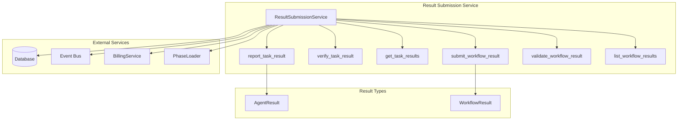
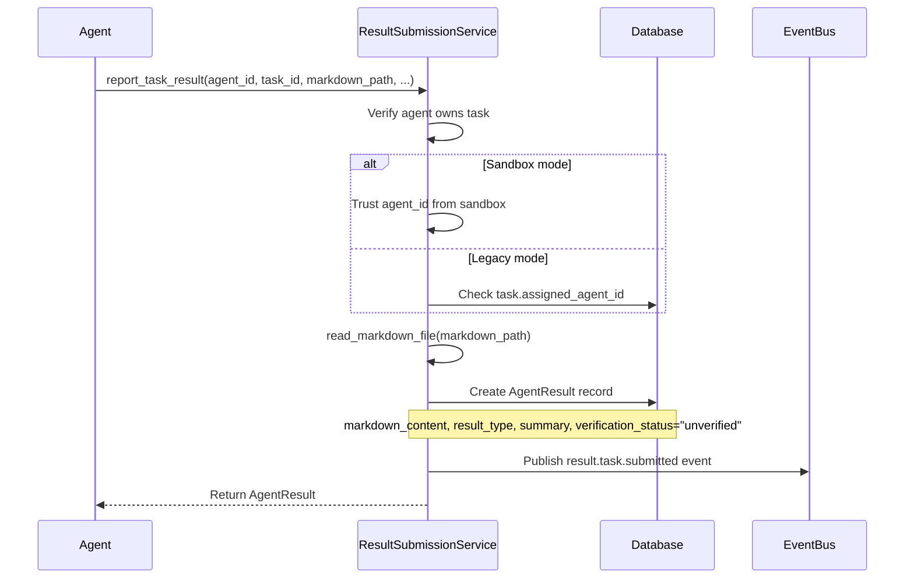
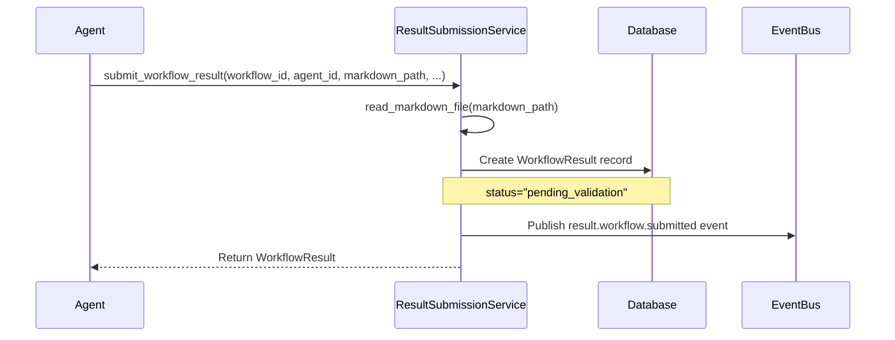
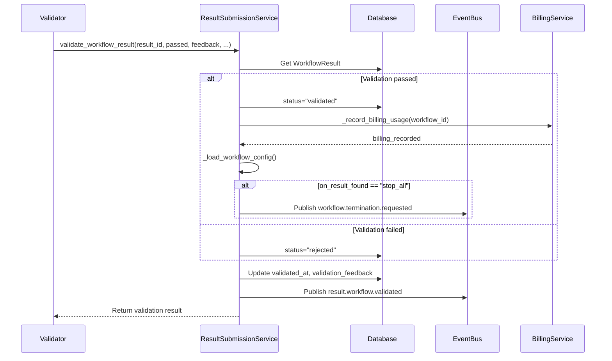
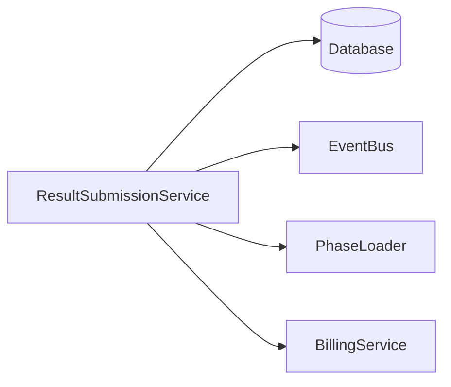

# Result Submission Service

> **Date**: 2025-07-20 | **Status**: Active | **Version**: 1.0 | **Owner**: Deep Docs Pipeline
> **Source**: Generated from codebase analysis | **Cross-links**: See Related Documents section

## Overview

The Result Submission Service manages the submission, validation, and lifecycle of both task-level and workflow-level results. It provides a unified interface for agents to report their achievements, handles verification workflows, and integrates with the billing system for workflow completion tracking. The service supports markdown-based result documentation with automatic validation and event-driven notifications.

## Architecture



## Key Components

### ResultSubmissionService Class

`backend/omoi_os/services/result_submission.py:24-479`

```python
class ResultSubmissionService:
    """Service for submitting and validating task-level and workflow-level results."""
    
    def __init__(
        self,
        db: DatabaseService,
        event_bus: Optional[EventBusService] = None,
        phase_loader: Optional[PhaseLoader] = None,
        billing_service: Optional["BillingService"] = None,
    ):
        self.db = db
        self.event_bus = event_bus
        self.phase_loader = phase_loader or PhaseLoader()
        self.billing_service = billing_service
```

**Task-Level Methods:**

| Method | Line | Purpose |
|--------|------|---------|
| `report_task_result` | 56-130 | Submit task-level AgentResult |
| `verify_task_result` | 132-175 | Mark task result as verified/disputed |
| `get_task_results` | 177-197 | Retrieve all results for a task |

**Workflow-Level Methods:**

| Method | Line | Purpose |
|--------|------|---------|
| `submit_workflow_result` | 203-259 | Submit workflow-level result |
| `validate_workflow_result` | 261-355 | Validate workflow result (pass/fail) |
| `list_workflow_results` | 357-377 | List all results for a workflow |

## Task-Level Results

### AgentResult Submission

`backend/omoi_os/services/result_submission.py:56-130`



```python
def report_task_result(
    self,
    agent_id: str,
    task_id: str,
    markdown_file_path: str,
    result_type: str,
    summary: str,
) -> AgentResult:
    """Submit task-level result."""
    
    # Verify agent owns task
    with self.db.get_session() as session:
        task = session.get(Task, task_id)
        
        # Sandbox tasks use sandbox_id, not assigned_agent_id
        if task.sandbox_id:
            pass  # Trust sandbox worker's agent_id
        elif task.assigned_agent_id != agent_id:
            raise ValueError(f"Task not assigned to agent {agent_id}")
    
    # Validate and read file
    markdown_content = read_markdown_file(markdown_file_path)
    
    # Create result record
    result = AgentResult(
        agent_id=agent_id,
        task_id=task_id,
        markdown_content=markdown_content,
        markdown_file_path=markdown_file_path,
        result_type=result_type,
        summary=summary,
        verification_status="unverified",
    )
```

### Task Result Verification

`backend/omoi_os/services/result_submission.py:132-175`

```python
def verify_task_result(
    self,
    result_id: str,
    validation_review_id: str,
    verified: bool,
) -> Optional[AgentResult]:
    """Mark task result as verified or disputed."""
    
    with self.db.get_session() as session:
        result = session.get(AgentResult, result_id)
        
        result.verification_status = "verified" if verified else "disputed"
        result.verified_at = utc_now()
        result.verified_by_validation_id = validation_review_id
        
        session.commit()
        
        # Publish verification event
        self.event_bus.publish(SystemEvent(
            event_type=f"result.task.{'verified' if verified else 'disputed'}",
            entity_type="agent_result",
            entity_id=result.id,
            payload={
                "task_id": result.task_id,
                "verification_status": result.verification_status,
            },
        ))
```

## Workflow-Level Results

### Workflow Result Submission

`backend/omoi_os/services/result_submission.py:203-259`



```python
def submit_workflow_result(
    self,
    workflow_id: str,
    agent_id: str,
    markdown_file_path: str,
    explanation: Optional[str] = None,
    evidence: Optional[List[str]] = None,
) -> WorkflowResult:
    """Submit workflow-level result."""
    
    # Validate file
    read_markdown_file(markdown_file_path)
    
    # Create result record
    result = WorkflowResult(
        workflow_id=workflow_id,
        agent_id=agent_id,
        markdown_file_path=markdown_file_path,
        explanation=explanation,
        evidence={"items": evidence} if evidence else None,
        status="pending_validation",
    )
    
    session.add(result)
    session.commit()
    
    # Publish event
    self.event_bus.publish(SystemEvent(
        event_type="result.workflow.submitted",
        entity_type="workflow_result",
        entity_id=result.id,
        payload={
            "workflow_id": workflow_id,
            "agent_id": agent_id,
        },
    ))
```

### Workflow Result Validation

`backend/omoi_os/services/result_submission.py:261-355`



```python
def validate_workflow_result(
    self,
    result_id: str,
    passed: bool,
    feedback: str,
    evidence: List[dict],
    validator_agent_id: str,
) -> dict:
    """Validate workflow result (validator agents only)."""
    
    with self.db.get_session() as session:
        result = session.get(WorkflowResult, result_id)
        
        # Update validation status
        result.status = "validated" if passed else "rejected"
        result.validated_at = utc_now()
        result.validation_feedback = feedback
        
        session.commit()
        
        # Publish validation event
        self.event_bus.publish(SystemEvent(
            event_type="result.workflow.validated",
            entity_type="workflow_result",
            entity_id=result.id,
            payload={
                "workflow_id": workflow_id,
                "passed": passed,
                "validator_agent_id": validator_agent_id,
            },
        ))
        
        # Determine action
        action_taken = "none"
        billing_recorded = False
        
        if passed:
            # Record billing
            billing_recorded = self._record_billing_usage(workflow_id)
            
            # Check workflow config for on_result_found
            config = self._load_workflow_config(workflow_id)
            on_result_found = config.get("on_result_found", "stop_all")
            
            if on_result_found == "stop_all":
                # Trigger workflow termination
                self.event_bus.publish(SystemEvent(
                    event_type="workflow.termination.requested",
                    entity_type="ticket",
                    entity_id=workflow_id,
                    payload={
                        "result_id": result_id,
                        "reason": "validated_result_found",
                    },
                ))
                action_taken = "workflow_terminated"
```

## Billing Integration

### Usage Recording

`backend/omoi_os/services/result_submission.py:409-479`

```python
def _record_billing_usage(self, workflow_id: str) -> bool:
    """Record workflow completion for billing."""
    
    if not self.billing_service:
        return False
    
    with self.db.get_session() as session:
        ticket = session.get(Ticket, workflow_id)
        project = session.get(Project, ticket.project_id)
        organization_id = project.organization_id
        
        usage_details = {
            "workflow_id": str(workflow_id),
            "ticket_title": ticket.title or "Untitled workflow",
        }
        
        usage_record = self.billing_service.record_workflow_usage(
            organization_id=organization_id,
            ticket_id=workflow_id,
            usage_details=usage_details,
        )
        
        if usage_record:
            logger.info(
                f"Recorded billing usage for workflow {workflow_id}, "
                f"org {organization_id}, charged: ${usage_record.amount:.2f}"
            )
            return True
```

## Data Models

### AgentResult

`backend/omoi_os/models/agent_result.py`

| Field | Type | Description |
|-------|------|-------------|
| `id` | UUID | Primary key |
| `agent_id` | UUID | Submitting agent |
| `task_id` | UUID | Related task |
| `markdown_content` | Text | Result documentation |
| `markdown_file_path` | String | Path to result file |
| `result_type` | String | Type of result (implementation, analysis, etc.) |
| `summary` | String | Brief summary |
| `verification_status` | String | unverified, verified, disputed |
| `verified_at` | datetime | When verified |
| `verified_by_validation_id` | UUID | Validator reference |

### WorkflowResult

`backend/omoi_os/models/workflow_result.py`

| Field | Type | Description |
|-------|------|-------------|
| `id` | UUID | Primary key |
| `workflow_id` | UUID | Related ticket/workflow |
| `agent_id` | UUID | Submitting agent |
| `markdown_file_path` | String | Path to result file |
| `explanation` | Text | What was accomplished |
| `evidence` | JSONB | List of evidence items |
| `status` | String | pending_validation, validated, rejected |
| `validated_at` | datetime | When validated |
| `validation_feedback` | Text | Validator feedback |

## Event Bus Integration

### Published Events

| Event | Trigger | Payload |
|-------|---------|---------|
| `result.task.submitted` | report_task_result | agent_id, task_id, result_type |
| `result.task.verified` | verify_task_result (passed) | task_id, verification_status |
| `result.task.disputed` | verify_task_result (failed) | task_id, verification_status |
| `result.workflow.submitted` | submit_workflow_result | workflow_id, agent_id |
| `result.workflow.validated` | validate_workflow_result | workflow_id, passed, validator_agent_id |
| `workflow.termination.requested` | validate_workflow_result (passed + stop_all) | result_id, reason |

## Workflow Configuration

### on_result_found Behavior

`backend/omoi_os/services/result_submission.py:383-407`

```python
def _load_workflow_config(self, workflow_id: str) -> dict:
    """Load workflow configuration from YAML."""
    
    try:
        config = self.phase_loader.load_workflow_config("software_development.yaml")
        return {
            "has_result": config.has_result,
            "result_criteria": config.result_criteria,
            "on_result_found": config.on_result_found,  # "stop_all" or "do_nothing"
        }
    except Exception:
        # Fallback to safe defaults
        return {
            "has_result": False,
            "result_criteria": "",
            "on_result_found": "do_nothing",
        }
```

| on_result_found | Behavior |
|-----------------|----------|
| `stop_all` | Trigger workflow termination on validation |
| `do_nothing` | Log result only, continue execution |

## Validation Helpers

### Markdown File Reading

`backend/omoi_os/services/validation_helpers.py`

```python
def read_markdown_file(file_path: str) -> str:
    """Read and validate a markdown file.
    
    Raises:
        FileNotFoundError: If file doesn't exist
        ValueError: If file is empty or not markdown
    """
    path = Path(file_path)
    
    if not path.exists():
        raise FileNotFoundError(f"Markdown file not found: {file_path}")
    
    if not path.suffix.lower() in ['.md', '.markdown']:
        raise ValueError(f"File must be markdown: {file_path}")
    
    content = path.read_text(encoding='utf-8')
    
    if not content.strip():
        raise ValueError(f"Markdown file is empty: {file_path}")
    
    return content
```

## Integration Points

### Service Dependencies



### Agent Output Collector Integration

The AgentOutputCollector works with results to:

1. **Extract error context** from failed task results
2. **Monitor result submission** via event bus
3. **Correlate results** with agent activity

## Error Handling

### Common Error Scenarios

| Scenario | Error Type | Handling |
|----------|------------|----------|
| Task not found | ValueError | Raise to caller |
| Agent doesn't own task | ValueError | Raise to caller |
| Markdown file not found | FileNotFoundError | Raise to caller |
| Empty markdown file | ValueError | Raise to caller |
| Workflow result not found | ValueError | Raise to caller |
| Billing service error | Exception | Log error, don't fail validation |

## Testing Considerations

### Unit Test Areas

1. **Task result submission** - Verify ownership checks
2. **Workflow result submission** - Verify file validation
3. **Validation** - Test pass/fail paths
4. **Billing integration** - Test usage recording
5. **Event publishing** - Verify event payloads

### Integration Test Areas

1. **End-to-end submission** - Submit → Validate → Complete
2. **Billing flow** - Validate passed → Record usage
3. **Termination flow** - Validate passed → Terminate workflow
4. **Event chain** - Verify all events published

## Related Documents

- Agent Output Collector - Monitors result-related activity
- [Task Queue Service](./task_queue.md) - Manages tasks that produce results
- [Diagnostic Service](./diagnostic_service.md) - Analyzes failed results
- Billing Service - Records workflow completion
- [Architecture Overview](../../../ARCHITECTURE.md) - System-wide context
