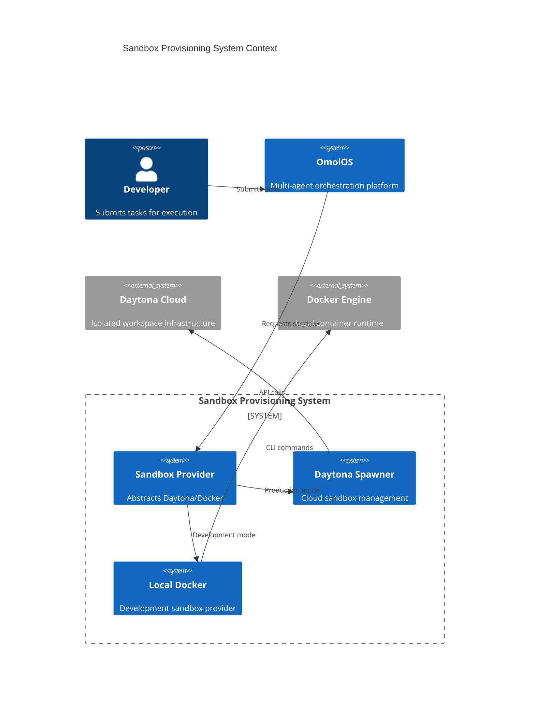
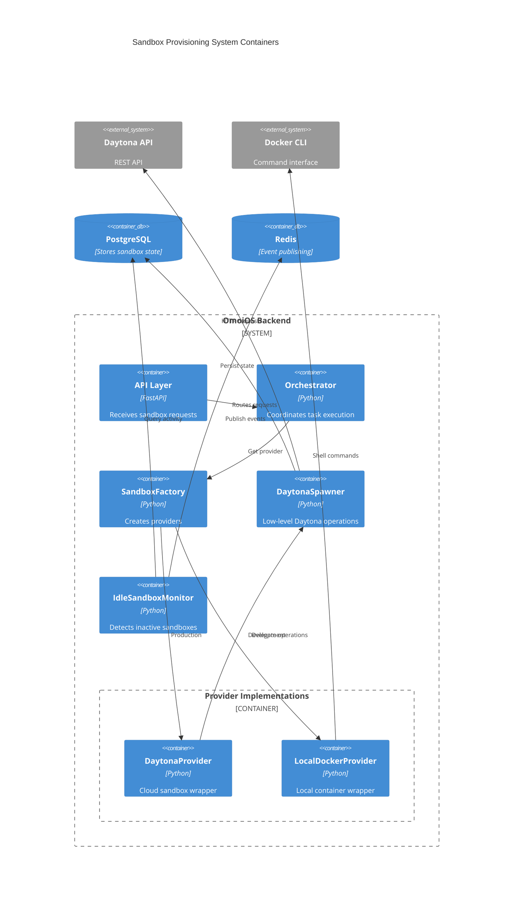
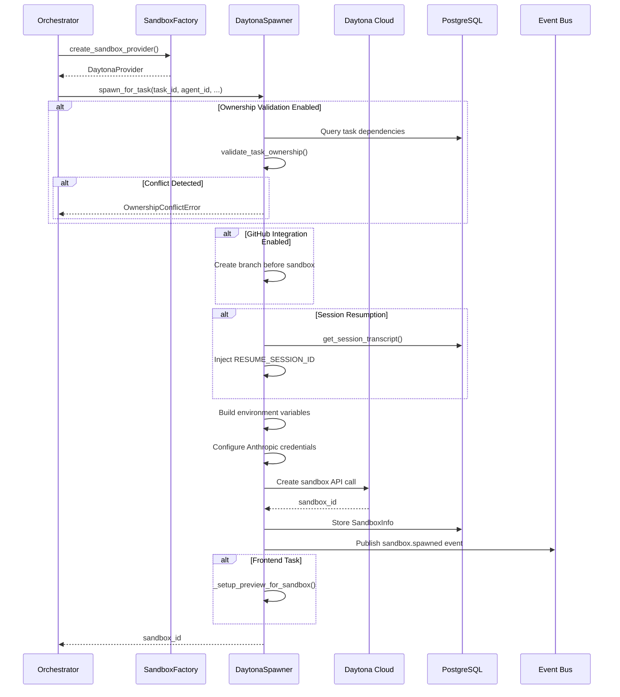
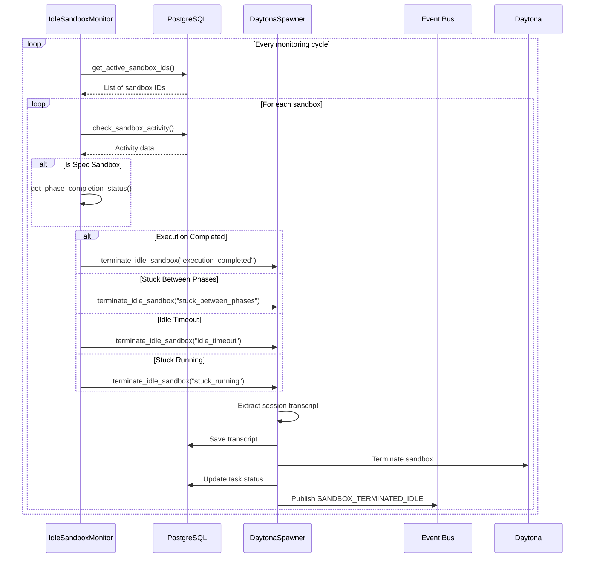

# Sandbox Provisioning System

**Date**: 2026-04-22  
**Status**: Active  
**Version**: 1.0

---

## Overview

The Sandbox Provisioning System is a core infrastructure component of OmoiOS responsible for creating, managing, and terminating isolated execution environments for AI agents. It provides a unified abstraction layer over multiple sandbox providers (Daytona Cloud and local Docker) while handling resource allocation, lifecycle management, and idle detection.

### Key Responsibilities

- **Sandbox Lifecycle Management**: Spawn, monitor, and terminate sandboxes for task execution
- **Provider Abstraction**: Support both Daytona Cloud (production) and local Docker (development)
- **Resource Configuration**: CPU, memory, disk allocation with configurable limits
- **Environment Injection**: Pass credentials, API keys, and configuration via environment variables
- **Idle Detection**: Monitor and terminate inactive sandboxes to optimize resource usage
- **Session Resumption**: Support for resuming interrupted agent sessions

### Architecture Philosophy

The system follows a **provider pattern** with protocol-based interfaces, enabling seamless switching between local development (Docker) and production (Daytona) environments without code changes. All sandbox operations are asynchronous to prevent blocking the orchestrator.

---

## Architecture

### System Context (C4 Level 1)



### Container Diagram (C4 Level 2)



---

## Service Matrix

| Service | File | Lines | Purpose | Key Methods |
|---------|------|-------|---------|-------------|
| `SandboxProvider` | `sandbox_provider.py` | 48 | Protocol definition | `spawn_for_task()`, `terminate_sandbox()`, `get_status()` |
| `SandboxFactory` | `sandbox_factory.py` | 29 | Provider instantiation | `create_sandbox_provider()` |
| `DaytonaProvider` | `daytona_provider.py` | 60 | Cloud provider wrapper | `spawn_for_task()`, `get_status()` |
| `DaytonaSpawner` | `daytona_spawner.py` | 1157 | Core Daytona logic | `spawn_for_task()`, `spawn_for_phase()`, `terminate_sandbox()` |
| `LocalDockerProvider` | `local_docker_provider.py` | 127 | Docker provider | `spawn_for_task()`, `get_status()` |
| `IdleSandboxMonitor` | `idle_sandbox_monitor.py` | 853 | Idle detection | `check_and_terminate_idle_sandboxes()` |

---

## Detailed Components

### 1. SandboxProvider Protocol

**File**: `backend/omoi_os/services/sandbox_provider.py:28-48`

The protocol defines the contract for all sandbox providers:

```python
@runtime_checkable
class SandboxProvider(Protocol):
    """Protocol for sandbox lifecycle management."""

    async def spawn_for_task(
        self,
        task_id: str,
        agent_id: str,
        phase_id: str,
        env_vars: dict[str, str],
        *,
        runtime: str = "claude",
        execution_mode: str = "implementation",
        image: Optional[str] = None,
    ) -> SandboxResult: ...

    async def terminate_sandbox(self, sandbox_id: str) -> None: ...

    async def get_status(self, sandbox_id: str) -> SandboxStatus: ...

    async def list_active(self) -> list[SandboxStatus]: ...
```

**Data Classes**:
- `SandboxResult`: Contains `sandbox_id`, `status`, `connection_info`
- `SandboxStatus`: Contains `sandbox_id`, `status`, `started_at`, `error`

### 2. SandboxFactory

**File**: `backend/omoi_os/services/sandbox_factory.py:7-29`

Factory pattern for provider instantiation:

```python
def create_sandbox_provider(db=None, event_bus=None, **kwargs) -> SandboxProvider:
    """Create SandboxProvider based on config."""
    settings = get_app_settings()
    provider_type = settings.sandbox.provider

    if provider_type == "local":
        from omoi_os.services.local_docker_provider import LocalDockerProvider
        return LocalDockerProvider(
            image=settings.sandbox.local_image,
            mount_workspace=settings.sandbox.local_mount_workspace,
            api_base_url=settings.sandbox.local_api_base_url,
        )
    else:
        # Daytona provider (default)
        spawner = get_daytona_spawner(db=db, event_bus=event_bus)
        return DaytonaProvider(spawner)
```

**Configuration Keys**:
- `sandbox.provider`: "daytona" or "local"
- `sandbox.local_image`: Docker image for local mode
- `sandbox.local_mount_workspace`: Host path to mount
- `sandbox.local_api_base_url`: API callback URL

### 3. DaytonaSpawner

**File**: `backend/omoi_os/services/daytona_spawner.py:58-1157`

The core Daytona integration service with comprehensive sandbox management:

**Constructor Parameters** (`__init__`, lines 81-134):
```python
def __init__(
    self,
    db: Optional[DatabaseService] = None,
    event_bus: Optional[EventBusService] = None,
    mcp_server_url: str = "http://localhost:18000/mcp/",
    daytona_api_key: Optional[str] = None,
    daytona_api_url: str = "https://app.daytona.io/api",
    sandbox_image: Optional[str] = "nikolaik/python-nodejs:python3.12-nodejs22",
    sandbox_snapshot: Optional[str] = None,
    auto_cleanup: bool = True,
    sandbox_memory_gb: int = 4,      # Max: 8
    sandbox_cpu: int = 2,            # Max: 4
    sandbox_disk_gb: int = 8,       # Max: 10
):
```

**Key Methods**:

#### `spawn_for_task()` (lines 139-873)

Primary method for creating task sandboxes:

```python
async def spawn_for_task(
    self,
    task_id: str,
    agent_id: str,
    phase_id: str,
    agent_type: Optional[str] = None,
    extra_env: Optional[Dict[str, str]] = None,
    labels: Optional[Dict[str, str]] = None,
    runtime: str = "openhands",  # or "claude"
    execution_mode: str = "implementation",  # or "exploration", "validation"
    continuous_mode: Optional[bool] = None,
    task_requirements: Optional["TaskRequirements"] = None,
    require_spec_skill: bool = False,
    project_id: Optional[str] = None,
    omoios_api_key: Optional[str] = None,
) -> str:
```

**Environment Variables Injected**:
- `AGENT_ID`, `TASK_ID`, `PHASE_ID`, `SANDBOX_ID`
- `EXECUTION_MODE`: Controls skill loading behavior
- `MCP_SERVER_URL`: For tool communication
- `CALLBACK_URL`: For event reporting
- `IS_SANDBOX=1`: Signals sandbox context
- `OMOIOS_API_URL`, `OMOIOS_PROJECT_ID`: For spec CLI
- `REQUIRE_SPEC_SKILL`: Enforces spec-driven development
- `CONTINUOUS_MODE`: Enables iterative execution
- `MAX_ITERATIONS`, `MAX_TOTAL_COST_USD`, `MAX_DURATION_SECONDS`: Limits
- `REQUIRE_CLEAN_GIT`, `REQUIRE_CODE_PUSHED`, `REQUIRE_PR_CREATED`: Git validation
- `ANTHROPIC_API_KEY` / `CLAUDE_CODE_OAUTH_TOKEN`: LLM credentials

**Ownership Validation** (lines 230-278):
```python
# Validate file ownership to prevent parallel task conflicts
ownership_service = OwnershipValidationService(db=self.db, strict_mode=False)
validation_result = ownership_service.validate_task_ownership(task)
if not validation_result.valid:
    raise OwnershipConflictError(
        conflicts=validation_result.conflicts,
        conflicting_task_ids=validation_result.conflicting_task_ids,
    )
```

**Branch Creation** (lines 608-661):
```python
# Create GitHub branch BEFORE sandbox creation
if github_repo and ticket_id and user_id:
    result = await branch_workflow.start_work_on_ticket(
        ticket_id=ticket_id,
        ticket_title=ticket_title,
        repo_owner=repo_owner,
        repo_name=repo_name,
        user_id=user_id,
        ticket_type=ticket_type,
    )
    branch_name = result.get("branch_name")
```

**Session Resumption** (lines 663-706):
```python
# Handle session resumption for Claude runtime
if runtime == "claude" and self.db:
    if resume_session_id:
        transcript_b64 = get_session_transcript(self.db, resume_session_id)
        env_vars["RESUME_SESSION_ID"] = resume_session_id
        env_vars["SESSION_TRANSCRIPT_B64"] = transcript_b64
```

#### `spawn_for_phase()` (lines 1004-1157)

Spawns sandboxes for spec phase execution (explore → requirements → design → tasks → sync):

```python
async def spawn_for_phase(
    self,
    spec_id: str,
    phase: str,
    project_id: str,
    phase_context: Optional[Dict[str, Any]] = None,
    resume_transcript: Optional[str] = None,
    extra_env: Optional[Dict[str, str]] = None,
) -> str:
```

**Phase-to-Mode Mapping**:
```python
phase_to_mode = {
    "explore": "exploration",
    "requirements": "exploration",
    "design": "exploration",
    "tasks": "exploration",
    "sync": "implementation",
}
```

**Spec Sandbox Environment**:
- `SPEC_PHASE=all`: Runs all phases in sequence
- `REQUIRE_SPEC_SKILL=true`: Enforces spec skill
- `REPORTER_MODE=http`: Uses HTTP event reporter
- `CONTINUOUS_MODE=false`: Disabled for spec state machine
- `MAX_TURNS=150`: Higher limit for complex specs
- `MAX_BUDGET_USD=50.0`: Budget for all 5 phases
- `CWD=/workspace`: Critical for correct file paths

### 4. IdleSandboxMonitor

**File**: `backend/omoi_os/services/idle_sandbox_monitor.py:53-853`

Detects and terminates idle sandboxes using an **inverted logic** approach:

**Design Principle** (lines 12-28):
```python
# INVERTED APPROACH: Instead of allowlisting work events, we blocklist non-work events.
# Any event NOT in the blocklist is considered work, which is safer for new event types.
```

**Non-Work Event Blocklist** (lines 76-103):
```python
NON_WORK_EVENT_TYPES: Set[str] = set(NON_WORK_EVENTS)  # From schemas.events
# - Heartbeats: agent.heartbeat, spec.heartbeat
# - Started events: agent.started
# - Error events: agent.error, spec.phase_failed
# - Waiting events: agent.waiting
# - Shutdown events: agent.shutdown
```

**Thresholds** (lines 85-117):
```python
DEFAULT_IDLE_THRESHOLD = timedelta(minutes=10)      # No work events for 10 min
HEARTBEAT_TIMEOUT = timedelta(minutes=2)             # No heartbeat for 2 min
STUCK_RUNNING_THRESHOLD = timedelta(minutes=15)     # Running but no work
STUCK_BETWEEN_PHASES_THRESHOLD = timedelta(minutes=5)  # Phase transition stuck
```

**Key Methods**:

#### `check_sandbox_activity()` (lines 310-475)

```python
def check_sandbox_activity(self, sandbox_id: str) -> dict:
    """Check if a sandbox has recent work activity.
    
    Returns dict with:
    - sandbox_id: The sandbox ID
    - last_work_at: Timestamp of last work event
    - last_heartbeat_at: Timestamp of last heartbeat
    - heartbeat_status: Status from last heartbeat
    - has_completed: Whether agent.completed event seen
    - is_alive: Whether sandbox has recent heartbeats
    - is_idle: Whether sandbox is alive but no recent work
    - is_stuck_running: Agent claims running but no work
    - idle_duration_seconds: How long idle
    """
```

**Idle Detection Logic**:
1. If `has_completed`: Not idle (work finished)
2. If `heartbeat_status == "running"`: Check for stuck condition
3. If no work events: Idle
4. If work age > threshold: Idle

#### `terminate_idle_sandbox()` (lines 529-647)

```python
async def terminate_idle_sandbox(
    self,
    sandbox_id: str,
    reason: str = "idle_timeout",
    idle_duration_seconds: float = 0,
) -> dict:
```

**Termination Steps**:
1. Extract and save session transcript (for resumption)
2. Stop sandbox via Daytona
3. Update associated task status (failed for idle, preserved for completion)
4. Emit `SANDBOX_TERMINATED_IDLE` event

#### `check_and_terminate_idle_sandboxes()` (lines 649-802)

Main monitoring loop that checks for:
- Completed sandboxes (`spec.execution_completed`)
- Idle sandboxes (no work events)
- Stuck running sandboxes (claims running but no work)
- Stuck between phases (phase completed but next hasn't started)

### 5. LocalDockerProvider

**File**: `backend/omoi_os/services/local_docker_provider.py:22-127`

Development-only provider using local Docker:

```python
class LocalDockerProvider:
    """SandboxProvider using local Docker containers. Dev-only."""

    DEFAULT_IMAGE = "nikolaik/python-nodejs:python3.12-nodejs22"

    async def spawn_for_task(
        self,
        task_id: str,
        agent_id: str,
        phase_id: str,
        env_vars: dict[str, str],
        *,
        runtime: str = "claude",
        execution_mode: str = "implementation",
        image: Optional[str] = None,
    ) -> SandboxResult:
        sandbox_id = f"local-{task_id[:8]}-{uuid4().hex[:6]}"
        
        # Build docker run command
        cmd = (
            f"docker run -d --name {sandbox_id} {env_flags} {mount_flag} "
            f"--add-host=host.docker.internal:host-gateway "
            f"{use_image} python /workspace/claude_sandbox_worker.py"
        )
        
        proc = await asyncio.create_subprocess_shell(cmd, ...)
```

**Connection Info**:
```python
connection_info={
    "provider": "local-docker",
    "container_id": container_id,
    "logs_cmd": f"docker logs -f {sandbox_id}",
    "exec_cmd": f"docker exec -it {sandbox_id} bash",
}
```

---

## Data Flow

### Sandbox Creation Sequence



### Idle Detection Flow



---

## API Surface

### Internal API (Service-to-Service)

| Method | Input | Output | Description |
|--------|-------|--------|-------------|
| `SandboxFactory.create_sandbox_provider()` | `db`, `event_bus` | `SandboxProvider` | Factory method |
| `DaytonaSpawner.spawn_for_task()` | Task params | `sandbox_id` | Create task sandbox |
| `DaytonaSpawner.spawn_for_phase()` | Spec params | `sandbox_id` | Create spec sandbox |
| `DaytonaSpawner.terminate_sandbox()` | `sandbox_id` | `None` | Destroy sandbox |
| `DaytonaSpawner.get_sandbox_info()` | `sandbox_id` | `SandboxInfo` | Get status |
| `IdleSandboxMonitor.check_and_terminate_idle_sandboxes()` | `None` | `List[dict]` | Monitor loop |
| `IdleSandboxMonitor.get_all_sandbox_status()` | `None` | `List[dict]` | Status query |

### External API (HTTP)

| Endpoint | Method | Description |
|----------|--------|-------------|
| `/api/v1/sandboxes/{id}/status` | GET | Get sandbox status |
| `/api/v1/sandboxes/{id}/terminate` | POST | Terminate sandbox |
| `/api/v1/sandboxes/{id}/transcript` | GET | Get session transcript |
| `/api/v1/sandboxes/{id}/messages` | POST | Send message to sandbox |

---

## Integration

### Upstream Dependencies

| Component | Integration Point | Purpose |
|-----------|-------------------|---------|
| `OrchestratorWorker` | Calls `spawn_for_task()` | Task execution initiation |
| `BranchWorkflowService` | Called before sandbox creation | Git branch setup |
| `CredentialsService` | Anthropic credentials retrieval | LLM authentication |
| `OwnershipValidationService` | Task ownership validation | Conflict prevention |
| `PreviewManager` | Frontend preview setup | Live preview URLs |

### Downstream Dependencies

| Component | Integration Point | Purpose |
|-----------|-------------------|---------|
| `Daytona Cloud API` | HTTP REST calls | Sandbox lifecycle |
| `PostgreSQL` | `SandboxEvent`, `Task` models | State persistence |
| `Redis` | `EventBusService` | Real-time events |
| `GitHub API` | Branch creation | Pre-sandbox setup |

---

## Error Handling

### Error Types

| Error | Source | Handling |
|-------|--------|----------|
| `OwnershipConflictError` | `OwnershipValidationService` | Log and raise, prevent spawn |
| `RuntimeError` | Daytona API failure | Log, emit event, raise |
| `ValueError` | Missing required params | Immediate failure |
| `TimeoutError` | Sandbox creation timeout | Retry with backoff |

### Retry Logic

Branch creation uses exponential backoff (lines 131-166 in `branch_workflow.py`):
```python
for attempt in range(self.max_retries):
    try:
        return await operation(*args, **kwargs)
    except Exception as e:
        delay = self.retry_delay * (2**attempt)
        await asyncio.sleep(delay)
```

---

## Configuration

### YAML Configuration (`config/base.yaml`)

```yaml
sandbox:
  provider: "daytona"  # or "local"
  local_image: "nikolaik/python-nodejs:python3.12-nodejs22"
  local_mount_workspace: "/path/to/workspace"
  local_api_base_url: "http://host.docker.internal:18000"

daytona:
  api_key: "${DAYTONA_API_KEY}"  # From env
  api_url: "https://app.daytona.io/api"
  image: "nikolaik/python-nodejs:python3.12-nodejs22"
  snapshot: "omoios-base-snapshot"
  sandbox_memory_gb: 4
  sandbox_cpu: 2
  sandbox_disk_gb: 8
```

### Environment Variables

| Variable | Required | Description |
|----------|----------|-------------|
| `DAYTONA_API_KEY` | Yes (production) | Daytona Cloud API key |
| `ANTHROPIC_API_KEY` | Yes | Claude API access |
| `CLAUDE_CODE_OAUTH_TOKEN` | Alternative | OAuth for Claude SDK |
| `LLM_API_KEY` | Yes | General LLM access |
| `GITHUB_TOKEN` | Optional | PR creation |

---

## Related Documentation

| Document | Purpose |
|----------|---------|
| `docs/architecture/02-execution-system.md` | Execution system overview |
| `docs/architecture/04-readjustment-system.md` | Guardian and monitoring |
| `backend/omoi_os/services/CLAUDE.md` | Backend conventions |
| `backend/config/base.yaml` | Configuration reference |

---

## Glossary

| Term | Definition |
|------|------------|
| **Sandbox** | Isolated execution environment for an agent |
| **Daytona** | Cloud provider for ephemeral development environments |
| **Spec Sandbox** | Sandbox running the spec state machine (5 phases) |
| **Task Sandbox** | Sandbox for executing a single task |
| **Idle Detection** | Monitoring for inactive sandboxes to optimize costs |
| **Session Resumption** | Restoring agent state from a previous session |
| **Ownership Validation** | Checking for file conflicts between parallel tasks |
