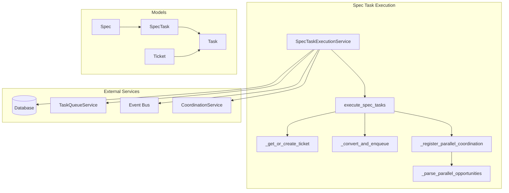
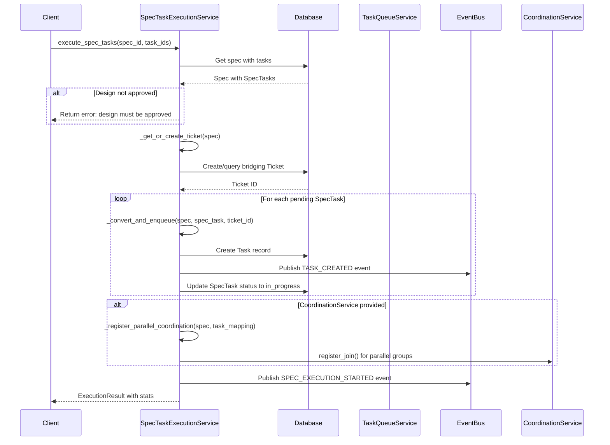
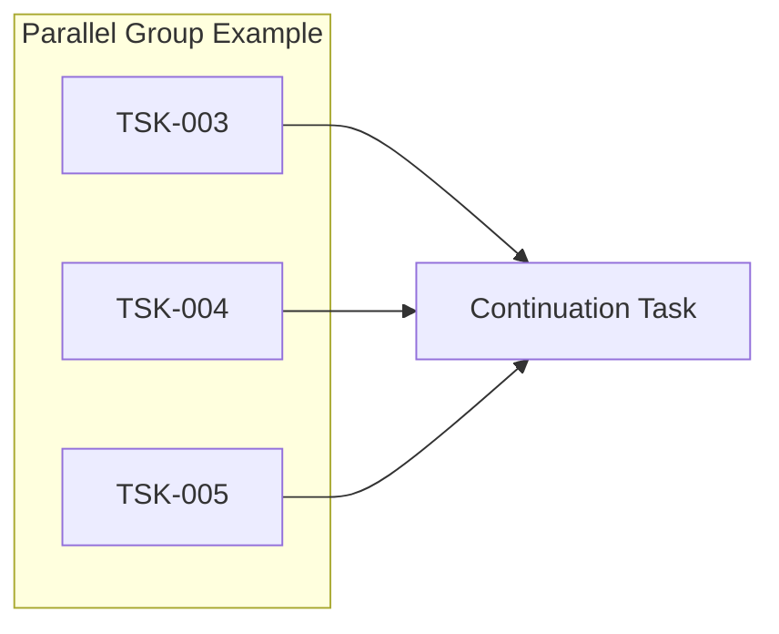
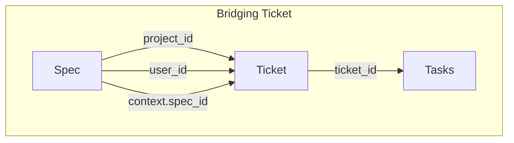
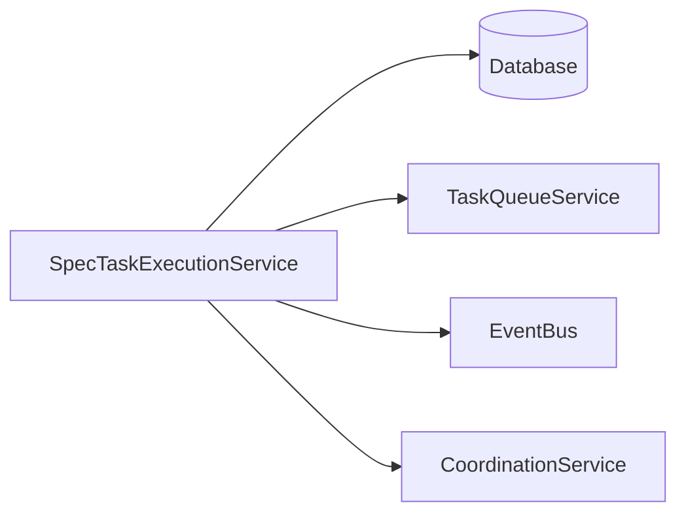

# Spec Task Execution Service

> **Date**: 2025-07-20 | **Status**: Active | **Version**: 1.0 | **Owner**: Deep Docs Pipeline
> **Source**: Generated from codebase analysis | **Cross-links**: See Related Documents section

## Overview

The Spec Task Execution Service bridges spec-driven development with the sandbox execution system. It converts approved SpecTasks into executable Tasks, manages their lifecycle through the TaskQueueService, and coordinates parallel execution opportunities identified during the spec's SYNC phase. This service enables the transition from planning (specs) to execution (sandboxes).

## Architecture



## Key Components

### SpecTaskExecutionService Class

`backend/omoi_os/services/spec_task_execution.py:84-881`

```python
class SpecTaskExecutionService:
    """Service for converting and executing SpecTasks via sandbox system."""
    
    # Priority mapping from SpecTask to Task
    PRIORITY_MAP = {
        "critical": "CRITICAL",
        "high": "HIGH",
        "medium": "MEDIUM",
        "low": "LOW",
    }
    
    # Phase mapping - all map to PHASE_IMPLEMENTATION for continuous execution
    PHASE_MAP = {
        "Requirements": "PHASE_IMPLEMENTATION",
        "Design": "PHASE_IMPLEMENTATION",
        "Implementation": "PHASE_IMPLEMENTATION",
        "Testing": "PHASE_INTEGRATION",
        "Done": "PHASE_REFACTORING",
    }
```

**Key Methods:**

| Method | Line | Purpose |
|--------|------|---------|
| `execute_spec_tasks` | 212-335 | Main entry point for spec task execution |
| `_get_or_create_ticket` | 337-389 | Creates bridging ticket for spec |
| `_convert_and_enqueue` | 391-491 | Converts SpecTask to Task and enqueues |
| `_extract_owned_files` | 493-583 | Extracts file ownership from spec phase_data |
| `_parse_parallel_opportunities` | 585-689 | Parses parallel execution opportunities |
| `_register_parallel_coordination` | 729-803 | Registers parallel groups for synthesis |

## Execution Flow

### Main Execution Sequence

`backend/omoi_os/services/spec_task_execution.py:212-335`



## SpecTask to Task Conversion

### Conversion Logic

`backend/omoi_os/services/spec_task_execution.py:391-491`

```python
async def _convert_and_enqueue(
    self,
    session,
    spec: Spec,
    spec_task: SpecTask,
    ticket_id: str,
) -> Optional[Task]:
    """Convert a SpecTask to Task and enqueue for execution."""
    
    # Map priority and phase
    priority = self.PRIORITY_MAP.get(spec_task.priority.lower(), "MEDIUM")
    phase_id = self.PHASE_MAP.get(spec_task.phase, "PHASE_IMPLEMENTATION")
    
    # Determine task type - default to implement_feature for continuous mode
    task_type = "implement_feature"
    if "test" in spec_task.phase.lower():
        task_type = "write_tests"
    
    # Build description with spec context
    description = (
        f"{spec_task.description or spec_task.title}\n\n"
        f"---\n"
        f"Spec Context:\n"
        f"- Spec Title: {spec.title}\n"
        f"- Spec Phase: {spec.phase}\n"
        f"- Task Phase: {spec_task.phase}\n"
    )
    
    # Extract file ownership patterns
    owned_files = self._extract_owned_files(spec, spec_task.id)
    
    # Create the Task
    task = Task(
        id=str(uuid4()),
        ticket_id=ticket_id,
        phase_id=phase_id,
        task_type=task_type,
        title=spec_task.title,
        description=description,
        priority=priority,
        status="pending",
        dependencies={"depends_on": spec_task.dependencies} if spec_task.dependencies else None,
        owned_files=owned_files,
        result={
            "spec_task_id": spec_task.id,
            "spec_id": spec.id,
        },
    )
```

### Field Mapping

| SpecTask Field | Task Field | Notes |
|----------------|------------|-------|
| `id` | `result.spec_task_id` | Stored in result JSONB |
| `title` | `title` | Direct mapping |
| `description` | `description` | Enhanced with spec context |
| `priority` | `priority` | Mapped via PRIORITY_MAP |
| `phase` | `phase_id` | Mapped via PHASE_MAP |
| `dependencies` | `dependencies` | Wrapped in `depends_on` |
| `status` | N/A | Tracked separately |

## Parallel Execution Coordination

### Parallel Opportunities Parsing

`backend/omoi_os/services/spec_task_execution.py:585-689`

The SYNC phase generates parallel opportunities stored in `spec.phase_data["sync"]["dependency_analysis"]["parallel_opportunities"]`:



```python
def _parse_parallel_opportunities(
    self,
    spec: Spec,
    task_mapping: Dict[str, str],
) -> List[ParallelGroup]:
    """Parse parallel opportunities from spec.phase_data."""
    
    # Extract from phase_data
    sync_data = spec.phase_data.get("sync", {}) if spec.phase_data else {}
    dependency_analysis = sync_data.get("dependency_analysis", {})
    opportunities = dependency_analysis.get("parallel_opportunities", [])
    
    for opp in opportunities:
        # Extract task IDs using regex pattern TSK-XXX
        task_pattern = r"(TSK-[A-Za-z0-9-]+)"
        found_ids = re.findall(task_pattern, opp)
        
        # Resolve spec task IDs to created task IDs
        resolved_ids = [task_mapping[spec_task_id] for spec_task_id in found_ids]
        
        # Find continuation task (depends on ALL parallel tasks)
        continuation_task_id = self._find_continuation_task(...)
        
        groups.append(ParallelGroup(
            source_task_ids=resolved_ids,
            continuation_task_id=continuation_task_id,
            description=opp,
            merge_strategy="combine",
        ))
```

### Coordination Registration

`backend/omoi_os/services/spec_task_execution.py:729-803`

```python
async def _register_parallel_coordination(
    self,
    spec: Spec,
    task_mapping: Dict[str, str],
    stats: ExecutionStats,
) -> None:
    """Register parallel task groups with CoordinationService for synthesis."""
    
    parallel_groups = self._parse_parallel_opportunities(spec, task_mapping)
    
    for group in parallel_groups:
        if not group.continuation_task_id:
            continue  # Skip groups without continuation
        
        join_id = f"join-{spec.id}-{uuid4().hex[:8]}"
        
        # Register with CoordinationService
        self.coordination.register_join(
            join_id=join_id,
            source_task_ids=group.source_task_ids,
            continuation_task_id=group.continuation_task_id,
            merge_strategy=group.merge_strategy,
        )
        
        stats.parallel_groups_created += 1
```

## File Ownership Extraction

### Pattern Extraction

`backend/omoi_os/services/spec_task_execution.py:493-583`

Extracts file ownership from TASKS phase output for conflict detection:

```python
def _extract_owned_files(
    self,
    spec: Spec,
    spec_task_id: str,
) -> Optional[List[str]]:
    """Extract file ownership patterns from spec phase_data."""
    
    # Get tasks from TASKS phase output
    tasks_data = spec.phase_data.get("tasks", {})
    tasks_list = tasks_data.get("tasks", [])
    
    # Find task by ID
    task_info = next(
        (t for t in tasks_list if isinstance(t, dict) and t.get("id") == spec_task_id),
        None
    )
    
    # Collect owned files
    owned_files = []
    owned_files.extend(task_info.get("files_to_create", []))
    owned_files.extend(task_info.get("files_to_modify", []))
    
    # Convert to glob patterns
    patterns = []
    for file_path in unique_files:
        if file_path.endswith("/"):
            patterns.append(f"{file_path}**")  # Directory glob
        else:
            patterns.append(file_path)  # Specific file
    
    return patterns
```

## Event Handling

### Task Completion Events

`backend/omoi_os/services/spec_task_execution.py:148-210`

```python
def subscribe_to_completions(self) -> None:
    """Subscribe to task completion events to update SpecTask status."""
    
    self.event_bus.subscribe("TASK_COMPLETED", self._handle_task_completed)
    self.event_bus.subscribe("TASK_FAILED", self._handle_task_failed)

def _handle_task_completed(self, event_data: dict) -> None:
    """Handle task completion events to update SpecTask."""
    
    task_id = event_data.get("entity_id")
    task = session.get(Task, task_id)
    
    # Extract spec_task_id from task result
    spec_task_id = task.result.get("spec_task_id")
    
    # Update SpecTask status
    spec_task = session.get(SpecTask, spec_task_id)
    spec_task.status = "completed"
```

## Data Models

### ExecutionStats

`backend/omoi_os/services/spec_task_execution.py:42-59`

```python
@dataclass
class ExecutionStats:
    """Statistics from SpecTask execution conversion."""
    
    tasks_created: int = 0
    tasks_skipped: int = 0
    ticket_id: Optional[str] = None
    parallel_groups_created: int = 0
    errors: List[str] = field(default_factory=list)
```

### ExecutionResult

`backend/omoi_os/services/spec_task_execution.py:62-69`

```python
@dataclass
class ExecutionResult:
    """Result of SpecTask execution initiation."""
    
    success: bool
    message: str
    stats: ExecutionStats = field(default_factory=ExecutionStats)
```

### ParallelGroup

`backend/omoi_os/services/spec_task_execution.py:72-82`

```python
@dataclass
class ParallelGroup:
    """A group of tasks that can run in parallel with a continuation."""
    
    source_task_ids: List[str]
    continuation_task_id: Optional[str]
    description: str
    merge_strategy: str = "combine"
```

## Bridging Ticket Pattern

### Ticket Creation

`backend/omoi_os/services/spec_task_execution.py:337-389`



```python
async def _get_or_create_ticket(self, session, spec: Spec) -> str:
    """Get existing ticket for spec or create a new one."""
    
    # Look for existing ticket with matching spec reference
    result = await session.execute(
        select(Ticket)
        .filter(Ticket.project_id == spec.project_id)
        .filter(Ticket.context["spec_id"].astext == spec.id)
    )
    existing_ticket = result.scalar_one_or_none()
    
    if existing_ticket:
        return existing_ticket.id
    
    # Create new bridging ticket
    ticket = Ticket(
        id=str(uuid4()),
        title=f"[Spec] {spec.title}",
        description=spec.description,
        phase_id="PHASE_IMPLEMENTATION",
        status="building",
        priority="MEDIUM",
        project_id=spec.project_id,
        user_id=spec.user_id,
        context={
            "spec_id": spec.id,
            "spec_title": spec.title,
            "source": "spec_task_execution",
        },
    )
```

## Integration Points

### Service Dependencies



### Event Bus Interactions

| Event | Direction | Purpose |
|-------|-----------|---------|
| `TASK_CREATED` | Publish | Notify orchestrator of new task |
| `SPEC_EXECUTION_STARTED` | Publish | Signal execution initiation |
| `TASK_COMPLETED` | Subscribe | Update SpecTask status |
| `TASK_FAILED` | Subscribe | Mark SpecTask as blocked |

## Error Handling

### Conversion Errors

```python
try:
    task = await self._convert_and_enqueue(session, spec, spec_task, ticket_id)
    if task:
        spec_task.status = "in_progress"
        stats.tasks_created += 1
except Exception as e:
    error_msg = f"Failed to convert task {spec_task.id}: {e}"
    stats.errors.append(error_msg)
    logger.error("spec_task_conversion_failed", ...)
```

### Common Error Scenarios

| Scenario | Handling | Impact |
|----------|----------|--------|
| Spec not found | Return error result | Execution fails |
| Design not approved | Return error result | Execution blocked |
| Task conversion fails | Log error, continue with others | Partial execution |
| Parallel coordination fails | Log error, continue | Synthesis may not work |

## Testing Considerations

### Unit Test Areas

1. **Task conversion** - Verify field mapping
2. **File ownership extraction** - Test pattern generation
3. **Parallel opportunity parsing** - Test regex extraction
4. **Continuation task finding** - Test dependency graph traversal
5. **Event handling** - Verify status updates

### Integration Test Areas

1. **End-to-end execution** - Create spec, execute, verify tasks created
2. **Parallel coordination** - Verify join registration
3. **Event flow** - Test completion event handling
4. **Bridging ticket** - Verify ticket creation and reuse

## Related Documents

- [Task Queue Service](./task_queue.md) - Manages converted task execution
- [Result Submission Service](./result_submission.md) - Handles task results
- Orchestrator Worker - Executes tasks
- [Spec State Machine](../../architecture/01-planning-system.md) - Spec lifecycle
- [Architecture Overview](../../../ARCHITECTURE.md) - System-wide context
