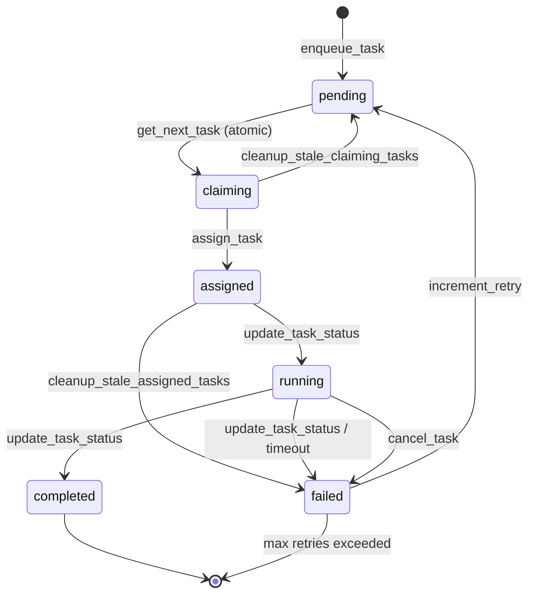
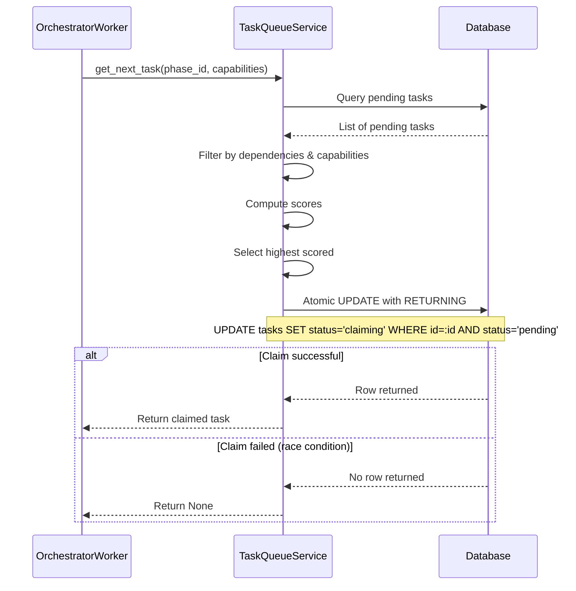
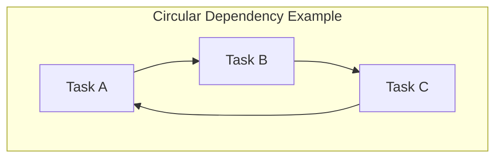
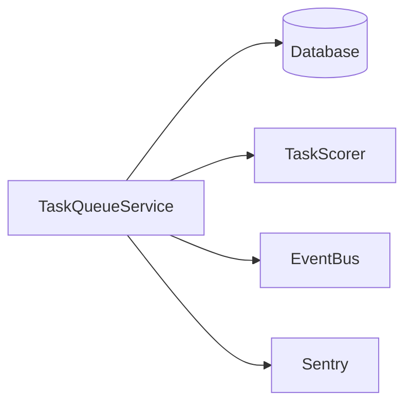

# Task Queue Service

> **Date**: 2025-07-20 | **Status**: Active | **Version**: 1.0 | **Owner**: Deep Docs Pipeline
> **Source**: Generated from codebase analysis | **Cross-links**: See Related Documents section

## Overview

The Task Queue Service is the central nervous system of OmoiOS's task execution pipeline. It manages task lifecycle from creation through completion, handles priority-based assignment with dynamic scoring, enforces dependency graphs, and provides comprehensive retry and timeout management. The service supports both legacy agent-based execution and modern sandbox-based execution modes.

## Architecture

```mermaid
graph TB
    subgraph "Task Queue Service"
        TQS[TaskQueueService]
        ET[enqueue_task]
        GNT[get_next_task]
        GRT[get_ready_tasks]
        AT[assign_task]
        UTS[update_task_status]
        CD[check_dependencies_complete]
        DCD[detect_circular_dependencies]
        IR[is_retryable_error]
        IT[increment_retry]
        CTT[check_task_timeout]
        CT[cancel_task]
    end
    
    subgraph "Supporting Components"
        TS[TaskScorer]
        GTT[generate_task_title]
    end
    
    subgraph "External Services"
        DB[(Database)]
        EB[Event Bus]
        Sentry[Sentry]
    end
    
    TQS --> ET
    TQS --> GNT
    TQS --> GRT
    TQS --> AT
    TQS --> UTS
    TQS --> CD
    TQS --> DCD
    TQS --> IR
    TQS --> IT
    TQS --> CTT
    TQS --> CT
    
    TQS --> TS
    TQS --> GTT
    
    TQS --> DB
    TQS --> EB
    TQS --> Sentry
```



## Key Components

### TaskQueueService Class

`backend/omoi_os/services/task_queue.py:81-1446`

```python
class TaskQueueService:
    """Manages task queue operations: enqueue, retrieve, assign, update."""
    
    def __init__(
        self,
        db: DatabaseService,
        event_bus: Optional["EventBusService"] = None,
    ):
        self.db = db
        self.scorer = TaskScorer(db)
        self.event_bus = event_bus
```

**Core Methods:**

| Method | Line | Purpose |
|--------|------|---------|
| `enqueue_task` | 135-223 | Add task to queue with scoring |
| `get_next_task` | 225-314 | Get highest-scored ready task with atomic claim |
| `get_ready_tasks` | 316-384 | Get multiple ready tasks for batch execution |
| `assign_task` | 386-415 | Assign task to agent/sandbox |
| `update_task_status` | 417-504 | Update status with event publishing |
| `check_dependencies_complete` | 631-645 | Verify dependency satisfaction |
| `detect_circular_dependencies` | 673-708 | DFS-based cycle detection |

**Retry & Timeout Methods:**

| Method | Line | Purpose |
|--------|------|---------|
| `should_retry` | 710-730 | Check if failed task can retry |
| `increment_retry` | 732-770 | Increment retry and reset status |
| `is_retryable_error` | 801-856 | Classify error retryability |
| `check_task_timeout` | 860-887 | Check if task exceeded timeout |
| `cancel_task` | 889-917 | Cancel running task |
| `mark_task_timeout` | 949-989 | Mark task as failed due to timeout |

**Stale Task Cleanup:**

| Method | Line | Purpose |
|--------|------|---------|
| `cleanup_stale_claiming_tasks` | 1079-1133 | Reset tasks stuck in claiming |
| `cleanup_stale_assigned_tasks` | 1174-1233 | Mark orphaned tasks as failed |

## Task Lifecycle

### State Machine



### Status Definitions

| Status | Description | Transitions |
|--------|-------------|-------------|
| `pending` | Waiting for assignment | → claiming |
| `claiming` | Atomic claim in progress | → assigned, → pending (stale) |
| `assigned` | Assigned to agent/sandbox | → running, → failed (stale) |
| `running` | Actively executing | → completed, → failed |
| `completed` | Successfully finished | Terminal |
| `failed` | Execution failed | → pending (retry), Terminal |
| `under_review` | Pending validation | Legacy status |
| `validation_in_progress` | Being validated | Legacy status |

## Task Enqueuing

### Enqueue Process

`backend/omoi_os/services/task_queue.py:135-223`

```python
def enqueue_task(
    self,
    ticket_id: str,
    phase_id: str,
    task_type: str,
    description: str,
    priority: str,
    dependencies: dict | None = None,
    session: Optional["Session"] = None,
    title: Optional[str] = None,
    execution_config: dict | None = None,
    required_capabilities: list[str] | None = None,
) -> Task:
    """Add a task to the queue."""
    
    task = Task(
        ticket_id=ticket_id,
        phase_id=phase_id,
        task_type=task_type,
        title=title,
        description=description,
        priority=priority,
        status="pending",
        dependencies=dependencies,
        execution_config=execution_config,
        required_capabilities=required_capabilities,
    )
    
    # Compute initial score (REQ-TQM-PRI-002)
    task.score = self.scorer.compute_score(task)
    
    # Publish event
    self._publish_event("TASK_CREATED", task)
    
    return task
```

## Task Retrieval & Assignment

### Atomic Claim Pattern

`backend/omoi_os/services/task_queue.py:225-314`



```python
def get_next_task(
    self,
    phase_id: Optional[str] = None,
    agent_capabilities: Optional[List[str]] = None,
) -> Task | None:
    """Get highest-scored pending task with atomic claim."""
    
    # Filter and score tasks
    available_tasks = []
    for task in tasks:
        if not self._check_dependencies_complete(session, task):
            continue
        if not self._check_capability_match(task, agent_capabilities):
            continue
        task.score = self.scorer.compute_score(task)
        available_tasks.append(task)
    
    # Select highest scored
    task = max(available_tasks, key=lambda t: t.score)
    
    # ATOMIC CLAIM: Use SELECT ... FOR UPDATE pattern
    result = session.execute(
        text("""
            UPDATE tasks
            SET status = 'claiming', score = :score
            WHERE id = :task_id
            AND status = 'pending'
            AND sandbox_id IS NULL
            RETURNING id
        """),
        {"task_id": str(task.id), "score": task.score},
    )
    claimed_row = result.fetchone()
    
    if not claimed_row:
        return None  # Another process claimed this task
    
    return task
```

## Dependency Management

### Dependency Checking

`backend/omoi_os/services/task_queue.py:541-567`

```python
def _check_dependencies_complete(self, session, task: Task) -> bool:
    """Check if all dependencies for a task are completed."""
    
    if not task.dependencies:
        return True
    
    depends_on = task.dependencies.get("depends_on", [])
    if not depends_on:
        return True
    
    # Check if all dependency tasks are completed
    dependency_tasks = session.query(Task).filter(
        Task.id.in_(depends_on)
    ).all()
    
    if len(dependency_tasks) != len(depends_on):
        return False  # Missing dependencies
    
    return all(
        dep_task.status == "completed" 
        for dep_task in dependency_tasks
    )
```

### Circular Dependency Detection

`backend/omoi_os/services/task_queue.py:673-708`



```python
def detect_circular_dependencies(
    self, 
    task_id: str, 
    depends_on: list[str], 
    visited: list[str] | None = None
) -> list[str] | None:
    """Detect circular dependencies using DFS."""
    
    if visited is None:
        visited = []
    
    if task_id in visited:
        # Found a cycle
        cycle_start = visited.index(task_id)
        return visited[cycle_start:] + [task_id]
    
    visited.append(task_id)
    
    for dep_id in depends_on:
        dep_task = session.query(Task).filter(Task.id == dep_id).first()
        if dep_task and dep_task.dependencies:
            cycle = self.detect_circular_dependencies(
                dep_id, 
                dep_task.dependencies.get("depends_on", []),
                visited.copy()
            )
            if cycle:
                return cycle
    
    return None
```

## Retry Logic

### Retry Classification

`backend/omoi_os/services/task_queue.py:801-856`

```python
def is_retryable_error(self, error_message: str | None) -> bool:
    """Check if an error message indicates a retryable error."""
    
    if not error_message:
        return True  # No error, assume retryable
    
    error_lower = error_message.lower()
    
    # Permanent errors - do NOT retry
    permanent_patterns = [
        "permission denied",
        "access denied",
        "authentication failed",
        "syntax error",
        "invalid argument",
        "not found",
        "already exists",
        "quota exceeded",
    ]
    
    for pattern in permanent_patterns:
        if pattern in error_lower:
            return False
    
    # Retryable errors
    retryable_patterns = [
        "connection",
        "timeout",
        "network",
        "temporary",
        "unavailable",
        "transient",
    ]
    
    for pattern in retryable_patterns:
        if pattern in error_lower:
            return True
    
    return True  # Default to retryable
```

### Retry Process

`backend/omoi_os/services/task_queue.py:732-770`

```python
def increment_retry(self, task_id: str) -> bool:
    """Increment retry count and reset status to pending."""
    
    with self.db.get_session() as session:
        task = session.query(Task).filter(Task.id == task_id).first()
        
        if task.retry_count >= task.max_retries:
            return False
        
        # Increment and reset
        task.retry_count += 1
        task.status = "pending"
        task.error_message = None
        
        # Clear assignment based on mode
        if task.sandbox_id:
            task.sandbox_id = None  # Sandbox mode
        else:
            task.assigned_agent_id = None  # Legacy mode
        
        session.commit()
        
        # Track metric
        track_task_retried(str(task.id), task.phase_id, task.retry_count)
        
        return True
```

## Timeout Management

### Timeout Checking

`backend/omoi_os/services/task_queue.py:860-887`

```python
def check_task_timeout(self, task_id: str) -> bool:
    """Check if a task has exceeded its timeout."""
    
    with self.db.get_session() as session:
        task = session.query(Task).filter(Task.id == task_id).first()
        
        # Only check running tasks with timeout
        if task.status != "running" or not task.timeout_seconds:
            return False
        
        if not task.started_at:
            return False
        
        elapsed = (utc_now() - task.started_at).total_seconds()
        return elapsed > task.timeout_seconds
```

### Timeout Status Query

`backend/omoi_os/services/task_queue.py:1041-1077`

```python
def get_task_timeout_status(self, task_id: str) -> dict:
    """Get comprehensive timeout status for a task."""
    
    return {
        "exists": True,
        "status": task.status,
        "timeout_seconds": task.timeout_seconds,
        "elapsed_seconds": elapsed_seconds,
        "time_remaining": time_remaining,
        "is_timed_out": is_timed_out,
        "can_cancel": task.status in ["assigned", "running"],
    }
```

## Stale Task Cleanup

### Stale Claiming Tasks

`backend/omoi_os/services/task_queue.py:1079-1133`

Tasks stuck in `claiming` status (orchestrator crashed mid-claim):

```python
def cleanup_stale_claiming_tasks(
    self, 
    stale_threshold_seconds: int = 60
) -> list[dict]:
    """Clean up tasks stuck in 'claiming' status."""
    
    stale_cutoff = utc_now() - timedelta(seconds=stale_threshold_seconds)
    
    tasks = session.query(Task).filter(
        Task.status == "claiming",
        Task.created_at < stale_cutoff,
    ).all()
    
    for task in tasks:
        task.status = "pending"  # Reset for retry
        cleaned_tasks.append({...})
    
    return cleaned_tasks
```

### Stale Assigned Tasks

`backend/omoi_os/services/task_queue.py:1174-1233`

Tasks stuck in `assigned` status (sandbox crashed before starting):

```python
def cleanup_stale_assigned_tasks(
    self, 
    stale_threshold_minutes: int = 3,
    dry_run: bool = False
) -> list[dict]:
    """Clean up tasks stuck in 'assigned' status."""
    
    stale_cutoff = utc_now() - timedelta(minutes=stale_threshold_minutes)
    
    tasks = session.query(Task).filter(
        Task.status.in_(["assigned", "claiming"]),
        Task.sandbox_id.isnot(None),  # Has sandbox
        Task.created_at < stale_cutoff,
    ).all()
    
    for task in tasks:
        if not dry_run:
            task.status = "failed"
            task.error_message = "Task stuck in assigned status..."
            task.completed_at = utc_now()
```

## Async Operations

### Async Task Retrieval

`backend/omoi_os/services/task_queue.py:1273-1338`

```python
async def get_ready_tasks_async(
    self,
    phase_id: Optional[str] = None,
    limit: int = 10,
    agent_capabilities: Optional[List[str]] = None,
) -> list[Task]:
    """Async version: Get multiple ready tasks."""
    
    async with self.db.get_async_session() as session:
        stmt = select(Task).filter(Task.status == "pending")
        
        result = await session.execute(stmt)
        tasks = result.scalars().all()
        
        # Filter with async dependency check
        available_tasks = []
        for task in tasks:
            if not await self._check_dependencies_complete_async(session, task):
                continue
            task.score = self.scorer.compute_score(task)
            available_tasks.append(task)
        
        # Sort and return
        available_tasks.sort(key=lambda t: t.score, reverse=True)
        return available_tasks[:limit]
```

## Event Publishing

### Event Types

`backend/omoi_os/services/task_queue.py:100-134`

```python
def _publish_event(
    self,
    event_type: str,
    task: Task,
    extra_payload: Optional[dict] = None,
) -> None:
    """Publish task event to event bus."""
    
    payload = {
        "task_id": str(task.id),
        "ticket_id": task.ticket_id,
        "phase_id": task.phase_id,
        "task_type": task.task_type,
        "status": task.status,
        "priority": task.priority,
    }
    
    event = SystemEvent(
        event_type=event_type,
        entity_type="task",
        entity_id=str(task.id),
        payload=payload,
    )
    
    self.event_bus.publish(event)
```

### Published Events

| Event | Trigger | Payload |
|-------|---------|---------|
| `TASK_CREATED` | enqueue_task | Task details |
| `TASK_ASSIGNED` | assign_task | Agent/sandbox ID |
| `TASK_STARTED` | update_task_status (running) | Old status |
| `TASK_COMPLETED` | update_task_status (completed) | Result info |
| `TASK_FAILED` | update_task_status (failed) | Error message |
| `TASK_CANCELLED` | cancel_task | Cancellation reason |
| `TASK_STATUS_CHANGED` | Other status changes | Old/new status |

## Integration Points

### Service Dependencies



### Orchestrator Worker Integration

The OrchestratorWorker uses TaskQueueService to:

1. **Poll for tasks** via `get_next_task()` or `get_next_task_async()`
2. **Claim tasks** atomically to prevent race conditions
3. **Assign tasks** to sandboxes via `assign_task()`
4. **Handle validation tasks** via `get_next_validation_task()`
5. **Clean up stale tasks** via cleanup methods

## Configuration

### Environment Variables

| Variable | Default | Description |
|----------|---------|-------------|
| `STALE_TASK_THRESHOLD_MINUTES` | 3 | Minutes before assigned task is stale |
| `STALE_CLAIMING_THRESHOLD_SECONDS` | 60 | Seconds before claiming task is stale |
| `STALE_TASK_CHECK_INTERVAL_SECONDS` | 15 | Cleanup loop interval |

## Testing Considerations

### Unit Test Areas

1. **Atomic claim** - Verify race condition handling
2. **Dependency checking** - Test complete/incomplete scenarios
3. **Circular detection** - Test cycle identification
4. **Retry logic** - Test classification and increment
5. **Timeout checking** - Test elapsed time calculation
6. **Stale cleanup** - Test threshold enforcement

### Integration Test Areas

1. **End-to-end task flow** - Create → Claim → Assign → Complete
2. **Dependency chains** - Verify DAG execution order
3. **Retry loops** - Test failure → retry → success
4. **Timeout enforcement** - Test automatic timeout marking
5. **Event publishing** - Verify all events fired

## Related Documents

- Orchestrator Worker - Primary consumer of task queue
- [Spec Task Execution](./spec_task_execution.md) - Creates tasks via this service
- [Diagnostic Service](./diagnostic_service.md) - Monitors task outcomes
- [Result Submission](./result_submission.md) - Handles completed task results
- [Architecture Overview](../../../ARCHITECTURE.md) - System-wide context
