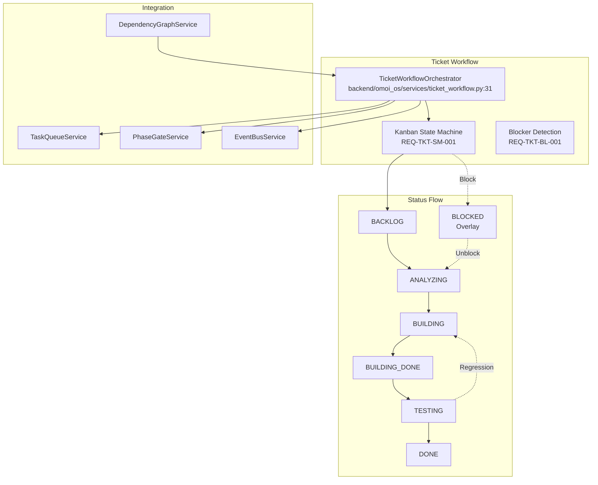

# Ticket Workflow Service Design

> **Date**: 2025-07-20 | **Status**: Active | **Version**: 1.0 | **Owner**: Deep Docs Pipeline
> **Source**: Generated from codebase analysis | **Cross-links**: See Related Documents section

## Overview

The Ticket Workflow Service orchestrates the Kanban-style state machine for ticket lifecycle management. It enforces valid state transitions, manages ticket blocking and unblocking, handles automatic phase progression based on gate criteria, and supports regression workflows when validation fails. The service integrates with the Task Queue, Phase Gate, and Event Bus systems to provide comprehensive workflow orchestration.

## Architecture



## State Machine

### Ticket Status Enumeration

`backend/omoi_os/models/ticket_status.py:6-48`

```python
class TicketStatus(StrEnum):
    """
    Ticket status enumeration per REQ-TKT-SM-001.

    States: backlog → analyzing → building → building-done → testing → done
    With optional 'blocked' overlay (handled via is_blocked flag).
    """

    BACKLOG = "backlog"
    ANALYZING = "analyzing"
    BUILDING = "building"
    BUILDING_DONE = "building-done"
    TESTING = "testing"
    DONE = "done"

# Valid state transitions per REQ-TKT-SM-002
VALID_TRANSITIONS: dict[str, list[str]] = {
    TicketStatus.BACKLOG.value: [TicketStatus.ANALYZING.value],
    TicketStatus.ANALYZING.value: [TicketStatus.BUILDING.value],
    TicketStatus.BUILDING.value: [TicketStatus.BUILDING_DONE.value],
    TicketStatus.BUILDING_DONE.value: [TicketStatus.TESTING.value],
    TicketStatus.TESTING.value: [
        TicketStatus.DONE.value,
        TicketStatus.BUILDING.value,  # Can regress on fix needed
    ],
    TicketStatus.DONE.value: [],  # Terminal state
}
```

### Phase-to-Status Mapping

`backend/omoi_os/services/ticket_workflow.py:43-62`

```python
# Phase to status mapping
PHASE_TO_STATUS: Dict[str, str] = {
    "PHASE_BACKLOG": TicketStatus.BACKLOG.value,
    "PHASE_REQUIREMENTS": TicketStatus.ANALYZING.value,
    "PHASE_DESIGN": TicketStatus.ANALYZING.value,
    "PHASE_IMPLEMENTATION": TicketStatus.BUILDING.value,
    "PHASE_TESTING": TicketStatus.TESTING.value,
    "PHASE_DEPLOYMENT": TicketStatus.BUILDING_DONE.value,
    "PHASE_DONE": TicketStatus.DONE.value,
}

# Status to phase mapping (reverse lookup)
STATUS_TO_PHASE: Dict[str, str] = {
    TicketStatus.BACKLOG.value: "PHASE_BACKLOG",
    TicketStatus.ANALYZING.value: "PHASE_REQUIREMENTS",
    TicketStatus.BUILDING.value: "PHASE_IMPLEMENTATION",
    TicketStatus.BUILDING_DONE.value: "PHASE_DEPLOYMENT",
    TicketStatus.TESTING.value: "PHASE_TESTING",
    TicketStatus.DONE.value: "PHASE_DONE",
}
```

## Core Components

### TicketWorkflowOrchestrator

`backend/omoi_os/services/ticket_workflow.py:31-659`

```python
class TicketWorkflowOrchestrator:
    """
    Ticket Workflow Orchestrator per REQ-TKT-SM-001 through REQ-TKT-BL-003.

    Enforces Kanban state machine, orchestrates phase transitions, manages
    ticket-to-task relationships, and coordinates with Task Queue and Validation systems.
    """

    # Configuration constants
    BLOCKING_THRESHOLD_MINUTES = 30  # REQ-TKT-BL-001 default
    MAX_RETRY_ATTEMPTS = 3
```

#### State Transition

`backend/omoi_os/services/ticket_workflow.py:89-192`

```python
def transition_status(
    self,
    ticket_id: str,
    to_status: str,
    initiated_by: Optional[str] = None,
    reason: Optional[str] = None,
    force: bool = False,
) -> Ticket:
    """
    Transition ticket to new status with validation per REQ-TKT-SM-002.

    Args:
        ticket_id: Ticket ID
        to_status: Target status
        initiated_by: Agent or user ID initiating transition
        reason: Optional reason for transition
        force: Skip validation if True (guardian override)

    Returns:
        Updated ticket

    Raises:
        InvalidTransitionError: If transition is not valid
        TicketBlockedError: If ticket is blocked (unless force=True)
    """
    with self.db.get_session() as session:
        ticket = session.get(Ticket, ticket_id)
        if not ticket:
            raise ValueError(f"Ticket {ticket_id} not found")

        from_status = ticket.status

        # Validate transition unless forced
        if not force:
            # Check if blocked first (unless transitioning to unblock state)
            if ticket.is_blocked and to_status not in BLOCKED_TRANSITIONS:
                raise TicketBlockedError(
                    f"Ticket is blocked (reason: {ticket.blocked_reason}), "
                    f"cannot transition to {to_status}. "
                    f"Must transition to an unblock state: {BLOCKED_TRANSITIONS}"
                )

            # Validate transition
            if not is_valid_transition(
                from_status, to_status, is_blocked=ticket.is_blocked
            ):
                raise InvalidTransitionError(
                    f"Invalid transition from {from_status} to {to_status} "
                    f"(blocked={ticket.is_blocked})"
                )

        # Update status
        previous_phase_id = ticket.phase_id
        ticket.status = to_status
        ticket.previous_phase_id = previous_phase_id

        # Update phase_id based on status
        if to_status in self.STATUS_TO_PHASE:
            ticket.phase_id = self.STATUS_TO_PHASE[to_status]

        # Clear blocked flag if transitioning from blocked state
        if ticket.is_blocked and to_status in BLOCKED_TRANSITIONS:
            ticket.is_blocked = False
            ticket.blocked_reason = None
            ticket.blocked_at = None

        ticket.updated_at = utc_now()

        # Record phase history
        phase_history = PhaseHistory(
            ticket_id=ticket.id,
            from_phase=previous_phase_id,
            to_phase=ticket.phase_id,
            transition_reason=reason
            or f"Status transition: {from_status} → {to_status}",
            transitioned_by=initiated_by,
            artifacts=None,
        )
        session.add(phase_history)

        session.commit()
        session.refresh(ticket)
        session.expunge(ticket)

        # Publish event
        if self.event_bus:
            self.event_bus.publish(
                SystemEvent(
                    event_type="ticket.status_transitioned",
                    entity_type="ticket",
                    entity_id=str(ticket.id),
                    payload={
                        "from_status": from_status,
                        "to_status": to_status,
                        "from_phase": previous_phase_id,
                        "to_phase": ticket.phase_id,
                        "initiated_by": initiated_by,
                        "reason": reason,
                    },
                )
            )

        return ticket
```

### Automatic Progression

`backend/omoi_os/services/ticket_workflow.py:198-252`

```python
def check_and_progress_ticket(self, ticket_id: str) -> Optional[Ticket]:
    """
    Check if ticket should automatically progress to next phase per REQ-TKT-SM-003.

    Args:
        ticket_id: Ticket ID to check

    Returns:
        Updated ticket if progressed, None if no progression
    """
    with self.db.get_session() as session:
        ticket = session.get(Ticket, ticket_id)
        if not ticket:
            return None

        # Skip if blocked or in terminal state
        if ticket.is_blocked or TicketStatus.is_terminal(ticket.status):
            return None

        # Collect artifacts from completed tasks before checking gate
        self.phase_gate.collect_artifacts(ticket_id, ticket.phase_id)

        # Check if phase gate criteria are met
        gate_result = self.phase_gate.check_gate_requirements(
            ticket_id, ticket.phase_id
        )

        if not gate_result["requirements_met"]:
            return None  # Gate criteria not met, cannot progress

        # Determine next status based on current status
        next_status = self._get_next_status(ticket.status)
        if not next_status:
            return None  # No next status available

        # Transition to next status
        session.expunge(ticket)
        return self.transition_status(
            ticket_id,
            next_status,
            initiated_by="ticket-workflow-orchestrator",
            reason="Automatic progression: phase gate criteria met",
        )

def _get_next_status(self, current_status: str) -> Optional[str]:
    """Get next status in progression chain."""
    progression_map = {
        TicketStatus.BACKLOG.value: TicketStatus.ANALYZING.value,
        TicketStatus.ANALYZING.value: TicketStatus.BUILDING.value,
        TicketStatus.BUILDING.value: TicketStatus.BUILDING_DONE.value,
        TicketStatus.BUILDING_DONE.value: TicketStatus.TESTING.value,
        TicketStatus.TESTING.value: TicketStatus.DONE.value,
    }
    return progression_map.get(current_status)
```

### Regression Handling

`backend/omoi_os/services/ticket_workflow.py:258-321`

```python
def regress_ticket(
    self,
    ticket_id: str,
    to_status: str,
    validation_feedback: Optional[str] = None,
    initiated_by: Optional[str] = None,
) -> Ticket:
    """
    Regress ticket to previous actionable phase per REQ-TKT-SM-004.

    Args:
        ticket_id: Ticket ID
        to_status: Target status (typically BUILDING for testing regressions)
        validation_feedback: Optional validation feedback
        initiated_by: Agent or user ID initiating regression

    Returns:
        Updated ticket

    Raises:
        InvalidTransitionError: If regression is not valid
    """
    with self.db.get_session() as session:
        ticket = session.get(Ticket, ticket_id)
        if not ticket:
            raise ValueError(f"Ticket {ticket_id} not found")

        # Validate regression transition
        if not is_valid_transition(
            ticket.status, to_status, is_blocked=ticket.is_blocked
        ):
            raise InvalidTransitionError(
                f"Invalid regression from {ticket.status} to {to_status}"
            )

    # Store regression context in ticket context
    with self.db.get_session() as session:
        ticket = session.get(Ticket, ticket_id)
        if not ticket:
            raise ValueError(f"Ticket {ticket_id} not found")

        current_context = ticket.context or {}
        regression_context = {
            "regressed_from": ticket.status,
            "regressed_to": to_status,
            "validation_feedback": validation_feedback,
            "regressed_at": utc_now().isoformat(),
        }

        if "regressions" not in current_context:
            current_context["regressions"] = []
        current_context["regressions"].append(regression_context)

        ticket.context = current_context
        ticket.updated_at = utc_now()
        session.commit()

    # Transition to regressed status
    return self.transition_status(
        ticket_id,
        to_status,
        initiated_by=initiated_by or "ticket-workflow-orchestrator",
        reason=f"Regression: {validation_feedback or 'Fix needed'}",
    )
```

## Blocking Management

### Blocker Detection

`backend/omoi_os/services/ticket_workflow.py:449-505`

```python
def detect_blocking(self) -> List[Dict[str, Any]]:
    """
    Detect tickets that should be marked as blocked per REQ-TKT-BL-001.

    Monitors tickets in non-terminal states and checks if they've exceeded
    the blocking threshold with no task progress.

    Returns:
        List of dicts with ticket_id, should_block, blocker_type
    """
    results = []

    with self.db.get_session() as session:
        # Get tickets in non-terminal states that aren't already blocked
        non_terminal_statuses = [
            TicketStatus.BACKLOG.value,
            TicketStatus.ANALYZING.value,
            TicketStatus.BUILDING.value,
            TicketStatus.BUILDING_DONE.value,
            TicketStatus.TESTING.value,
        ]

        tickets = (
            session.query(Ticket)
            .filter(
                Ticket.status.in_(non_terminal_statuses),
                Ticket.is_blocked == False,
            )
            .all()
        )

        threshold = timedelta(minutes=self.BLOCKING_THRESHOLD_MINUTES)
        now = utc_now()

        for ticket in tickets:
            # Check if ticket has been in current state longer than threshold
            time_in_state = now - (ticket.updated_at or ticket.created_at)
            if time_in_state < threshold:
                continue  # Not yet at threshold

            # Check for task progress
            has_progress = self._has_task_progress(session, ticket.id, threshold)

            if not has_progress:
                # Classify blocker type
                blocker_type = self._classify_blocker_sync(session, ticket)
                results.append(
                    {
                        "ticket_id": ticket.id,
                        "should_block": True,
                        "blocker_type": blocker_type,
                        "time_in_state_minutes": time_in_state.total_seconds() / 60,
                    }
                )

    return results
```

### Mark Blocked

`backend/omoi_os/services/ticket_workflow.py:327-395`

```python
def mark_blocked(
    self,
    ticket_id: str,
    blocker_type: str,
    suggested_remediation: Optional[str] = None,
    initiated_by: Optional[str] = None,
) -> Ticket:
    """
    Mark ticket as blocked per REQ-TKT-BL-001.

    Args:
        ticket_id: Ticket ID
        blocker_type: Blocker classification (dependency, waiting_on_clarification, failing_checks, environment)
        suggested_remediation: Optional suggested remediation
        initiated_by: Agent or user ID initiating block

    Returns:
        Updated ticket
    """
    with self.db.get_session() as session:
        ticket = session.get(Ticket, ticket_id)
        if not ticket:
            raise ValueError(f"Ticket {ticket_id} not found")

        # Skip if already blocked
        if ticket.is_blocked:
            session.commit()
            session.refresh(ticket)
            session.expunge(ticket)
            return ticket

        # Skip if in terminal state
        if TicketStatus.is_terminal(ticket.status):
            session.commit()
            session.refresh(ticket)
            session.expunge(ticket)
            return ticket

        # Mark as blocked
        ticket.is_blocked = True
        ticket.blocked_reason = blocker_type
        ticket.blocked_at = utc_now()
        ticket.updated_at = utc_now()

        session.commit()
        session.refresh(ticket)
        session.expunge(ticket)

        # Create remediation task if possible
        self._create_remediation_task(ticket_id, blocker_type)

        # Publish event
        if self.event_bus:
            self.event_bus.publish(
                SystemEvent(
                    event_type="ticket.blocked",
                    entity_type="ticket",
                    entity_id=str(ticket.id),
                    payload={
                        "blocker_type": blocker_type,
                        "suggested_remediation": suggested_remediation,
                        "status": ticket.status,
                        "phase_id": ticket.phase_id,
                        "initiated_by": initiated_by,
                    },
                )
            )

        return ticket
```

### Unblock Ticket

`backend/omoi_os/services/ticket_workflow.py:397-447`

```python
def unblock_ticket(
    self,
    ticket_id: str,
    initiated_by: Optional[str] = None,
) -> Ticket:
    """
    Unblock ticket and return to previous phase.

    Args:
        ticket_id: Ticket ID
        initiated_by: Agent or user ID initiating unblock

    Returns:
        Updated ticket
    """
    with self.db.get_session() as session:
        ticket = session.get(Ticket, ticket_id)
        if not ticket:
            raise ValueError(f"Ticket {ticket_id} not found")

        if not ticket.is_blocked:
            return ticket

        # Clear blocked flag
        old_blocked_reason = ticket.blocked_reason
        ticket.is_blocked = False
        ticket.blocked_reason = None
        ticket.blocked_at = None
        ticket.updated_at = utc_now()

        session.commit()
        session.refresh(ticket)
        session.expunge(ticket)

        # Publish event
        if self.event_bus:
            self.event_bus.publish(
                SystemEvent(
                    event_type="ticket.unblocked",
                    entity_type="ticket",
                    entity_id=str(ticket.id),
                    payload={
                        "previous_blocker": old_blocked_reason,
                        "status": ticket.status,
                        "phase_id": ticket.phase_id,
                        "initiated_by": initiated_by,
                    },
                )
            )

        return ticket
```

## Dependency Resolution

### Dependency Graph Service

`backend/omoi_os/services/dependency_graph.py:14-421`

```python
class DependencyGraphService:
    """Builds dependency graphs from tasks, tickets, and discoveries."""

    def __init__(self, db: DatabaseService):
        self.db = db

    def build_ticket_graph(
        self,
        ticket_id: str,
        include_resolved: bool = True,
        include_discoveries: bool = True,
    ) -> Dict[str, Any]:
        """
        Build dependency graph for a single ticket.

        Returns:
            {
                "nodes": [...],
                "edges": [...],
                "metadata": {...}
            }
        """
```

### Critical Path Analysis

`backend/omoi_os/services/dependency_graph.py:363-420`

```python
def _find_critical_path(self, nodes: List[Dict], edges: List[Dict]) -> List[str]:
    """
    Find the longest dependency path (critical path).

    Uses topological sort + longest path algorithm.
    """
    # Build adjacency list (only depends_on edges)
    graph = defaultdict(list)
    in_degree = defaultdict(int)
    node_set = {n["id"] for n in nodes if n["type"] == "task"}

    for edge in edges:
        if (
            edge["type"] == "depends_on"
            and edge["from"] in node_set
            and edge["to"] in node_set
        ):
            graph[edge["from"]].append(edge["to"])
            in_degree[edge["to"]] += 1

    # Initialize longest path
    longest_path = defaultdict(int)
    path_predecessor = {}

    # Topological sort with longest path calculation
    queue = deque(
        [
            n["id"]
            for n in nodes
            if n["type"] == "task" and in_degree.get(n["id"], 0) == 0
        ]
    )

    while queue:
        node = queue.popleft()

        for neighbor in graph[node]:
            if longest_path[node] + 1 > longest_path[neighbor]:
                longest_path[neighbor] = longest_path[node] + 1
                path_predecessor[neighbor] = node

            in_degree[neighbor] -= 1
            if in_degree[neighbor] == 0:
                queue.append(neighbor)

    # Find node with longest path
    if not longest_path:
        return []

    end_node = max(longest_path.items(), key=lambda x: x[1])[0]

    # Reconstruct path
    path = []
    current = end_node
    while current:
        path.append(current)
        current = path_predecessor.get(current)

    return list(reversed(path))
```

## Data Models

### Ticket Model

`backend/omoi_os/models/ticket.py:26-177`

```python
class Ticket(Base):
    """Ticket represents a workflow request that generates multiple tasks."""

    __tablename__ = "tickets"

    id: Mapped[str] = mapped_column(
        String, primary_key=True, default=lambda: str(uuid4())
    )
    title: Mapped[str] = mapped_column(String(500), nullable=False)
    description: Mapped[Optional[str]] = mapped_column(Text, nullable=True)
    phase_id: Mapped[str] = mapped_column(String(50), nullable=False, index=True)
    status: Mapped[str] = mapped_column(
        String(50), nullable=False, index=True, default=lambda: "backlog"
    )
    priority: Mapped[str] = mapped_column(
        String(20), nullable=False, index=True
    )  # CRITICAL, HIGH, MEDIUM, LOW
    previous_phase_id: Mapped[Optional[str]] = mapped_column(
        String(50), nullable=True, index=True
    )

    # Blocking overlay mechanism (REQ-TKT-SM-001, REQ-TKT-BL-001)
    is_blocked: Mapped[bool] = mapped_column(
        Boolean,
        nullable=False,
        default=False,
        index=True,
        comment="Blocked overlay flag (used alongside current status)",
    )
    blocked_reason: Mapped[Optional[str]] = mapped_column(
        String(100),
        nullable=True,
        comment="Blocker classification: dependency, waiting_on_clarification, failing_checks, environment (REQ-TKT-BL-002)",
    )
    blocked_at: Mapped[Optional[datetime]] = mapped_column(
        DateTime(timezone=True),
        nullable=True,
        comment="Timestamp when ticket was marked as blocked",
    )

    # Ticket dependencies for spec-driven workflows
    dependencies: Mapped[Optional[dict]] = mapped_column(
        JSONB,
        nullable=True,
        comment="Ticket dependencies: blocked_by and blocks other tickets",
    )

    # Relationships
    tasks: Mapped[list["Task"]] = relationship(
        "Task", back_populates="ticket", cascade="all, delete-orphan"
    )
    phase_history: Mapped[list["PhaseHistory"]] = relationship(
        "PhaseHistory",
        back_populates="ticket",
        cascade="all, delete-orphan",
        order_by="PhaseHistory.created_at",
    )
```

### Task Model

`backend/omoi_os/models/task.py:24-191`

```python
class Task(Base):
    """Task represents a single work unit that can be assigned to an agent."""

    __tablename__ = "tasks"

    id: Mapped[str] = mapped_column(
        String, primary_key=True, default=lambda: str(uuid4())
    )
    ticket_id: Mapped[str] = mapped_column(
        String, ForeignKey("tickets.id", ondelete="CASCADE"), nullable=False, index=True
    )
    phase_id: Mapped[str] = mapped_column(String(50), nullable=False, index=True)
    task_type: Mapped[str] = mapped_column(
        String(100), nullable=False
    )  # analyze_requirements, implement_feature, etc.
    priority: Mapped[str] = mapped_column(
        String(20), nullable=False, index=True
    )  # CRITICAL, HIGH, MEDIUM, LOW
    score: Mapped[float] = mapped_column(
        Float,
        nullable=False,
        default=0.0,
        index=True,
        comment="Dynamic scheduling score computed from priority, age, deadline, blocker count, and retry penalty (REQ-TQM-PRI-002)",
    )
    status: Mapped[str] = mapped_column(
        String(50), nullable=False, index=True
    )  # pending, assigned, running, completed, failed

    dependencies: Mapped[Optional[dict]] = mapped_column(
        JSONB, nullable=True
    )  # Task dependencies: {"depends_on": ["task_id_1", "task_id_2"]}

    parent_task_id: Mapped[Optional[str]] = mapped_column(
        String,
        ForeignKey("tasks.id", ondelete="CASCADE"),
        nullable=True,
        index=True,
        comment="Parent task ID for branching and sub-tasks (REQ-TQM-DM-001)",
    )

    # Relationships
    ticket: Mapped["Ticket"] = relationship("Ticket", back_populates="tasks")
```

## Priority Management

### Task Scoring Algorithm

Tasks are scored based on multiple factors:

1. **Priority weight**: CRITICAL (1.0), HIGH (0.8), MEDIUM (0.5), LOW (0.3)
2. **Age factor**: Tasks get priority boost as they age
3. **Deadline proximity**: Tasks approaching SLA deadlines get higher scores
4. **Blocker count**: Tasks blocking many other tasks get priority
5. **Retry penalty**: Failed tasks get slight penalty to prevent starvation

## Event Integration

The workflow orchestrator publishes events via the EventBus:

| Event Type | Description | Payload |
|------------|-------------|---------|
| `ticket.status_transitioned` | Status changed | from_status, to_status, initiated_by |
| `ticket.blocked` | Ticket marked blocked | blocker_type, status, phase_id |
| `ticket.unblocked` | Ticket unblocked | previous_blocker, status, phase_id |
| `coordination.sync.created` | Sync point created | sync_id, waiting_task_ids |
| `coordination.split.created` | Task split created | split_id, target_task_ids |
| `coordination.join.created` | Tasks joined | join_id, continuation_task_id |

## Related Documents

- [Task Queue Service](./task_queue.md) - Task assignment and lifecycle
- Phase Gate Service - Phase transition validation
- Dependency Graph - Visual dependency management
- [Coordination Service](./coordination_service.md) - Multi-agent coordination
- Ticket Status Model - Status enumeration
- [Workflow Architecture](../../architecture/01-planning-system.md) - System design
