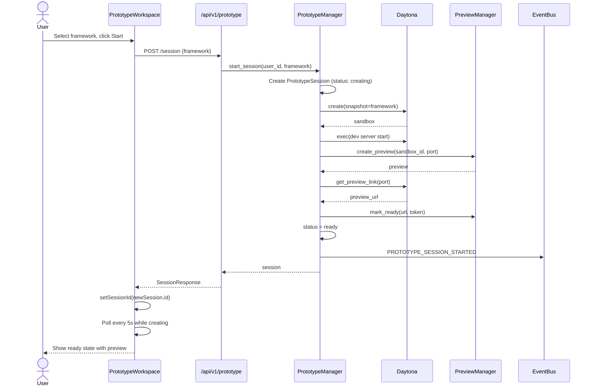
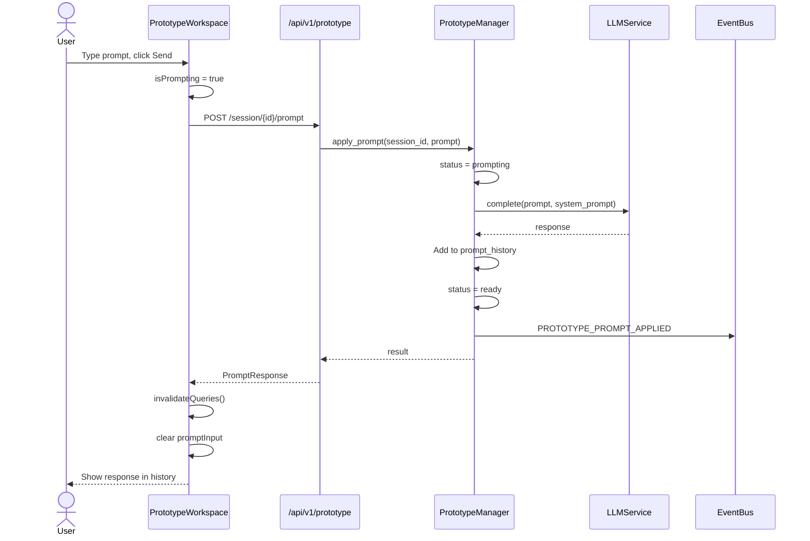
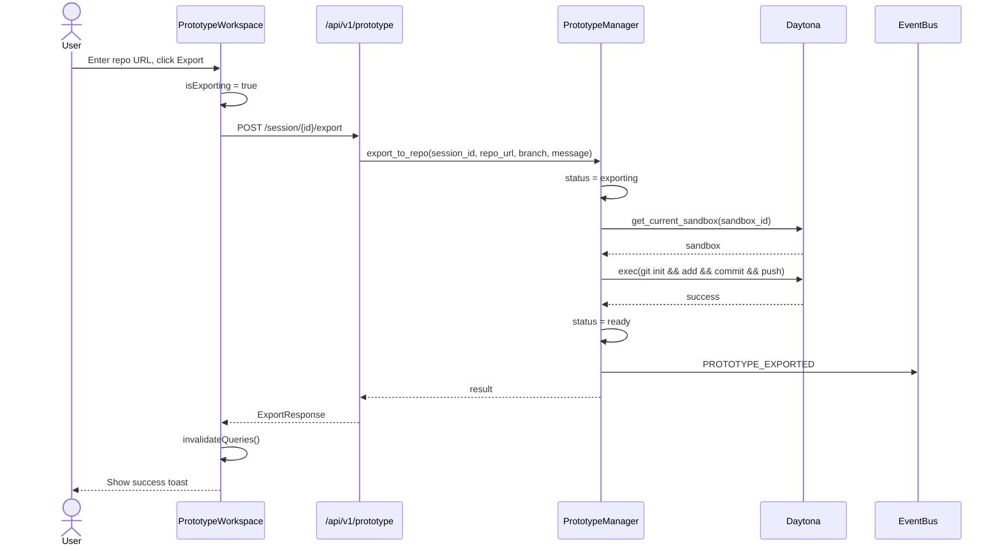
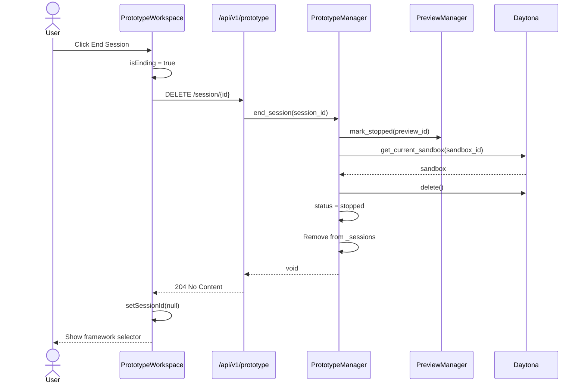

# 18 Prototype System

**Part of**: [Page Flow Documentation](./README.md)

---

## Overview

The Prototype System provides a rapid prototyping workspace for quickly building and previewing frontend applications without the full spec-driven workflow. It enables users to:

1. **Start a session** with a pre-configured framework template (React + Vite, Next.js, or Vue + Vite)
2. **Apply natural language prompts** to generate or modify code
3. **See live preview** of the running application in real-time
4. **Export to Git** when satisfied with the results

Unlike the full spec-driven workflow (Flows 2-3), prototyping skips the requirements/design/tasks phases and goes straight to iterative code generation with immediate visual feedback.

**Key Characteristics:**
- **Ephemeral sessions**: In-memory only, lost on server restart
- **Isolated sandboxes**: Each session gets its own Daytona container
- **Live preview**: Dev server runs inside sandbox with preview URL
- **Natural language prompts**: Describe what you want, AI generates code
- **One-click export**: Push to any git repository when done

---

## Flow 68: Prototype Workspace

```
┌─────────────────────────────────────────────────────────────────────────────┐
│  PAGE: /prototype                                                             │
│                                                                               │
│  ┌────────────────────────────────────────────────────────────────────────┐   │
│  │  Header                                                                │   │
│  │  Prototype  [Ready]  [react-vite]                           [End Session]│   │
│  └────────────────────────────────────────────────────────────────────────┘   │
│                                                                               │
│  ┌─────────────────────────────┐  ┌────────────────────────────────────────┐  │
│  │  Left Panel (400px)         │  │  Right Panel (flex-1)                  │  │
│  │                             │  │                                        │  │
│  │  ┌───────────────────────┐  │  │  ┌──────────────────────────────────┐  │  │
│  │  │ Prompt Input          │  │  │  │  Preview Toolbar                 │  │  │
│  │  │                       │  │  │  │  🌐 https://preview.url            │  │  │
│  │  │ [Describe what you  ]│  │  │  │  [react-vite] [↻] [↗] [■]         │  │  │
│  │  │ [want to build...    ]│  │  │  └──────────────────────────────────┘  │  │
│  │  │                       │  │  │  │                                        │  │
│  │  │ [Send Prompt]         │  │  │  │  ┌────────────────────────────────┐  │  │
│  │  └───────────────────────┘  │  │  │  │                                │  │  │
│  │                             │  │  │  │     Live Application           │  │  │
│  │  ┌───────────────────────┐  │  │  │  │     Preview (iframe)           │  │  │
│  │  │ Prompt History        │  │  │  │  │                                │  │  │
│  │  │                       │  │  │  │  │  ┌────────────────────────┐   │  │  │
│  │  │ ┌───────────────────┐ │  │  │  │  │  │  Counter: 0            │   │  │  │
│  │  │ │ Add a counter     │ │  │  │  │  │  │  [Increment] [Decrement]│   │  │  │
│  │  │ │ Created useState  │ │  │  │  │  │  └────────────────────────┘   │  │  │
│  │  │ │ with increment/ │ │  │  │  │  │                                │  │  │
│  │  │ │ decrement buttons│ │  │  │  │  │                                │  │  │
│  │  │ │                   │ │  │  │  │  │                                │  │  │
│  │  │ │ 2:34 PM           │ │  │  │  │  │                                │  │  │
│  │  │ └───────────────────┘ │  │  │  │  │                                │  │  │
│  │  │                       │  │  │  │  │                                │  │  │
│  │  │ ┌───────────────────┐ │  │  │  │  │                                │  │  │
│  │  │ │ Make it blue      │ │  │  │  │  │                                │  │  │
│  │  │ │ Changed button    │ │  │  │  │  │                                │  │  │
│  │  │ │ background to     │ │  │  │  │  │                                │  │  │
│  │  │ │ blue-500          │ │  │  │  │  │                                │  │  │
│  │  │ │                   │ │  │  │  │  │                                │  │  │
│  │  │ │ 2:36 PM           │ │  │  │  │  │                                │  │  │
│  │  │ └───────────────────┘ │  │  │  │  │                                │  │  │
│  │  └───────────────────────┘  │  │  │  └────────────────────────────────┘  │  │
│  │                             │  │  │                                        │  │
│  │  ┌───────────────────────┐  │  │  └────────────────────────────────────────┘  │
│  │  │ Export to Git       │  │  │                                               │
│  │  │                     │  │  │                                               │
│  │  │ [https://github... ] [⬇]│                                               │
│  │  └───────────────────────┘  │                                               │
│  └─────────────────────────────┘                                               │
└─────────────────────────────────────────────────────────────────────────────┘
```

### Route
`/prototype`

### Purpose
Primary workspace for rapid prototyping. Users describe what they want to build in natural language, see AI-generated code applied to a live sandbox, and view the results immediately in a browser preview.

### User Actions

#### Starting a Session
- **Select framework**: Choose from React + Vite, Next.js + TypeScript + Tailwind, or Vue + Vite
- **Click "Start Session"**: Creates sandbox, starts dev server, initializes preview
- **Wait for ready state**: Status badge changes from "Creating..." to "Ready"

#### During Active Session
- **Type prompt**: Describe desired changes in the textarea
- **Send prompt**: Click button or press Enter (Shift+Enter for newlines)
- **View history**: Scroll through previous prompts and responses
- **Watch preview**: Live app updates as code changes (via iframe)
- **Export code**: Enter git repo URL and click download button to push
- **End session**: Click "End Session" to clean up sandbox resources

#### Preview Controls
- **Refresh**: Reload iframe to see latest changes
- **Open in new tab**: View preview in full browser window
- **Stop**: Terminate the preview session

### Components

#### Page-Level
- `PrototypePage` — Simple wrapper that renders `PrototypeWorkspace`

#### Workspace
- `PrototypeWorkspace` — Main container managing session lifecycle
  - Framework selector (when no active session)
  - Split-pane layout (left: prompts, right: preview)
  - Header with status badge and end session button
  - Prompt input with loading states
  - Scrollable prompt history
  - Export section with repo URL input

#### Reused Components
- `PreviewPanel` — Shared preview component (also used by sandbox system)
  - Toolbar with URL, framework badge, refresh, open, stop buttons
  - Iframe with sandbox security attributes
  - Status states: pending, starting, ready, failed, stopped

#### UI Primitives (ShadCN)
- `Button` — Actions (start, send, export, end)
- `Badge` — Status indicators and framework labels
- `Textarea` — Prompt input
- `Card/CardContent/CardHeader/CardTitle` — Prompt history items
- `ScrollArea` — Scrollable history panel
- `Select/SelectContent/SelectItem/SelectTrigger/SelectValue` — Framework picker

### Framework Templates

| Framework | Snapshot Name | Dev Port | Start Command |
|-----------|--------------|----------|---------------|
| React + Vite | `omoios-react-vite-snapshot` | 5173 | `npm run dev -- --host 0.0.0.0` |
| Next.js | `omoios-next-snapshot` | 3000 | `npm run dev -- --hostname 0.0.0.0` |
| Vue + Vite | `omoios-vue-vite-snapshot` | 5173 | `npm run dev -- --host 0.0.0.0` |

---

## Session Lifecycle

```
┌─────────────────────────────────────────────────────────────────────────────┐
│                         PROTOTYPE SESSION LIFECYCLE                           │
├─────────────────────────────────────────────────────────────────────────────┤
│                                                                               │
│  ┌──────────┐    ┌──────────┐    ┌──────────┐    ┌──────────┐    ┌──────────┐ │
│  │  NONE    │───▶│ CREATING │───▶│   READY  │◀──▶│PROMPTING │    │ EXPORTING│ │
│  │          │    │          │    │          │    │          │    │          │ │
│  │ No active│    │ Sandbox  │    │ Accepts  │    │ AI gen   │    │ Git push │ │
│  │ session  │    │ starting │    │ prompts  │    │ in prog  │    │ in prog  │ │
│  └──────────┘    └──────────┘    └────┬─────┘    └──────────┘    └────┬─────┘ │
│         │                             │                              │       │
│         │                             │                              │       │
│         │                             ▼                              ▼       │
│         │                        ┌──────────┐                   ┌──────────┐│
│         │                        │  FAILED  │                   │ STOPPED  ││
│         │                        │          │                   │          ││
│         │                        │ Error    │                   │ Cleaned  ││
│         │                        │ occurred │                   │ up       ││
│         │                        └──────────┘                   └──────────┘│
│         │                                                                     │
│         └────────────────────────────────────────────────────────────────────▶│
│                                                                               │
└─────────────────────────────────────────────────────────────────────────────┘
```

### Status States

| Status | Badge Color | Description | User Can |
|--------|-------------|-------------|----------|
| `creating` | Secondary (gray) | Sandbox provisioning, dev server starting | Wait |
| `ready` | Default (primary) | Session active, accepting prompts | Send prompts, export, end |
| `prompting` | Secondary (gray) | AI generating code response | Wait (see spinner) |
| `exporting` | Secondary (gray) | Pushing code to git repository | Wait |
| `stopped` | Outline | Session ended, resources cleaned | Start new session |
| `failed` | Destructive (red) | Error during creation or operation | View error, end session |

---

## API Integration

### Backend Endpoints

All prototype endpoints are prefixed with `/api/v1/prototype/`.

---

#### POST /api/v1/prototype/session

**Description:** Start a new prototype session

**Request Body:**
```json
{
  "framework": "react-vite"
}
```

**Response (201):**
```json
{
  "id": "proto-uuid",
  "user_id": "user-uuid",
  "framework": "react-vite",
  "sandbox_id": null,
  "preview_id": null,
  "status": "creating",
  "preview_url": null,
  "prompt_history": [],
  "error_message": null,
  "created_at": "2025-01-15T10:00:00Z"
}
```

**Errors:**
- `400 Bad Request` — Unsupported framework

---

#### GET /api/v1/prototype/session/{session_id}

**Description:** Get prototype session status

**Path Params:** `session_id` (string)

**Response (200):**
```json
{
  "id": "proto-uuid",
  "user_id": "user-uuid",
  "framework": "react-vite",
  "sandbox_id": "sandbox-123",
  "preview_id": "preview-456",
  "status": "ready",
  "preview_url": "https://preview.url",
  "prompt_history": [
    {
      "prompt": "Add a counter",
      "response_summary": "Created useState with increment/decrement",
      "timestamp": "2025-01-15T10:05:00Z"
    }
  ],
  "error_message": null,
  "created_at": "2025-01-15T10:00:00Z"
}
```

**Errors:**
- `404 Not Found` — Session doesn't exist

---

#### POST /api/v1/prototype/session/{session_id}/prompt

**Description:** Apply a prompt to generate/modify code

**Path Params:** `session_id` (string)

**Request Body:**
```json
{
  "prompt": "Make the counter blue"
}
```

**Response (200):**
```json
{
  "prompt": "Make the counter blue",
  "response_summary": "Changed button background to blue-500",
  "timestamp": "2025-01-15T10:06:00Z"
}
```

**Errors:**
- `404 Not Found` — Session not found or not in promptable state

---

#### POST /api/v1/prototype/session/{session_id}/export

**Description:** Export prototype code to a git repository

**Path Params:** `session_id` (string)

**Request Body:**
```json
{
  "repo_url": "https://github.com/user/repo",
  "branch": "prototype",
  "commit_message": "Export prototype"
}
```

**Response (200):**
```json
{
  "repo_url": "https://github.com/user/repo",
  "branch": "prototype",
  "commit_message": "Export prototype",
  "timestamp": "2025-01-15T10:10:00Z"
}
```

**Errors:**
- `404 Not Found` — Session not found or no sandbox available

---

#### DELETE /api/v1/prototype/session/{session_id}

**Description:** End a prototype session and clean up resources

**Path Params:** `session_id` (string)

**Response:** `204 No Content`

**Errors:**
- `404 Not Found` — Session not found

---

## State Management

### React Query Hooks

#### usePrototype(sessionId: string | null)

Main hook for prototype session lifecycle management.

**Features:**
- Fetches session status with automatic polling during active operations
- Listens to WebSocket events for real-time updates
- Provides mutations for start, prompt, export, and end operations

**Query Configuration:**
```typescript
// Auto-poll while session is in active states
refetchInterval: (query) => {
  const data = query.state.data;
  if (!data) return false;
  if (data.status === "creating" || 
      data.status === "prompting" || 
      data.status === "exporting") {
    return 5_000; // Poll every 5 seconds
  }
  return false;
}
```

**WebSocket Event Handling:**
```typescript
// Listen for PROTOTYPE_PROMPT_APPLIED and PROTOTYPE_EXPORTED events
useEvents({
  enabled: !!sessionId,
  filters: {
    event_types: ["PROTOTYPE_PROMPT_APPLIED", "PROTOTYPE_EXPORTED"],
  },
  onEvent: (event) => {
    if (event.entity_id === sessionId) {
      invalidateSessionQuery();
    }
  },
});
```

**Return Values:**
| Property | Type | Description |
|----------|------|-------------|
| `session` | `PrototypeSession \| null` | Current session data |
| `isLoading` | `boolean` | Loading initial data |
| `startSession` | `(framework: string) => Promise<PrototypeSession>` | Start new session |
| `isStarting` | `boolean` | Start mutation pending |
| `applyPrompt` | `(prompt: string) => Promise<PromptResponse>` | Send prompt |
| `isPrompting` | `boolean` | Prompt mutation pending |
| `promptResult` | `PromptResponse \| undefined` | Last prompt result |
| `exportToRepo` | `(params) => Promise<ExportResponse>` | Export to git |
| `isExporting` | `boolean` | Export mutation pending |
| `exportResult` | `ExportResponse \| undefined` | Last export result |
| `endSession` | `() => void` | End and cleanup |
| `isEnding` | `boolean` | End mutation pending |

### Query Keys

```typescript
export const prototypeKeys = {
  all: ["prototype"] as const,
  session: (sessionId: string) => 
    [...prototypeKeys.all, "session", sessionId] as const,
};
```

### Local State (Component-Level)

```typescript
// PrototypeWorkspace local state
const [sessionId, setSessionId] = useState<string | null>(null);
const [framework, setFramework] = useState("react-vite");
const [promptInput, setPromptInput] = useState("");
const [exportUrl, setExportUrl] = useState("");
```

---

## Error Handling

### Frontend Error States

#### Session Creation Failed
```
┌─────────────────────────────────────────────────────────────┐
│  ⚠️ Session failed                                          │
│                                                             │
│  Daytona API error: unable to create sandbox               │
│                                                             │
└─────────────────────────────────────────────────────────────┘
```
- Displayed in right panel when `session.status === "failed"`
- Shows `error_message` from session data
- User can click "End Session" to clean up and start over

#### Prompt Application Failed
- Error handled by mutation state
- Toast notification on failure
- Session returns to "ready" state automatically

#### Export Failed
- Error handled by mutation state
- Toast notification on failure
- Session returns to "ready" state automatically

### Backend Error Handling

| Error Scenario | HTTP Status | User Message |
|----------------|-------------|--------------|
| Unsupported framework | 400 | "Unsupported framework: xyz. Supported: [react-vite, next, vue-vite]" |
| Session not found | 404 | "Session not found: {id}" |
| Session not promptable | 404 | "Session not in a promptable state: {status}" |
| No sandbox for export | 404 | "Session has no sandbox" |
| Daytona API failure | 500 | Internal error (logged, generic message to user) |

### Recovery Mechanisms

1. **Automatic retry**: React Query retries failed queries 3 times
2. **Polling fallback**: If WebSocket fails, polling continues during active states
3. **State recovery**: Failed prompts/exports return session to "ready" state
4. **Cleanup on end**: End session attempts to stop preview and delete sandbox even if partially failed

---

## Sequence Diagrams

### Starting a Prototype Session



### Applying a Prompt



### Exporting to Git Repository



### Ending a Session



---

## WebSocket Events

The prototype system publishes these event types via the EventBus:

| Event Type | Entity Type | Payload | When Published |
|------------|-------------|---------|----------------|
| `PROTOTYPE_SESSION_STARTED` | `prototype` | `{user_id, framework, sandbox_id, preview_url}` | Session created and ready |
| `PROTOTYPE_PROMPT_APPLIED` | `prototype` | `{prompt, response_summary, timestamp}` | Prompt processed successfully |
| `PROTOTYPE_EXPORTED` | `prototype` | `{repo_url, branch, commit_message, timestamp}` | Export completed |

Frontend listens to these events to invalidate queries and refresh session data.

---

## Accessibility

### Keyboard Navigation

| Action | Key |
|--------|-----|
| Send prompt | Enter (in textarea) |
| Newline in prompt | Shift+Enter |
| Refresh preview | Click refresh button |
| End session | Click end button |

### Screen Reader Support

- Status badges include aria-labels with full status description
- Loading states announced via aria-live regions
- Error messages use role="alert"
- Iframe has descriptive title="Live Preview"

### Focus Management

- Prompt textarea auto-focused when session becomes ready
- Focus returns to prompt textarea after sending
- Export input focused when tabbing through left panel

---

## Related Documentation

- [13_sandbox_system.md](./13_sandbox_system.md) — Sandbox execution and monitoring
- [10_command_center.md](./10_command_center.md) — Primary task submission flow
- [02_projects_specs.md](./02_projects_specs.md) — Full spec-driven workflow
- [../architecture/02-execution-system.md](../architecture/02-execution-system.md) — Orchestrator and sandbox execution

---

**Next**: See [README.md](./README.md) for complete documentation index.
