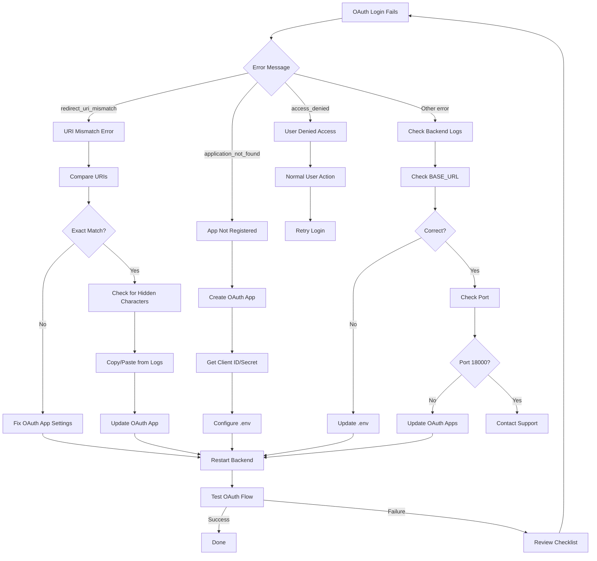

# OAuth Redirect URI Error - Quick Fix

## The Problem

```
The redirect_uri is not associated with this application.
```

This error occurs when the OAuth provider (GitHub, Google, etc.) receives a redirect URI that doesn't match any URI registered in the OAuth application settings. The mismatch can happen due to:

- Incorrect callback URL configuration in OAuth app settings
- Port number mismatches (e.g., 18000 vs 8000)
- Protocol differences (http vs https)
- Trailing slashes or path variations
- Environment-specific URL changes (local vs staging vs production)

## Root Cause Analysis

### How OAuth Redirect URI Validation Works

When a user initiates OAuth login, the following flow occurs:

1. **Frontend** redirects to OAuth provider with `client_id` and `redirect_uri`
2. **OAuth Provider** validates that `redirect_uri` matches registered URLs exactly
3. **On mismatch**, provider returns `redirect_uri_mismatch` error immediately
4. **On match**, provider authenticates user and redirects back to the callback URL
5. **Backend** receives the callback, exchanges code for tokens, completes authentication

### Common Root Causes

| Cause | Symptom | Detection |
|-------|---------|-----------|
| Port mismatch | Using port 3000 in dev but OAuth app has 18000 | Check browser URL vs OAuth settings |
| Protocol mismatch | http://localhost vs https://localhost | SSL/TLS configuration issue |
| Path mismatch | Missing `/api/v1/auth/oauth/{provider}/callback` | 404 errors on callback |
| Trailing slash | `/callback` vs `/callback/` | Exact string match failure |
| Environment confusion | Staging URL in production OAuth app | Check `OMOIOS_ENV` variable |
| Missing OAuth app registration | New provider not added to any OAuth app | Provider returns "application not found" |

## The Solution (5 Steps)

### 1. Find Your Redirect URI

Your app sends this redirect URI to OAuth providers:

**For Development:**
- GitHub: `http://localhost:18000/api/v1/auth/oauth/github/callback`
- Google: `http://localhost:18000/api/v1/auth/oauth/google/callback`
- GitLab: `http://localhost:18000/api/v1/auth/oauth/gitlab/callback`

**For Staging:**
Replace `localhost:18000` with your staging domain:
- `https://staging.omoios.dev/api/v1/auth/oauth/{provider}/callback`

**For Production:**
Replace `localhost:18000` with your production domain:
- `https://omoios.dev/api/v1/auth/oauth/{provider}/callback`

**Backend Configuration:**

The redirect URI is constructed in the backend using the `BASE_URL` environment variable:

```python
# From auth_service.py and OAuth configuration
redirect_uri = f"{base_url}/api/v1/auth/oauth/{provider}/callback"
```

Verify your `.env` file has the correct base URL:
```bash
# Development
BASE_URL=http://localhost:18000

# Staging
BASE_URL=https://staging.omoios.dev

# Production
BASE_URL=https://omoios.dev
```

### 2. Update GitHub OAuth App

**Configuration Steps:**

1. Navigate to: https://github.com/settings/developers
2. Click on your OAuth App (or create one if missing)
3. Under **Authorization callback URL**, enter:
   ```
   http://localhost:18000/api/v1/auth/oauth/github/callback
   ```
4. Click **Update application**
5. Wait 10-30 seconds for changes to propagate

**GitHub OAuth App Settings:**

| Setting | Development Value | Production Value |
|---------|-----------------|------------------|
| Application name | OmoiOS Dev | OmoiOS |
| Homepage URL | http://localhost:3000 | https://omoios.dev |
| Authorization callback URL | http://localhost:18000/api/v1/auth/oauth/github/callback | https://omoios.dev/api/v1/auth/oauth/github/callback |
| Enable Device Flow | No | No |

**Multiple Redirect URIs:**
GitHub only allows ONE callback URL per OAuth app. For multiple environments, create separate OAuth apps:
- `OmoiOS Local` → localhost:18000
- `OmoiOS Staging` → staging.omoios.dev
- `OmoiOS Production` → omoios.dev

### 3. Update Google OAuth App

**Configuration Steps:**

1. Go to: https://console.cloud.google.com/apis/credentials
2. Select your project
3. Click your OAuth 2.0 Client ID
4. Under **Authorized redirect URIs**, click **ADD URI**
5. Enter: `http://localhost:18000/api/v1/auth/oauth/google/callback`
6. Click **SAVE**
7. Changes take effect immediately (no propagation delay)

**Google OAuth Client Settings:**

| Setting | Development Value | Production Value |
|---------|-----------------|------------------|
| Application type | Web application | Web application |
| Authorized JavaScript origins | http://localhost:3000 | https://omoios.dev |
| Authorized redirect URIs | http://localhost:18000/api/v1/auth/oauth/google/callback | https://omoios.dev/api/v1/auth/oauth/google/callback |

**Important:** Google allows multiple redirect URIs per client. Add all your environments:
- `http://localhost:18000/api/v1/auth/oauth/google/callback`
- `https://staging.omoios.dev/api/v1/auth/oauth/google/callback`
- `https://omoios.dev/api/v1/auth/oauth/google/callback`

### 4. Update GitLab OAuth App

**Configuration Steps:**

1. Navigate to: https://gitlab.com/-/profile/applications
2. Find your application (or create new)
3. Set **Redirect URI** to:
   ```
   http://localhost:18000/api/v1/auth/oauth/gitlab/callback
   ```
4. Check required scopes: `read_user`, `api`
5. Click **Save application**

**GitLab Application Settings:**

| Setting | Value |
|---------|-------|
| Name | OmoiOS |
| Redirect URI | http://localhost:18000/api/v1/auth/oauth/gitlab/callback |
| Scopes | read_user, api |
| Confidential | Yes |

### 5. Restart & Test

**Backend Restart:**

```bash
# Stop the backend server
# Start with fresh environment variables
just backend-api
# or
uv run uvicorn omoi_os.api.main:app --host 0.0.0.0 --port 18000 --reload
```

**Verification Steps:**

1. Open browser to `http://localhost:3000`
2. Click "Sign in with GitHub" (or Google/GitLab)
3. Complete OAuth flow
4. Verify successful redirect back to dashboard

## Environment-Specific Fixes

### Local Development

**Common Issues:**

1. **Port Conflicts**:
   ```bash
   # Check if port 18000 is in use
   lsof -i :18000
   
   # Kill process if needed
   kill -9 <PID>
   
   # Or use different port and update OAuth apps
   PORT=18001 just backend-api
   ```

2. **Missing Environment Variables**:
   ```bash
   # Ensure .env has all required OAuth settings
   GITHUB_CLIENT_ID=your_github_client_id
   GITHUB_CLIENT_SECRET=your_github_client_secret
   GOOGLE_CLIENT_ID=your_google_client_id
   GOOGLE_CLIENT_SECRET=your_google_client_secret
   BASE_URL=http://localhost:18000
   ```

3. **Frontend-Backend URL Mismatch**:
   ```bash
   # frontend/.env.local
   NEXT_PUBLIC_API_URL=http://localhost:18000
   ```

### Staging Environment

**Configuration:**

```bash
# .env.staging
BASE_URL=https://staging.omoios.dev
GITHUB_CLIENT_ID=staging_github_client_id
GITHUB_CLIENT_SECRET=staging_github_client_secret
OMOIOS_ENV=staging
```

**OAuth App Setup:**
- Create separate OAuth apps for staging
- Use staging-specific client IDs/secrets
- Register `https://staging.omoios.dev/api/v1/auth/oauth/{provider}/callback`

### Production Environment

**Security Considerations:**

1. **HTTPS Only**: Production MUST use https:// URLs
2. **Strict Redirect URI Matching**: Ensure exact match including:
   - Protocol (https)
   - Domain (omoios.dev)
   - Path (/api/v1/auth/oauth/{provider}/callback)
   - No trailing slash

3. **Environment Variables**:
   ```bash
   BASE_URL=https://omoios.dev
   GITHUB_CLIENT_ID=prod_client_id
   GITHUB_CLIENT_SECRET=prod_client_secret
   OMOIOS_ENV=production
   ```

## Testing Procedures

### Manual Testing

**Test Case 1: GitHub OAuth Flow**

1. Navigate to login page
2. Click "Sign in with GitHub"
3. Authorize application (first time)
4. Verify redirect to `/dashboard`
5. Check user profile shows GitHub avatar/name

**Test Case 2: Google OAuth Flow**

1. Navigate to login page
2. Click "Sign in with Google"
3. Select Google account
4. Verify redirect to `/dashboard`
5. Check user created with Google email

**Test Case 3: Error Handling**

1. Temporarily change OAuth app callback URL to invalid value
2. Attempt login
3. Verify error message: "OAuth redirect URI mismatch"
4. Check backend logs show attempted URI
5. Restore correct URL and verify fix

### Automated Testing

**Backend OAuth Route Tests:**

```python
# From backend/omoi_os/api/routes/auth.py
# Test OAuth callback handling

async def test_github_oauth_callback(client, mock_github_token):
    response = await client.get(
        "/api/v1/auth/oauth/github/callback",
        params={"code": "test_code", "state": "test_state"}
    )
    assert response.status_code == 200
    assert "access_token" in response.json()
```

**Environment Validation:**

```bash
# Verify OAuth configuration
just check-oauth-config

# Expected output:
# GitHub: ✓ Configured (http://localhost:18000/api/v1/auth/oauth/github/callback)
# Google: ✓ Configured (http://localhost:18000/api/v1/auth/oauth/google/callback)
```

## Prevention Checklist

### For Developers

- [ ] Verify `BASE_URL` in `.env` matches OAuth app callback URL exactly
- [ ] Check port number consistency (18000 for backend API)
- [ ] No trailing slashes in callback URLs
- [ ] Separate OAuth apps for each environment
- [ ] Test OAuth flow after any URL changes

### For DevOps/Deployment

- [ ] Production OAuth apps use https:// only
- [ ] Staging and production have separate OAuth credentials
- [ ] Environment variables injected correctly in deployment
- [ ] Health check includes OAuth configuration validation
- [ ] Monitoring alerts for OAuth failure rates

### For Code Reviews

- [ ] Any URL changes reviewed for OAuth impact
- [ ] New OAuth providers added to all environment OAuth apps
- [ ] Callback path changes (`/api/v1/auth/oauth/{provider}/callback`) consistent
- [ ] Documentation updated for any OAuth flow changes

## Troubleshooting Deep Dive

### Still Not Working?

**Check Backend Logs:**

Look for a line like:
```
OAuth redirect URI for github: http://localhost:18000/api/v1/auth/oauth/github/callback
```

Make sure this EXACTLY matches what's registered in your OAuth provider.

**Enable Debug Logging:**

```python
# In backend logging configuration
LOG_LEVEL=DEBUG

# You'll see detailed OAuth flow:
# - Initiating OAuth flow with redirect_uri: ...
# - Received callback from provider
# - Exchanging code for token
# - Token received, creating user session
```

**Common Debug Steps:**

1. **Verify exact string match**:
   ```bash
   # Copy from backend logs
   LOGGED_URI="http://localhost:18000/api/v1/auth/oauth/github/callback"
   
   # Copy from OAuth app settings
   REGISTERED_URI="http://localhost:18000/api/v1/auth/oauth/github/callback"
   
   # Compare
   [ "$LOGGED_URI" = "$REGISTERED_URI" ] && echo "MATCH" || echo "MISMATCH"
   ```

2. **Check for hidden characters**:
   - Trailing spaces
   - Newline characters
   - Unicode normalization differences

3. **Verify environment variable loading**:
   ```bash
   # In backend container/shell
   python -c "from omoi_os.config import get_app_settings; print(get_app_settings().base_url)"
   ```

### Provider-Specific Issues

**GitHub:**
- Only ONE callback URL allowed per app
- Changes take 10-30 seconds to propagate
- Organization-owned apps have different settings location

**Google:**
- Multiple callback URLs allowed
- Changes immediate
- Must add both `http://localhost:3000` (frontend) and callback URL to "Authorized JavaScript origins"

**GitLab:**
- Self-hosted GitLab has different URL structure
- Scopes must include at minimum `read_user`

## Mermaid Diagnosis Flowchart



## Quick Reference

| Provider | Settings URL | Multiple URIs | Propagation Time |
|----------|--------------|---------------|------------------|
| GitHub | github.com/settings/developers | No | 10-30 seconds |
| Google | console.cloud.google.com/apis/credentials | Yes | Immediate |
| GitLab | gitlab.com/-/profile/applications | No | Immediate |

**Exact URI Format:**
```
{BASE_URL}/api/v1/auth/oauth/{provider}/callback
```

**Development:** `http://localhost:18000/api/v1/auth/oauth/github/callback`
**Production:** `https://omoios.dev/api/v1/auth/oauth/github/callback`

See [full troubleshooting guide](./oauth_redirect_uri_fix.md) for more details.
