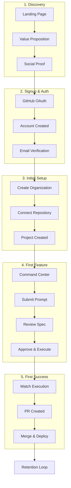
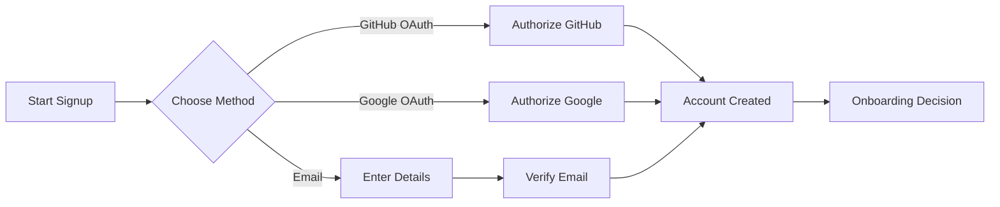
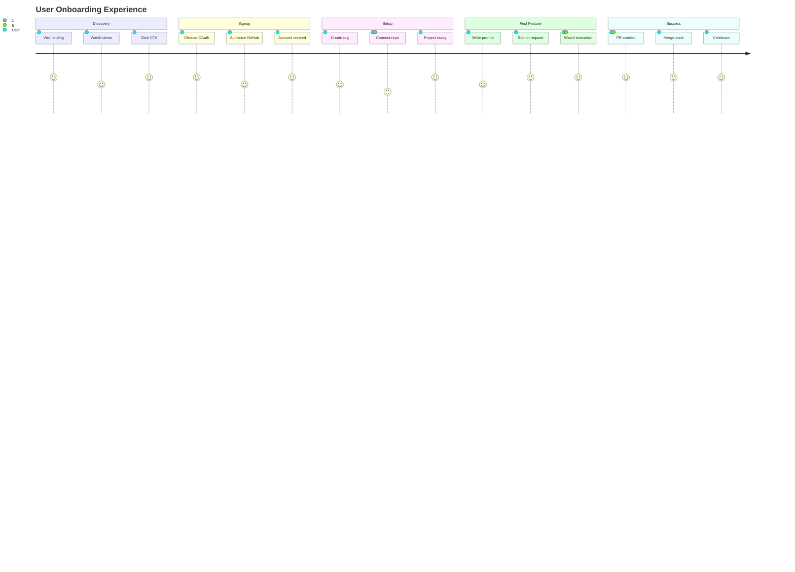

# 1 Onboarding

**Part of**: [User Journey Documentation](./README.md)

---

## Overview

The OmoiOS onboarding journey transforms a curious visitor into an active user who has successfully shipped their first AI-assisted feature. This document traces the complete flow from initial landing to first successful PR.



---

## Phase 1: Discovery & Landing

### User Entry Points

| Entry Point | User Intent | Landing Experience |
|-------------|-------------|-------------------|
| Direct (omoios.dev) | Curious about AI-assisted development | Hero section with demo video |
| GitHub Marketplace | Looking for dev tools | Feature-focused landing |
| Blog/Content | Learning about AI coding | Educational → CTA flow |
| Referral | Trusts recommender | Social proof emphasized |
| Pricing Page | Evaluating cost/value | Transparent pricing + trial |

### Landing Page Flow

```
┌─────────────────────────────────────────────────────────────┐
│  HERO SECTION                                                │
│  "Start a feature before bed. Wake up to a PR."             │
│  [Watch Demo] [Get Started Free]                             │
├─────────────────────────────────────────────────────────────┤
│  SOCIAL PROOF                                                │
│  "Shipped 50,000+ features" • "Used by 10,000+ developers"  │
│  [Logos: Vercel, Stripe, Linear-style]                       │
├─────────────────────────────────────────────────────────────┤
│  HOW IT WORKS (3 steps)                                      │
│  1. Describe feature → 2. AI plans & builds → 3. Review PR  │
├─────────────────────────────────────────────────────────────┤
│  DEMO VIDEO/GIF                                              │
│  [Animated: Command Center → Spec → Sandbox → PR]            │
├─────────────────────────────────────────────────────────────┤
│  FEATURE GRID                                                │
│  • Spec-driven workflow • Isolated sandboxes • GitHub PRs   │
├─────────────────────────────────────────────────────────────┤
│  CTA SECTION                                                 │
│  "Ready to ship faster?" [Get Started Free - No credit card] │
└─────────────────────────────────────────────────────────────┘
```

### Key Conversion Elements

1. **Demo Video** (90 seconds)
   - Shows real feature being built
   - Voiceover explaining each step
   - Ends with "That's it - PR ready for review"

2. **Social Proof**
   - Live counter: "X features shipped today"
   - Testimonial carousel
   - GitHub stars badge

3. **Risk Reversal**
   - "Free forever tier"
   - "No credit card required"
   - "Cancel anytime"

---

## Phase 2: Signup & Authentication

### Registration Options



### GitHub OAuth Flow (Recommended)

**User Experience:**
```
1. Clicks "Get Started with GitHub"
2. Redirected to GitHub authorization page
3. Sees: "OmoiOS wants to access your repositories"
4. Authorizes access
5. Redirected back to OmoiOS
6. Account automatically created
7. Lands on organization creation page
```

**UI Components:** (from `frontend/app/(auth)/login/page.tsx`)
- GitHub OAuth button with icon
- Clear permission explanation
- "Why we need this" tooltip

**API Calls:**
```typescript
// Initiates OAuth flow
GET /api/v1/auth/oauth/github/authorize

// Callback handler
GET /api/v1/auth/oauth/github/callback?code=...

// Creates session
POST /api/v1/auth/session
```

### Email Registration Flow

**User Experience:**
```
1. Clicks "Sign up with Email"
2. Form appears:
   - Full Name (optional)
   - Email (required)
   - Password (with strength indicator)
   - Confirm Password
3. Password requirements shown:
   ✓ At least 8 characters
   ✓ One uppercase letter
   ✓ One lowercase letter
   ✓ One number
4. Submits form
5. Sees: "Check your email for verification"
6. Clicks verification link
7. Account activated
```

**UI Components:** (from `frontend/app/(auth)/register/page.tsx`)
- Real-time password validation
- Visual strength indicator
- Inline error messages
- Success state with email icon

**API Calls:**
```typescript
// Registration
POST /api/v1/auth/register
Body: { email, password, full_name }

// Email verification
GET /api/v1/auth/verify-email?token=...
```

### Error States and Recovery

| Error | User Sees | Recovery |
|-------|-----------|----------|
| Email already exists | "Account exists. Sign in instead?" | Link to login |
| Weak password | Password requirements checklist | Real-time feedback |
| OAuth denied | "Authorization cancelled" | Retry button |
| Email not delivered | "Didn't receive email?" | Resend option |
| Invalid token | "Verification link expired" | Request new link |

---

## Phase 3: Organization & Project Setup

### Organization Creation

**First-Time User Flow:**
```
1. Post-signup, sees: "Let's set up your workspace"
2. Organization name input (auto-filled from GitHub username)
3. Organization slug (auto-generated, editable)
4. Optional: Upload logo
5. Clicks "Create Organization"
6. Success: "Organization created!"
```

**UI Components:**
- Organization name input with validation
- Slug preview (omoios.dev/org/[slug])
- Avatar upload with preview
- Progress indicator (Step 1 of 3)

**API Calls:**
```typescript
// Create organization
POST /api/v1/organizations
Body: { name, slug, logo_url? }
```

### Project Creation

**Option A: AI-Assisted Exploration (Recommended)**

```
1. "How would you like to create your first project?"
2. User selects: "Explore with AI assistance"
3. Prompt: "What do you want to build?"
   - Example: "I want to create an authentication system"
4. AI asks clarifying questions:
   - "What auth methods? (OAuth, email/password, SSO)"
   - "Multi-tenant support needed?"
   - "Preferred tech stack?"
5. User answers in chat interface
6. AI generates Requirements Document
7. User reviews → Approves/Rejects/Provides feedback
8. AI generates Design Document
9. User reviews → Approves
10. Clicks "Initialize Project"
11. System creates:
    - Project record
    - Initial tickets
    - Tasks for each phase
    - Spec workspace
```

**Option B: Quick Start (Existing Project)**

```
1. User selects: "Connect existing repository"
2. Repository selector (from GitHub connection)
3. Project name auto-filled from repo name
4. Clicks "Create Project"
5. System analyzes codebase
6. Project ready for first spec
```

**UI Components:** (from `frontend/app/(app)/projects/new/page.tsx`)
- Project creation wizard
- Repository selector dropdown
- AI exploration chat interface
- Requirements/Design preview panels

**API Calls:**
```typescript
// Create project
POST /api/v1/projects
Body: { 
  name, 
  github_owner, 
  github_repo,
  description?
}

// AI-assisted exploration
POST /api/v1/projects/explore
Body: { description, answers? }

// Get repository list
GET /api/v1/github/repos
```

---

## Phase 4: First Feature Creation

### Command Center Entry

**User Experience:**
```
1. Post-project creation, redirected to /command
2. Sees clean interface:
   
   "What would you like to build?"
   
   [______________________________]
   
   [Quick Mode] [Spec-Driven Mode]
   
   Connected to: MyProject
   
3. Helper text: "Describe your feature in natural language"
4. Placeholder: "e.g., Add user authentication with email and password"
```

**UI Components:** (from `frontend/app/(app)/command/page.tsx`)
- Large prompt input area
- Workflow mode selector (Quick vs Spec-driven)
- Project/Repository selector
- Model selector (optional)
- Submit button with loading state

**Workflow Mode Selection:**

| Mode | Best For | User Sees |
|------|----------|-----------|
| **Quick** | Simple features, fast iteration | Immediate sandbox creation, real-time coding |
| **Spec-Driven** | Complex features, team review | Full spec workflow with approvals |

### First Prompt Submission

**User Flow:**
```
1. Types: "Add a dark mode toggle to the navbar"
2. Selects "Quick mode" for speed
3. Clicks submit or presses Enter
4. System shows:
   - "Creating task..."
   - "Launching sandbox environment..."
   - Progress indicators
5. Auto-redirects to sandbox page when ready
```

**API Calls:**
```typescript
// Quick mode - create ticket and spawn sandbox
POST /api/v1/tickets
Body: {
  title: "Add dark mode toggle...",
  description: "Add a dark mode toggle...",
  project_id: "...",
  auto_spawn_sandbox: true,
  workflow_mode: "quick"
}

// Poll for sandbox creation
GET /api/v1/tasks?ticket_id=...&limit=20

// Or WebSocket event
Event: SANDBOX_CREATED
Payload: { sandbox_id, ticket_id }
```

---

## Phase 5: First Execution & Success

### Sandbox Monitoring

**User Experience:**
```
1. Redirected to /sandbox/[sandboxId]
2. Views live terminal showing agent activity:
   
   [Agent] Analyzing codebase structure...
   [Agent] Found Navbar component at src/components/Navbar.tsx
   [Agent] Creating dark mode toggle component...
   [Agent] Installing next-themes package...
   [Agent] Updating tailwind config...
   
3. Can see file changes in real-time
4. Can pause/resume agent
5. Can chat with agent if needed
```

**UI Components:**
- xterm.js terminal component
- File tree showing changes
- Live diff viewer
- Agent status indicator
- Pause/Resume controls

**API Calls:**
```typescript
// Get sandbox details
GET /api/v1/sandboxes/:sandboxId

// Stream terminal output
WebSocket: wss://api.omoios.dev/ws/sandboxes/:id

// Get file changes
GET /api/v1/sandboxes/:id/files

// Send chat message
POST /api/v1/sandboxes/:id/chat
```

### First PR Creation

**Success Moment:**
```
1. Agent completes implementation
2. System creates branch: feature/dark-mode-toggle
3. System opens PR with description:
   
   ## Dark Mode Toggle
   
   Added dark mode toggle to navbar with:
   - Theme provider setup
   - Toggle button in navbar
   - System preference detection
   - Smooth transitions
   
   [View Changes] [Review PR]
   
4. User sees notification: "🎉 PR ready for review!"
5. Clicks "Review PR" → Opens GitHub
6. Reviews changes, approves, merges
7. Feature deployed!
```

**UI Components:**
- Success toast notification
- PR link button
- Celebration animation
- "Create Next Feature" CTA

**API Calls:**
```typescript
// Create branch and PR
POST /api/v1/sandboxes/:id/create-pr

// Get PR status
GET /api/v1/sandboxes/:id/pr-status
```

---

## Onboarding Journey Map



---

## Time-to-Value Metrics

### Target Onboarding Times

| Step | Target Time | Cumulative |
|------|-------------|------------|
| Landing → Signup | < 2 minutes | 2 min |
| Signup → Organization | < 3 minutes | 5 min |
| Organization → Project | < 5 minutes | 10 min |
| Project → First Prompt | < 2 minutes | 12 min |
| Prompt → PR Created | < 15 minutes | 27 min |
| **Total: Signup to First PR** | **< 30 minutes** | **30 min** |

### Success Indicators by Stage

| Stage | Success Signal | Failure Signal |
|-------|---------------|----------------|
| Landing | Clicks "Get Started" | Bounces without action |
| Signup | Completes OAuth | Abandons at auth screen |
| Setup | Creates organization | Stuck on org creation |
| Project | Connects repository | Can't find/authorize repo |
| Feature | Submits first prompt | Leaves Command Center |
| Execution | Watches sandbox | Closes during execution |
| Success | Merges first PR | Doesn't return after first PR |

---

## Error Recovery Paths

### Common Onboarding Failures

| Failure Point | Root Cause | Recovery |
|---------------|------------|----------|
| OAuth fails | User denies permissions | Explain why permissions needed, retry |
| No repos found | No GitHub repos or private | Guide to create first repo |
| Project creation fails | Repo already connected | Show existing project |
| Sandbox fails to spawn | Resource limits | Upgrade prompt or retry |
| Agent gets stuck | Complex feature | Suggest breaking into smaller specs |
| PR creation fails | Branch conflicts | Manual resolution guide |

### Support Intervention Triggers

Auto-trigger support when:
- User stuck on same step > 10 minutes
- Multiple failed attempts (> 3)
- Error rate > 50% in first session
- No activity 24 hours post-signup

---

## Tips for First-Time Users

### Recommended First Features

| Feature Complexity | Example | Why It Works |
|-------------------|---------|--------------|
| Simple | "Add a loading spinner" | Quick win, visible result |
| Medium | "Add dark mode toggle" | Clear UI change, popular request |
| Complex | "Add user authentication" | Full spec workflow demo |

### Onboarding Best Practices

1. **Start with Quick Mode**: Get immediate gratification
2. **Use existing repo**: Easier than starting from scratch
3. **Pick visible features**: UI changes are satisfying
4. **Watch the sandbox**: Seeing AI work builds trust
5. **Review the PR**: Understanding what AI did helps future use

### Progressive Disclosure

As users gain experience, reveal advanced features:
- **First session**: Quick mode only, simple prompts
- **Second session**: Introduce Spec-driven mode
- **Third session**: Show Kanban board, multiple specs
- **Fourth session**: Introduce team features, sharing

---

## Cross-References

### Related User Journey Docs
- [02_feature_planning.md](./02_feature_planning.md) - Detailed spec creation flow
- [03_execution_monitoring.md](./03_execution_monitoring.md) - Sandbox monitoring details
- [08_user_personas.md](./08_user_personas.md) - Different user types

### Related Page Flows
- **Page Flows: Onboarding** - UI flow details
- **Page Flows: Command Center** - Primary entry point
- **Page Flows: Project Creation** - Setup details

### Related Implementation
- `../frontend/providers/AuthProvider.tsx` - Authentication context
- `frontend/app/(app)/command/page.tsx` - Main entry point
- `frontend/app/(auth)/login/page.tsx` - Authentication UI

---

**Next**: See [README.md](./README.md) for complete documentation index.
