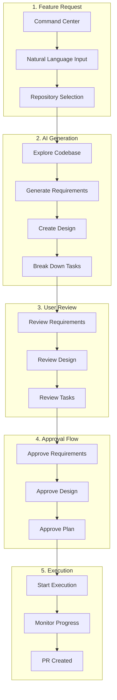
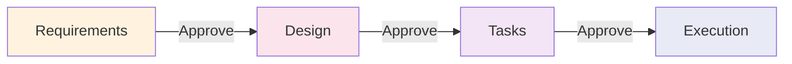

# 2 Feature Planning

**Part of**: [User Journey Documentation](./README.md)

---

## Overview

Feature planning in OmoiOS transforms a user's idea into a structured, executable specification through an AI-assisted workflow. This document covers the complete journey from initial feature request through phase transitions, reviews, and approvals.



---

## Creating a Feature Request

### Entry Points

| Entry Point | User Context | Pre-filled Data |
|-------------|--------------|-----------------|
| Command Center (`/command`) | Starting fresh | None |
| Project Page (`/projects/:id`) | Project context | Project pre-selected |
| Kanban Board (`/board/:id`) | Managing work | Project pre-selected |
| GitHub Issue | External trigger | Title/description from issue |

### Method 1: Natural Language Feature Request

**User Flow:**
```
1. User navigates to Command Center
2. Views prompt input area with placeholder:
   "What would you like to build?"
   
3. Enters natural language description:
   "Add payment processing with Stripe integration
    - Support credit cards and Apple Pay
    - Include webhook handling for payment events
    - Add payment history to user dashboard"
    
4. Selects workflow mode:
   ┌─────────────────────────────────────┐
   │ [Quick]  │ [Spec-Driven ●]          │
   │ Fast     │ Full planning & review   │
   └─────────────────────────────────────┘
   
5. Confirms project/repository selection
6. Clicks "Create Spec" or presses Enter
```

**UI Components:** (from `frontend/app/(app)/command/page.tsx`)
- **PromptInput**: Large textarea with auto-resize
- **WorkflowModeSelector**: Toggle between Quick and Spec-driven
- **RepoSelector**: Project and repository dropdown
- **ModelSelector**: AI model selection (optional)
- **SubmitButton**: With loading state

**API Calls:**
```typescript
// From useSpecs hook
const launchSpecMutation = useLaunchSpec()

// Create spec and start execution
POST /api/v1/specs/launch
Body: {
  title: "Add payment processing...",
  description: "Add payment processing with Stripe...",
  project_id: "proj_123",
  auto_execute: true,
  workflow_mode: "spec_driven"
}

// Response
{
  spec_id: "spec_456",
  sandbox_id: "sandbox_789",
  status: "exploring"
}
```

**Validation:**
- Title required (auto-generated from description if empty)
- Description minimum 10 characters
- Project must be selected or repository connected
- User must have write permissions to project

### Method 2: GitHub Issue Integration

**User Flow:**
```
1. User creates GitHub issue in connected repository
2. Webhook triggers OmoiOS
3. System receives payload with issue details
4. Auto-creates ticket in Backlog column
5. User sees notification: "New ticket from GitHub issue #123"
6. User clicks "Generate Spec" on ticket
7. System creates spec from issue content
```

**API Calls:**
```typescript
// Webhook handler
POST /api/v1/webhooks/github
Headers: X-GitHub-Event: issues
Body: { action: "opened", issue: {...} }

// Create ticket from issue
POST /api/v1/tickets
Body: {
  title: issue.title,
  description: issue.body,
  github_issue_number: issue.number,
  source: "github_webhook"
}

// Generate spec from ticket
POST /api/v1/specs
Body: {
  ticket_id: "ticket_123",
  auto_generate: true
}
```

---

## Phase-by-Phase UX

### Phase 1: Explore

**What the User Sees:**
```
┌─────────────────────────────────────────────────────────────┐
│  Spec: Add payment processing with Stripe                   │
│  Status: 🔍 Exploring                                        │
│                                                              │
│  Progress:                                                   │
│  [████████████████████░░░░░░░░] 65%                        │
│                                                              │
│  Activity:                                                   │
│  ✓ Analyzing repository structure                           │
│  ✓ Finding payment-related files                            │
│  ✓ Identifying dependencies                                  │
│  → Scanning for existing Stripe integration                  │
│                                                              │
│  [View Details] [Cancel]                                     │
└─────────────────────────────────────────────────────────────┘
```

**UI Components:**
- **PhaseProgress**: Shows "Explore" as active phase
- **Progress bar**: Real-time exploration progress
- **EventTimeline**: Live activity feed
- **Cancel button**: Abort exploration

**API Calls:**
```typescript
// Poll for spec status
const { data: spec } = useSpec(specId, {
  refetchInterval: (query) => 
    query.state.data?.status === "exploring" ? 1500 : 10000
})

// Get exploration events
const { data: events } = useSpecEvents(specId, {
  eventType: "FILE_ANALYZED",
  refetchInterval: 2000
})
```

**Success State:**
- Phase indicator advances to "PRD"
- "Explore" section populated with codebase context
- Auto-continues to PRD generation

---

### Phase 2: PRD Generation

**What the User Sees:**
```
┌─────────────────────────────────────────────────────────────┐
│  📋 PRD Generated                                           │
│                                                              │
│  # Payment Processing Feature                              │
│                                                              │
│  ## Overview                                               │
│  Implement Stripe-based payment processing...              │
│                                                              │
│  ## User Stories                                           │
│  - As a user, I want to pay with credit card...            │
│  - As a user, I want to view payment history...           │
│                                                              │
│  ## Success Metrics                                       │
│  - Payment success rate > 95%                               │
│  - Checkout completion time < 2 minutes                   │
│                                                              │
│  [Edit PRD] [Approve & Continue →]                         │
└─────────────────────────────────────────────────────────────┘
```

**User Interactions:**
1. Reviews generated PRD content
2. Can edit inline by clicking "Edit PRD"
3. Can request changes with feedback
4. Clicks "Approve & Continue" to proceed

**API Calls:**
```typescript
// Get PRD content
GET /api/v1/specs/:specId/prd

// Update PRD
PATCH /api/v1/specs/:specId/prd
Body: { content: "..." }

// Approve PRD phase
POST /api/v1/specs/:specId/approve-prd
```

---

### Phase 3: Requirements

**What the User Sees:**
```
┌─────────────────────────────────────────────────────────────┐
│  📝 Requirements                                             │
│                                                              │
│  REQ-001: Payment Form Display                             │
│  ┌─────────────────────────────────────────────────────┐   │
│  │ WHEN: User navigates to checkout page                │   │
│  │ THE SYSTEM SHALL: Display payment form with:       │   │
│  │ • Card number input                                 │   │
│  │ • Expiry date input                                 │   │
│  │ • CVV input                                         │   │
│  └─────────────────────────────────────────────────────┘   │
│                                                              │
│  Acceptance Criteria:                                        │
│  ☑ Form validates card number format (Luhn check)         │
│  ☑ Shows card type icon (Visa, Mastercard, etc.)          │
│  ☐ Handles international cards                           │
│                                                              │
│  [Add Criterion] [Edit Requirement]                        │
│                                                              │
│  ─────────────────────────────────────────────────────────  │
│                                                              │
│  REQ-002: Stripe Integration                               │
│  ┌─────────────────────────────────────────────────────┐   │
│  │ WHEN: User submits valid payment form                │   │
│  │ THE SYSTEM SHALL: Process payment via Stripe API     │   │
│  └─────────────────────────────────────────────────────┘   │
│                                                              │
│  [+ Add Requirement]                                         │
│                                                              │
│  [Request Changes] [Approve Requirements →]                  │
└─────────────────────────────────────────────────────────────┘
```

**UI Components:** (from `frontend/app/(app)/projects/[id]/specs/[specId]/page.tsx`)
- **Collapsible requirement cards**
- **EARS format display** with WHEN/THEN styling
- **Acceptance criteria checklist**
- **Add/Edit/Delete buttons** for each requirement
- **Dialog modals** for adding/editing

**User Interactions:**
```
1. Reviews each requirement in EARS format
2. Expands requirements to see acceptance criteria
3. Adds missing acceptance criteria:
   - Clicks "Add Criterion"
   - Types: "Handles international cards"
   - Saves
4. Edits requirement if needed:
   - Clicks "Edit"
   - Modifies condition or action
   - Saves
5. Reviews all requirements
6. Clicks "Approve Requirements"
7. Sees toast: "Requirements approved ✓"
8. Auto-advances to Design phase
```

**API Calls:**
```typescript
// From useSpecs hook
const approveReqMutation = useApproveRequirements(specId)
const addRequirementMutation = useAddRequirement(specId)
const addCriterionMutation = useAddCriterion(specId, reqId)

// API endpoints
POST /api/v1/specs/:specId/requirements
Body: { title, condition, action }

POST /api/v1/specs/:specId/requirements/:reqId/criteria
Body: { text }

POST /api/v1/specs/:specId/approve-requirements
```

---

### Phase 4: Design

**What the User Sees:**
```
┌─────────────────────────────────────────────────────────────┐
│  🎨 Design                                                   │
│                                                              │
│  ## Architecture Overview                                  │
│                                                              │
│  PaymentService                                            │
│  ├─ StripeClient                                          │
│  ├─ PaymentValidator                                      │
│  └─ WebhookHandler                                        │
│                                                              │
│  ## Data Model                                             │
│  ```typescript                                             │
│  interface Payment {                                       │
│    id: string;                                             │
│    amount: number;                                         │
│    currency: string;                                     │
│    status: 'pending' | 'completed' | 'failed';           │
│    stripePaymentIntentId: string;                        │
│    createdAt: Date;                                      │
│  }                                                         │
│  ```                                                       │
│                                                              │
│  ## Sequence Diagram                                       │
│  [Mermaid diagram showing payment flow]                    │
│                                                              │
│  ## Error Handling                                         │
│  - Card declined: Show error, allow retry                 │
│  - Network error: Queue for retry, notify user            │
│  - Webhook failure: Log, alert admin                      │
│                                                              │
│  [Edit Design] [Approve Design →]                        │
└─────────────────────────────────────────────────────────────┘
```

**User Interactions:**
```
1. Reviews architecture diagram
2. Examines data models
3. Studies sequence diagram for payment flow
4. Reviews error handling strategy
5. Clicks "Edit Design" if changes needed:
   - Modifies architecture components
   - Updates data models
   - Adjusts error handling
6. Clicks "Approve Design"
7. Sees toast: "Design approved ✓"
8. Auto-advances to Tasks phase
```

**API Calls:**
```typescript
// From useSpecs hook
const approveDesignMutation = useApproveDesign(specId)
const updateDesignMutation = useUpdateDesign(specId)

// API endpoints
PATCH /api/v1/specs/:specId/design
Body: { 
  architecture: {...},
  data_models: {...},
  sequence_diagrams: [...],
  error_handling: {...}
}

POST /api/v1/specs/:specId/approve-design
```

---

### Phase 5: Tasks

**What the User Sees:**
```
┌─────────────────────────────────────────────────────────────┐
│  ✅ Tasks                                                    │
│                                                              │
│  Task Dependency Graph:                                    │
│  ┌─────────┐    ┌─────────┐    ┌─────────┐              │
│  │ Task 1  │───→│ Task 2  │───→│ Task 3  │              │
│  │ Setup   │    │ Stripe  │    │ Webhook │              │
│  │ Stripe  │    │ Client  │    │ Handler │              │
│  └─────────┘    └─────────┘    └─────────┘              │
│                                                              │
│  Task List:                                                │
│  ┌─────────────────────────────────────────────────────┐   │
│  │ ☑ Task 1: Set up Stripe SDK and configuration      │   │
│  │   Priority: High | Estimated: 2 hours              │   │
│  │   [View] [Edit] [Delete]                           │   │
│  ├─────────────────────────────────────────────────────┤   │
│  │ ☐ Task 2: Create PaymentService class              │   │
│  │   Priority: High | Estimated: 3 hours                │   │
│  │   Depends on: Task 1                               │   │
│  │   [View] [Edit] [Delete]                           │   │
│  ├─────────────────────────────────────────────────────┤   │
│  │ ☐ Task 3: Implement webhook handling               │   │
│  │   Priority: Medium | Estimated: 2 hours              │   │
│  │   Depends on: Task 2                               │   │
│  │   [View] [Edit] [Delete]                           │   │
│  └─────────────────────────────────────────────────────┘   │
│                                                              │
│  [+ Add Task]                                                │
│                                                              │
│  [Request Changes] [Approve Plan →]                        │
└─────────────────────────────────────────────────────────────┘
```

**User Interactions:**
```
1. Reviews task dependency graph
2. Examines each task:
   - Description
   - Priority
   - Estimated effort
   - Dependencies
3. Adds missing tasks:
   - Clicks "+ Add Task"
   - Fills: title, description, priority
   - Sets dependencies
   - Saves
4. Edits tasks if needed:
   - Adjusts priorities
   - Modifies descriptions
   - Changes dependencies
5. Reviews complete plan
6. Clicks "Approve Plan"
7. Sees toast: "Plan approved. Execution starting..."
8. Redirects to Execution tab or board
```

**API Calls:**
```typescript
// From useSpecs hook
const addTaskMutation = useAddTask(specId)
const updateTaskMutation = useUpdateTask(specId)
const deleteTaskMutation = useDeleteTask(specId)
const executeTasksMutation = useExecuteSpecTasks(specId)

// API endpoints
POST /api/v1/specs/:specId/tasks
Body: { title, description, priority, phase, dependencies? }

PATCH /api/v1/specs/:specId/tasks/:taskId
Body: { title?, description?, priority?, status? }

POST /api/v1/specs/:specId/execute-tasks
Response: { 
  success: true, 
  tasks_created: 5,
  message: "5 tasks queued for execution"
}
```

---

## Reviewing Outputs and Providing Feedback

### Review Patterns by Persona

| Persona | Review Focus | Typical Feedback |
|---------|--------------|------------------|
| Solo Dev | Implementation feasibility | "Add error handling for X" |
| Team Lead | Architecture alignment | "Use our existing auth pattern" |
| Enterprise | Compliance/security | "Add audit logging" |

### Feedback Mechanisms

**Inline Comments:**
```
1. User highlights text in requirement
2. Clicks "Add Comment"
3. Types feedback: "Should also handle expired cards"
4. AI receives feedback and regenerates
5. User sees updated requirement
```

**Request Changes:**
```
1. User clicks "Request Changes" button
2. Modal appears: "What would you like improved?"
3. User selects categories:
   ☑ Add more detail
   ☐ Fix technical accuracy
   ☐ Improve clarity
   ☐ Other: _______
4. Adds specific feedback
5. AI regenerates based on feedback
6. User reviews updated version
```

**Direct Editing:**
```
1. User clicks "Edit" on any section
2. Inline editor opens
3. User makes changes
4. Clicks "Save"
5. Changes persisted immediately
6. Version history tracked
```

---

## Approval Flows

### Default Approval Gates



### Configurable Approval Settings

**Per-Project Configuration:**
```typescript
// From backend/omoi_os/services/phase_manager.py
interface ApprovalGateConfig {
  // Requirements phase
  require_requirements_approval: boolean  // default: true
  
  // Design phase  
  require_design_approval: boolean        // default: true
  
  // Tasks phase
  require_task_approval: boolean        // default: false
  
  // Auto-advance settings
  auto_advance_on_gate_pass: boolean    // default: true
  notify_on_phase_complete: boolean     // default: true
}
```

**UI Configuration:**
```
Project Settings → Phases Tab
┌─────────────────────────────────────────┐
│ Approval Gates                          │
│                                         │
│ ☑ Require requirements approval        │
│ ☑ Require design approval              │
│ ☐ Require task approval                │
│                                         │
│ Notifications                           │
│ ☑ Email on phase completion            │
│ ☑ Slack on phase completion            │
│                                         │
│ [Save Settings]                        │
└─────────────────────────────────────────┘
```

### Approval Notifications

| Trigger | Notification | Action |
|---------|--------------|--------|
| Phase complete | Email + In-app | Review and approve |
| Approval requested | Slack DM | Click to review |
| Changes requested | In-app toast | View feedback |
| All approvals done | Email summary | Execution starting |

---

## Phase Transitions

### Automatic Transitions

| From | To | Trigger | User Action |
|------|-----|---------|-------------|
| Explore | PRD | Exploration complete | None |
| PRD | Requirements | PRD approved | Click "Approve" |
| Requirements | Design | Requirements approved | Click "Approve" |
| Design | Tasks | Design approved | Click "Approve" |
| Tasks | Sync | Plan approved | Click "Approve" |
| Sync | Complete | All tasks done | None |

### Manual Transitions

Users can manually move specs between phases:
```
Spec Settings → Phase
┌─────────────────────────────────────────┐
│ Current Phase: Design                    │
│                                         │
│ Move to:                               │
│ ○ Back to Requirements                 │
│ ● Continue to Design (current)         │
│ ○ Skip to Tasks                        │
│ ○ Fast-track to Execution              │
│                                         │
│ [Move Phase]                           │
└─────────────────────────────────────────┘
```

**API Calls:**
```typescript
// Manual phase transition
POST /api/v1/specs/:specId/transition
Body: { 
  to_phase: "tasks",
  reason: "Design is sufficient, moving to implementation"
}
```

---

## Error States and Recovery

### Common Planning Failures

| Failure | User Sees | Recovery |
|---------|-----------|----------|
| Generation timeout | "Taking longer than expected..." | Auto-retry or manual refresh |
| Low-quality output | "This doesn't look right" | Request regeneration with feedback |
| Missing context | "Need more information about X" | Add details, re-explore |
| Conflict with existing code | "This may conflict with existing auth" | Review conflicts, adjust design |
| Too complex | "This spec is very large" | Suggest breaking into smaller specs |

### Recovery UI Patterns

**Retry with Feedback:**
```
┌─────────────────────────────────────────┐
│ ⚠️ Generation didn't meet expectations │
│                                         │
│ What would you like improved?          │
│                                         │
│ ☑ More detailed requirements           │
│ ☑ Better error handling                │
│ ☐ Different architecture approach      │
│                                         │
│ Additional comments:                   │
│ [______________________________]       │
│                                         │
│ [Regenerate with Feedback]             │
└─────────────────────────────────────────┘
```

---

## Tips and Best Practices

### For Effective Feature Planning

1. **Start with user value**: "Users can pay with credit card" not "Integrate Stripe"
2. **Be specific about scope**: Include what's in and out of scope
3. **Define success criteria**: How will you know this works?
4. **Review incrementally**: Don't wait for all phases to complete
5. **Use the feedback loop**: AI learns from your corrections

### For Team Collaboration

1. **Assign phase reviewers**: Different experts for requirements vs design
2. **Link related tickets**: Connect specs to existing issues
3. **Share spec URLs**: Stakeholders can view without editing
4. **Export for documentation**: Markdown export for wikis
5. **Version comparisons**: See what changed between iterations

### For Large Features

1. **Break into sub-specs**: Multiple specs for different components
2. **Define interfaces first**: API contracts between components
3. **Sequence dependencies**: Order specs by dependency chain
4. **Use custom phases**: Add "Integration Test" phase if needed
5. **Review as a team**: Schedule spec review meetings

---

## Cross-References

### Related User Journey Docs
- [01_onboarding.md](./01_onboarding.md) - First-time feature planning
- [07_phase_system.md](./07_phase_system.md) - Phase system deep-dive
- [04_approvals_completion.md](./04_approvals_completion.md) - Approval workflows

### Related Page Flows
- **Page Flows: Spec Workspace** - UI details
- **Page Flows: Command Center** - Entry point

### Related Implementation
- `../frontend/hooks/useSpecs.ts` - React Query hooks
- `frontend/app/(app)/projects/[id]/specs/[specId]/page.tsx` - Main UI
- `../backend/omoi_os/services/phase_manager.py` - Backend logic

---

**Next**: See [README.md](./README.md) for complete documentation index.
