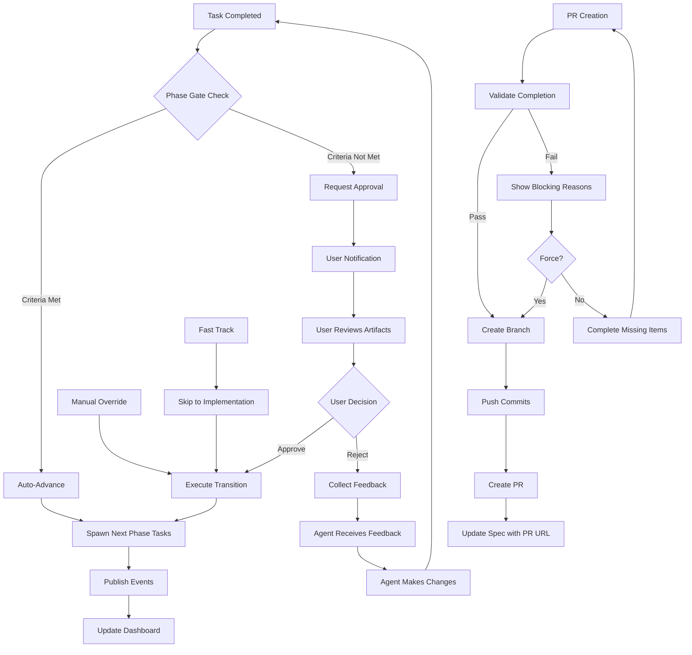

# 4 Approvals Completion

**Part of**: [User Journey Documentation](./README.md)

---

### Phase 4: Approval Gates & Phase Transitions

The approval and completion phase represents the critical human-in-the-loop checkpoints where users review AI-generated work before it progresses. This phase ensures quality control while maintaining the autonomous momentum of the system.

#### 4.1 Phase Gate Approvals

The phase gate system creates structured approval points where the system pauses execution and requests human validation before continuing. This balances autonomous execution with human oversight.

```
Agent completes all tasks in PHASE_IMPLEMENTATION:
   ↓
1. System checks done_definitions:
   - Component code files created ✓
   - Minimum 3 test cases passing ✓
   - Phase 3 validation task created ✓
   ↓
2. System validates expected_outputs:
   - Files match patterns ✓
   - Tests pass ✓
   ↓
3. System requests user approval for phase transition
   ↓
4. Notification appears:
   - In-app notification
   - Email (if configured)
   - Dashboard shows approval pending badge
   ↓
5. User reviews:
   - Code changes (commit diff viewer)
   - Test results
   - Agent reasoning summaries
   ↓
6. User approves or rejects:
   - Approve → Ticket moves to PHASE_INTEGRATION
   - Reject → Ticket regresses, agent receives feedback
   ↓
7. Workflow continues autonomously
```

**Approval Points:**
- Phase transitions (INITIAL → IMPLEMENTATION → INTEGRATION → REFACTORING)
- PR reviews (before merge)
- Budget threshold exceeded
- High-risk changes

#### 4.2 Complete Approval Workflow

The approval workflow is orchestrated through the `PhaseManager` service, which validates transitions against configured gate criteria before allowing progression.

**Phase Configuration & Gate Criteria:**

Each phase has defined gate criteria that must be satisfied before transition:

| Phase | Required Artifacts | Min Test Coverage | Custom Validators |
|-------|-------------------|-------------------|-------------------|
| PHASE_REQUIREMENTS | requirements_document | - | all_tasks_completed |
| PHASE_DESIGN | design_document | - | all_tasks_completed |
| PHASE_IMPLEMENTATION | code_changes | 80.0% | all_tasks_completed |
| PHASE_TESTING | test_results | - | all_tests_passing |
| PHASE_DEPLOYMENT | deployment_evidence | - | all_tasks_completed |

**Transition Validation Process:**

1. **Pre-Transition Checks** (`can_transition` method):
   - Verify ticket exists and is not blocked
   - Validate target phase exists
   - Check if transition is in allowed_transitions list
   - Execute phase gate validation via `PhaseGateService`

2. **Gate Criteria Validation**:
   - Check for required artifacts (documents, code changes, test results)
   - Verify all phase tasks are completed
   - Validate minimum test coverage thresholds
   - Run custom validators (e.g., `all_tests_passing`)

3. **Blocking Reasons Collection**:
   - If validation fails, collect all blocking reasons
   - Return detailed feedback to user about what's missing
   - Trigger gate failure callbacks for monitoring

**Example Transition Result:**

```python
TransitionResult(
    success=True,
    from_phase="PHASE_IMPLEMENTATION",
    to_phase="PHASE_TESTING",
    from_status="BUILDING",
    to_status="TESTING",
    reason="Automatic advancement: phase gate criteria met",
    artifacts_collected=5,
    tasks_spawned=2,
)
```

#### 4.3 Phase Transition UX

The frontend provides a seamless approval experience through React Query mutations that interface with the phase management API.

**Approval Hooks (from useSpecs.ts):**

```typescript
// Approve requirements phase
const approveRequirements = useApproveRequirements(specId);
await approveRequirements.mutateAsync();

// Approve design phase
const approveDesign = useApproveDesign(specId);
await approveDesign.mutateAsync();
```

**UI Flow for Phase Approval:**

1. **Pending Approval Indicator**:
   - Dashboard shows "Approval Pending" badge on spec card
   - In-app notification appears with phase completion summary
   - Email notification sent (if user has email notifications enabled)

2. **Review Interface**:
   - Spec workspace displays completed phase artifacts
   - Requirements tab shows generated requirements document
   - Design tab shows architecture diagrams and technical specifications
   - Tasks tab shows completed task list with test results

3. **Approval Action**:
   - "Approve & Continue" button activates next phase
   - "Request Changes" button opens feedback dialog
   - "View Details" expands artifact inspection panel

4. **Post-Approval Updates**:
   - Query client invalidates spec detail cache
   - Dashboard refreshes to show new phase status
   - Event bus publishes `ticket.phase_transitioned` event
   - New phase tasks are automatically spawned

**Error Handling in Approval Flow:**

```typescript
// On approval failure
onError: (error) => {
  toast.error(`Approval failed: ${error.message}`);
  // Show blocking reasons in modal
  showBlockingReasonsModal(error.blocking_reasons);
}
```

#### 4.4 Completion Triggers

The system provides multiple mechanisms for triggering phase completion and advancement.

**Automatic Advancement (`check_and_advance`):**

The `PhaseManager` continuously monitors phase completion criteria and can automatically advance tickets when gates are satisfied:

```python
# Called after task completion
result = phase_manager.check_and_advance(ticket_id)

# Checks:
# 1. Ticket not blocked or in terminal phase
# 2. Next phase exists in progression
# 3. Gate criteria met (artifacts, tests, coverage)
# 4. Executes transition with "phase-manager-auto-advance" initiator
```

**Task Completion Triggers:**

Specific task types trigger automatic phase transitions:

| Task Type | Completion Action |
|-----------|-------------------|
| implement_feature | Moves ticket directly to PHASE_DONE |
| fix_bug | Triggers check_and_advance |
| write_tests | Triggers check_and_advance |
| deploy | Triggers check_and_advance |

**Fast-Track to Implementation:**

For tickets ready to skip requirements/design phases:

```python
result = phase_manager.fast_track_to_implementation(ticket_id)
# Skips PHASE_REQUIREMENTS and PHASE_DESIGN
# Forces transition to PHASE_IMPLEMENTATION
# Spawns implementation tasks immediately
```

**Manual Completion (`move_to_done`):**

For administrative or edge-case completion:

```python
result = phase_manager.move_to_done(
    ticket_id,
    initiated_by="admin",
    reason="Emergency fix deployed"
)
# Forces transition to PHASE_DONE
# Skips all gate validation
# No tasks spawned
```

#### 4.5 PR Creation Flow

When implementation is complete, the system automates PR creation through the GitHub integration.

**PR Creation Hook (from useSpecs.ts):**

```typescript
const createPR = useCreateSpecPR(specId);
const result = await createPR.mutateAsync({ force: false });
// Returns: { pr_url, pr_number, branch_name, message }
```

**PR Creation Workflow:**

1. **Pre-Validation**:
   - Verify all implementation tasks completed
   - Check test coverage meets threshold (80%)
   - Validate no uncommitted changes in sandbox

2. **Branch Management**:
   - Create feature branch from main: `feature/spec-{spec_id}`
   - Commit all changes with conventional commit format
   - Push branch to origin

3. **PR Generation**:
   - Generate PR title from spec title
   - Create description with:
     - Implementation summary
     - Test coverage report
     - Files changed list
     - Link to spec workspace

4. **Post-Creation**:
   - Update spec with `pr_url` and `pr_number`
   - Invalidate spec detail cache
   - Trigger PR webhook for notifications

**Force PR Creation:**

For cases where some tasks aren't complete but PR is needed:

```typescript
const result = await createPR.mutateAsync({ force: true });
// Bypasses task completion checks
// Creates PR with warning note about incomplete tasks
```

#### 4.6 Notification Patterns

The notification system keeps users informed of approval requirements and completion events across multiple channels.

**Notification Types:**

| Event | In-App | Email | WebSocket | Badge |
|-------|--------|-------|-------------|-------|
| Phase Complete | ✓ | ✓ | ✓ | ✓ |
| Approval Required | ✓ | ✓ | ✓ | ✓ |
| PR Created | ✓ | ✓ | ✓ | - |
| PR Merged | ✓ | ✓ | ✓ | ✓ |
| Gate Failed | ✓ | - | ✓ | - |
| Task Failed | ✓ | ✓ | ✓ | - |

**In-App Notification Structure:**

```typescript
interface PhaseCompletionNotification {
  type: "phase_completion";
  spec_id: string;
  phase: string;
  artifacts_collected: number;
  actions: [
    { label: "Review & Approve", url: "/specs/{id}" },
    { label: "View Changes", url: "/specs/{id}/diff" }
  ];
}
```

**Email Notification Template:**

```
Subject: [OmoiOS] Phase Complete: {spec_title} - {phase_name}

Your spec has completed the {phase_name} phase.

Artifacts Generated:
- {artifact_list}

Next Steps:
1. Review the generated artifacts
2. Approve to continue to {next_phase}
3. Or request changes with feedback

[Review Spec] [Approve] [Request Changes]
```

**WebSocket Event Publishing:**

```python
event_bus.publish(SystemEvent(
    event_type="ticket.phase_transitioned",
    entity_type="ticket",
    entity_id=ticket_id,
    payload={
        "from_phase": from_phase,
        "to_phase": to_phase,
        "initiated_by": initiated_by,
        "artifacts_collected": artifacts_collected,
    }
))
```

#### 4.7 Error Recovery

The approval system includes robust error handling and recovery mechanisms for failed transitions and gate validations.

**Gate Failure Recovery:**

When gate criteria are not met:

1. **Collect Blocking Reasons**:
   ```python
   can, reasons = phase_manager.can_transition(ticket_id, next_phase)
   # reasons = [
   #   "Phase gate requirements not met. Missing: ['test_results']",
   #   "Not all phase tasks are completed"
   # ]
   ```

2. **Execute Gate Failure Callbacks**:
   ```python
   for callback in self._on_gate_failure_callbacks:
       callback(self, ticket_id, current_phase, next_phase)
   # Triggers notifications, logging, monitoring alerts
   ```

3. **User Recovery Options**:
   - View detailed blocking reasons in UI
   - Navigate to incomplete tasks
   - Request manual override (admin only)
   - Add missing artifacts manually

**Transition Rollback:**

If a transition fails mid-process:

1. Database transaction rolls back phase/status changes
2. Phase history entry is not created
3. Event is not published to event bus
4. Tasks are not spawned for new phase
5. User sees error with retry option

**Blocked Ticket Recovery:**

For tickets in PHASE_BLOCKED:

```python
# Transition to any allowed phase unblocks the ticket
if to_phase in blocked_config.allowed_transitions:
    ticket.is_blocked = False
    ticket.blocked_reason = None
    ticket.blocked_at = None
```

**Common Recovery Scenarios:**

| Issue | Cause | Recovery Action |
|-------|-------|-----------------|
| Missing artifacts | Tasks didn't generate expected output | Re-run tasks or manually upload artifacts |
| Low test coverage | Implementation tasks skipped tests | Spawn additional `write_tests` tasks |
| Gate timeout | PhaseGateService unavailable | Retry transition, check service health |
| Invalid transition | Workflow misconfiguration | Check phase config, use force transition |

#### 4.8 Completion Summary & Export

When all phases are complete and PRs are merged, the system provides a comprehensive completion summary.

```
All tasks completed and PRs merged:
   ↓
1. System shows Completion Summary checklist:
   ✅ All requirements met
   ✅ All tests passing (50/50)
   ✅ All PRs merged
   ✅ Code deployed to staging (if configured)
   ✅ Documentation updated
   ↓
2. User reviews completion summary
   ↓
3. User clicks "Mark as Complete"
   ↓
4. Spec status changes to "Completed"
   ↓
5. Spec moves to "Completed" section in dashboard
   ↓
6. User can export spec:
   - Click "Export Spec" button
   - Select format: Markdown | YAML | PDF
   - Download file with complete spec (Requirements + Design + Tasks + Execution history)
   ↓
7. Toast notification: "Spec completed and exported ✓"
```

**Completion Summary Checklist:**
- All requirements met (verified against EARS requirements)
- All tests passing (with coverage percentage)
- All PRs merged (with commit SHAs)
- Code deployed (if deployment configured)
- Documentation updated (if documentation tasks exist)
- All agent learnings saved to memory system

**Export Hook (from useSpecs.ts):**

```typescript
const exportSpec = useExportSpec();
const result = await exportSpec.mutateAsync({
  specId: "spec_123",
  format: "markdown" // or "yaml", "json"
});
// Triggers file download with complete spec data
```

**Export Options:**
- **Markdown**: Complete spec in markdown format with frontmatter
- **YAML**: Structured YAML export for version control
- **JSON**: Machine-readable format for integrations

#### 4.9 Approval Workflow Mermaid Diagram



---

**Next**: See [README.md](./README.md) for complete documentation index.
