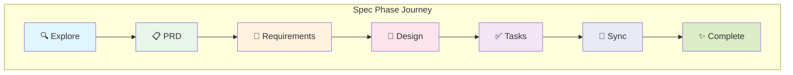

# 7 Phase System

**Part of**: [User Journey Documentation](./README.md)

---

## Overview

The OmoiOS Phase System is the backbone of spec-driven development, guiding features through a structured workflow from initial exploration to completed implementation. From the user's perspective, phases represent checkpoints where AI-generated artifacts are reviewed, approved, or refined before execution continues.



---

## Phase-by-Phase User Experience

### Phase 1: Explore

**What the User Sees:**
- System analyzes connected codebase structure
- AI identifies relevant files, patterns, and dependencies
- Context gathering for the feature request

**User Interactions:**
```
1. User submits feature request in Command Center
2. System shows: "Exploring your codebase..."
3. Progress indicator with file analysis count
4. Completion notification: "Exploration complete - found 12 relevant files"
```

**UI Components:**
- **PhaseProgress** component shows "Explore" as active (blue pulsing)
- **EventTimeline** displays files being analyzed
- **Loading state** with codebase exploration metrics

**API Calls:**
```typescript
// Triggered automatically on spec creation
POST /api/v1/specs/:specId/explore
GET /api/v1/specs/:specId/events?event_type=FILE_ANALYZED
```

**Success State:**
- Phase indicator turns green
- "Explore" section populated with codebase context
- Auto-advances to PRD phase

**Failure/Recovery:**
- If exploration fails: Toast notification with retry option
- User can manually trigger re-exploration from spec settings
- Error details in Event Timeline

---

### Phase 2: PRD (Product Requirements Document)

**What the User Sees:**
- AI-generated product requirements document
- Feature overview, user stories, and success criteria
- Structured format for stakeholder communication

**User Interactions:**
```
1. Notification: "PRD generated"
2. User clicks "Requirements" tab in Spec Workspace
3. Views structured PRD with sections:
   - Feature Overview
   - User Stories
   - Acceptance Criteria
   - Success Metrics
4. Can edit inline or request regeneration
```

**UI Components:**
- **Markdown renderer** for PRD content
- **Edit buttons** for each section
- **Approval button**: "Approve PRD → Continue to Requirements"
- **Collapsible sections** for long documents

**API Calls:**
```typescript
// Get spec with PRD content
GET /api/v1/specs/:specId

// Update PRD section
PATCH /api/v1/specs/:specId/prd

// Approve PRD phase
POST /api/v1/specs/:specId/approve-prd
```

**Success State:**
- PRD content visible in Requirements tab
- "Approve PRD" button enabled
- Upon approval: Auto-advances to Requirements phase

**User Decision Points:**
| Option | Action | Next State |
|--------|--------|------------|
| Approve PRD | Click "Approve PRD" | → Requirements phase |
| Request Changes | Click "Request Changes", add feedback | AI regenerates PRD |
| Edit Manually | Inline edit, save | Updated PRD, still in PRD phase |

---

### Phase 3: Requirements

**What the User Sees:**
- EARS-format requirements (Easy Approach to Requirements Syntax)
- Structured requirements with WHEN/THE SYSTEM SHALL patterns
- Acceptance criteria for each requirement
- Requirement IDs (REQ-001, REQ-002, etc.)

**User Interactions:**
```
1. Views EARS requirements in structured blocks:
   
   REQ-001: User Authentication
   ┌─────────────────────────────────────┐
   │ WHEN: User submits login form       │
   │ THE SYSTEM SHALL:                   │
   │ Validate credentials and create     │
   │ session                             │
   └─────────────────────────────────────┘
   
   Acceptance Criteria:
   ✓ Valid credentials accepted
   ✓ Invalid credentials rejected
   ✓ Session expires after 24 hours

2. Can add, edit, delete requirements
3. Can add acceptance criteria to any requirement
4. Reviews all requirements for completeness
5. Clicks "Approve Requirements" to continue
```

**UI Components:**
- **Collapsible requirement cards** (from `frontend/components/spec/`)
- **EARS format display** with WHEN/THEN styling
- **Acceptance criteria checklist** with checkboxes
- **Add/Edit/Delete buttons** for each requirement
- **Approval action bar** at bottom of tab

**API Calls:**
```typescript
// From useSpecs hook
const { data: spec } = useSpec(specId)
const approveReqMutation = useApproveRequirements(specId)
const addRequirementMutation = useAddRequirement(specId)

// API endpoints
GET /api/v1/specs/:specId/requirements
POST /api/v1/specs/:specId/requirements
PATCH /api/v1/specs/:specId/requirements/:reqId
DELETE /api/v1/specs/:specId/requirements/:reqId
POST /api/v1/specs/:specId/approve-requirements
```

**Success State:**
- All requirements defined with acceptance criteria
- "Approve Requirements" button clicked
- Toast: "Requirements approved ✓"
- Auto-advances to Design phase

**Error States:**
- Missing acceptance criteria: Warning badge on requirement
- Empty requirements list: "Add at least one requirement" message
- API failure: Toast error with retry option

---

### Phase 4: Design

**What the User Sees:**
- Architecture diagrams (Mermaid/ASCII)
- Data models and schemas
- API specifications
- Sequence diagrams showing component interactions
- Error handling strategies

**User Interactions:**
```
1. Clicks "Design" tab in Spec Workspace
2. Views architecture components:
   
   Authentication Service
   ├─ OAuth2 Handler
   ├─ JWT Generator
   └─ Token Validator
   
3. Views data model examples:
   ```typescript
   interface User {
     id: string;
     email: string;
     passwordHash: string;
     createdAt: Date;
   }
   ```
   
4. Views sequence diagram for login flow
5. Reviews error handling section
6. Clicks "Approve Design" to continue
```

**UI Components:**
- **Architecture diagram viewer** (Mermaid rendering)
- **Code block display** for data models
- **Sequence diagram visualization**
- **Tabbed interface** for different design aspects
- **Edit and approval buttons**

**API Calls:**
```typescript
// From useSpecs hook
const approveDesignMutation = useApproveDesign(specId)
const updateDesignMutation = useUpdateDesign(specId)

// API endpoints
GET /api/v1/specs/:specId/design
PATCH /api/v1/specs/:specId/design
POST /api/v1/specs/:specId/approve-design
```

**Success State:**
- Design artifacts visible in Design tab
- Architecture, data models, and diagrams populated
- "Approve Design" button clicked
- Toast: "Design approved ✓"
- Auto-advances to Tasks phase

**User Decision Points:**
| Option | Action | Next State |
|--------|--------|------------|
| Approve Design | Click "Approve Design" | → Tasks phase |
| Edit Design | Click "Edit", modify content | Updated design |
| Request Changes | Add feedback comment | AI regenerates design |

---

### Phase 5: Tasks

**What the User Sees:**
- Discrete implementation tasks with dependencies
- Task breakdown from design artifacts
- Estimated effort and priority for each task
- Dependency graph visualization

**User Interactions:**
```
1. Clicks "Tasks" tab in Spec Workspace
2. Views task list:
   
   Task 1: Create User model [High Priority]
   └─ Depends on: None
   
   Task 2: Implement password hashing [High Priority]
   └─ Depends on: Task 1
   
   Task 3: Create login endpoint [Medium Priority]
   └─ Depends on: Task 2
   
3. Can edit task descriptions and priorities
4. Can adjust task dependencies
5. Can add new tasks manually
6. Reviews complete task breakdown
7. Clicks "Approve Plan" to start execution
```

**UI Components:**
- **Task list** with priority badges
- **Dependency visualization** (React Flow graph)
- **Edit dialogs** for task details
- **Add task button** with form modal
- **Approval action bar** with "Approve Plan" button

**API Calls:**
```typescript
// From useSpecs hook
const { data: spec } = useSpec(specId)
const addTaskMutation = useAddTask(specId)
const updateTaskMutation = useUpdateTask(specId)
const deleteTaskMutation = useDeleteTask(specId)
const executeTasksMutation = useExecuteSpecTasks(specId)

// API endpoints
GET /api/v1/specs/:specId/tasks
POST /api/v1/specs/:specId/tasks
PATCH /api/v1/specs/:specId/tasks/:taskId
DELETE /api/v1/specs/:specId/tasks/:taskId
POST /api/v1/specs/:specId/execute-tasks
```

**Success State:**
- Task list populated with dependencies
- "Approve Plan" button clicked
- Execution begins automatically
- Redirect to Execution tab or board view
- Toast: "Plan approved. Execution starting..."

---

### Phase 6: Sync

**What the User Sees:**
- Task execution progress
- Sandbox creation and agent assignment
- Real-time updates as tasks complete
- Branch and PR creation status

**User Interactions:**
```
1. System automatically transitions to Sync phase
2. Views Execution tab showing:
   - Overall progress percentage
   - Active sandboxes and agents
   - Completed vs pending tasks
   - Live event stream
   
3. Can click into individual sandboxes
4. Can pause/resume execution
5. Receives notification when PR is ready
```

**UI Components:**
- **Progress bar** with percentage
- **EventTimeline** with real-time updates
- **Sandbox status cards**
- **Task completion indicators**
- **Branch/PR creation status**

**API Calls:**
```typescript
// From useSpecs hook
const { data: executionStatus } = useExecutionStatus(specId, {
  refetchInterval: 1500 // Poll every 1.5s during execution
})
const { data: events } = useSpecEvents(specId, {
  refetchInterval: 2000
})

// API endpoints
GET /api/v1/specs/:specId/execution-status
GET /api/v1/specs/:specId/events
POST /api/v1/specs/:specId/create-branch
POST /api/v1/specs/:specId/create-pr
```

**Success State:**
- All tasks completed
- Branch created with changes
- PR opened with full description
- Spec status: "completed"
- Notification: "PR ready for review"

**Failure States:**
- Task failure: Shown in event timeline with error details
- Sandbox error: Health dashboard alert
- User can retry failed tasks or adjust requirements

---

### Phase 7: Complete

**What the User Sees:**
- Success celebration modal
- Summary of what was accomplished
- Link to created PR
- Option to share success or create next spec

**User Interactions:**
```
1. Views completion modal:
   "🎉 Spec Complete!"
   
   ✓ 12 tasks completed
   ✓ 3 sandboxes used
   ✓ 1 PR created
   
   [View PR] [Create Next Feature] [Share]
   
2. Clicks "View PR" to review in GitHub
3. Or clicks "Create Next Feature" to start new spec
4. Or clicks "Share" for viral loop
```

**UI Components:**
- **SpecCompletionModal** with celebration animation
- **Success metrics** display
- **Action buttons** for next steps
- **Share buttons** for social/viral loop

---

## Phase Transitions and Approval Flows

### Automatic vs Manual Transitions

| Phase | Entry | Exit | User Action Required |
|-------|-------|------|---------------------|
| Explore | Auto on spec create | Auto on completion | No |
| PRD | Auto after Explore | Manual approval | Yes - Approve PRD |
| Requirements | Auto after PRD | Manual approval | Yes - Approve Requirements |
| Design | Auto after Requirements | Manual approval | Yes - Approve Design |
| Tasks | Auto after Design | Manual approval | Yes - Approve Plan |
| Sync | Auto after Tasks approval | Auto on completion | No |
| Complete | Auto after Sync | Terminal phase | No |

### Approval Gate Configuration

Users can configure approval requirements per project:

```typescript
// From backend/omoi_os/services/phase_manager.py
interface PhaseGateConfig {
  require_requirements_approval: boolean  // Default: true
  require_design_approval: boolean       // Default: true
  require_task_approval: boolean        // Default: false
  auto_advance_on_gate_pass: boolean     // Default: true
}
```

**Configuration UI:**
- Located in Project Settings → Phases tab
- Toggle switches for each approval gate
- Save applies to all future specs in project

---

## Success and Failure States

### Phase Success Indicators

| Phase | Success Indicator | UI Feedback |
|-------|-------------------|-------------|
| Explore | Files analyzed | Green checkmark, file count |
| PRD | Document generated | Content visible, approve button enabled |
| Requirements | EARS format complete | All requirements have criteria |
| Design | Artifacts created | Diagrams and models visible |
| Tasks | Tasks with dependencies | Task list with dependency graph |
| Sync | All tasks completed | 100% progress, PR created |
| Complete | PR merged | Celebration modal |

### Phase Failure Recovery

| Failure Type | User Notification | Recovery Action |
|--------------|-------------------|-----------------|
| Exploration failed | Toast: "Exploration failed" | Retry button, manual file selection |
| PRD generation failed | Toast: "Failed to generate PRD" | Regenerate with feedback |
| Requirements incomplete | Warning badge | Add missing criteria |
| Design validation failed | Inline error | Edit and resubmit |
| Task execution failed | Event timeline error | Retry task, adjust requirements |
| Sandbox error | Health dashboard alert | Restart sandbox, escalate to support |

---

## Tips and Best Practices for Users

### For Efficient Phase Navigation

1. **Use keyboard shortcuts**:
   - `Cmd+1` → Requirements tab
   - `Cmd+2` → Design tab
   - `Cmd+3` → Tasks tab
   - `Cmd+4` → Execution tab

2. **Enable auto-advance** in project settings to skip manual approvals for trusted specs

3. **Review on mobile**: Use the mobile-responsive spec viewer for quick approvals on the go

4. **Set up notifications**: Enable Slack/email alerts for phase completions requiring approval

### For High-Quality AI Output

1. **Be specific in initial prompt**: "Add user authentication" → "Add JWT-based authentication with refresh tokens"

2. **Review and refine at each phase**: Catching issues early prevents rework

3. **Add acceptance criteria**: The more specific, the better AI implementation

4. **Use the feedback loop**: "Request Changes" with specific feedback improves AI learning

### For Team Coordination

1. **Assign phase reviewers**: Different team members can own different phases

2. **Use phase gates as checkpoints**: Sprint planning around phase completions

3. **Track phase metrics**: Identify bottlenecks (e.g., always waiting on design approval)

4. **Customize phases per project**: Research projects may need different phases than feature work

---

## Cross-References

### Related User Journey Docs
- [01_onboarding.md](./01_onboarding.md) - First-time phase experience
- [02_feature_planning.md](./02_feature_planning.md) - Creating specs and navigating phases
- [04_approvals_completion.md](./04_approvals_completion.md) - Detailed approval workflows

### Related Page Flows
- **Page Flows: Spec Workspace** - UI details for phase navigation
- **Page Flows: Phase Gates** - Approval gate interface

### Related Architecture
- [Phase Manager Service](../architecture/01-planning-system.md) - Backend phase orchestration
- [Spec State Machine](../design/services/phase_manager.md) - Technical phase implementation

---

**Next**: See [README.md](./README.md) for complete documentation index.
