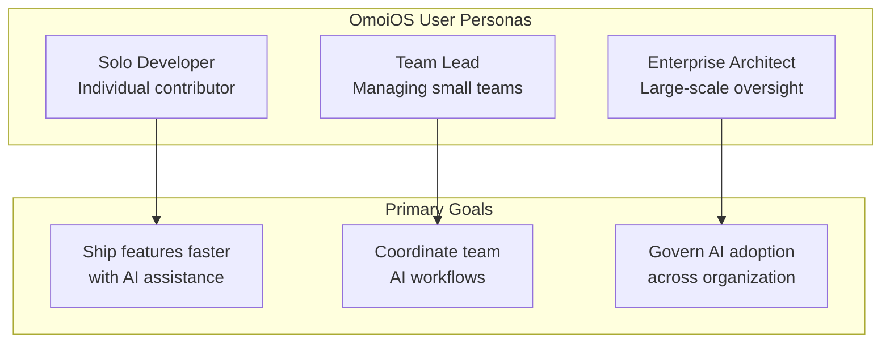

```mermaid
flowchart LR
    A[Team struggling with<br/>delivery deadlines] --> B[Evaluates OmoiOS<br/>for team]
    B --> C[Creates organization<br/>with team members]
    C --> D[Sets up first project<br/>with GitHub integration]
    D --> E[Creates spec for<br/>complex feature]
    E --> F[Reviews AI-generated<br/>design with team]
    F --> G[Assigns sub-tasks to<br/>AI and human developers]
    G --> H[Monitors progress via<br/>Kanban and health dashboards]
    H --> I[Reviews and merges<br/>AI-generated PRs]
    I --> J[Team ships 2x faster<br/>with same headcount]
```

```mermaid
flowchart LR
    A[Evaluating AI<br/>transformation strategy] --> B[Pilots OmoiOS with<br/>one team]
    B --> C[Measures results:<br/>velocity, quality, cost]
    C --> D[Expands to multiple<br/>teams and projects]
    D --> E[Configures enterprise<br/>security and compliance]
    E --> F[Sets up organization<br/>structure and RBAC]
    F --> G[Trains team leads<br/>on best practices]
    G --> H[Monitors org-wide<br/>metrics and health]
    H --> I[Reports AI transformation<br/>success to leadership]
```

# 8 User Personas

**Part of**: [User Journey Documentation](./README.md)

---

## Overview

OmoiOS serves three primary user personas, each with distinct goals, pain points, and interaction patterns. Understanding these personas is essential for designing features that meet user needs and for prioritizing development efforts.



---

## Persona 1: Solo Developer

### Profile

| Attribute | Description |
|-----------|-------------|
| **Role** | Individual contributor, indie hacker, freelancer |
| **Team Size** | 1-2 people |
| **Technical Skill** | High - full-stack capable |
| **Primary Motivation** | Ship features faster without hiring |
| **Time Constraints** | Limited - wearing multiple hats |

### Goals

1. **Accelerate Development**: Turn ideas into working code overnight
2. **Reduce Context Switching**: Stay in flow state without interruptions
3. **Learn Best Practices**: See how AI agents structure code and solve problems
4. **Maintain Control**: Review and approve all changes before they land

### Pain Points

| Pain Point | Current Workaround | OmoiOS Solution |
|------------|-------------------|-----------------|
| "I spend hours on boilerplate code" | Copy-paste from previous projects | AI generates project-specific code |
| "I forget edge cases" | Manual testing, user bug reports | AI discovers and handles edge cases |
| "Context switching kills productivity" | Long coding sessions at night | Queue work, review results in morning |
| "I can't afford to hire developers" | Do everything myself | AI agents handle implementation |

### Typical Journey Flow

```mermaid
flowchart LR
    A[Discover OmoiOS] --> B[Sign up with GitHub]
    B --> C[Connect first repository]
    C --> D[Create first spec:<br/>"Add user authentication"]
    D --> E[Review AI-generated<br/>requirements & design]
    E --> F[Approve and start execution]
    F --> G[Wake up to PR ready<br/>for review]
    G --> H[Merge and deploy]
    H --> I[Share success story]
```

### Feature Usage Patterns

**High Usage:**
- **Command Center** (`/command`) - Primary entry point for new features
- **Spec Workspace** (`/projects/:id/specs/:specId`) - Reviewing AI-generated plans
- **Sandbox Monitoring** (`/sandbox/:id`) - Watching agents work in real-time
- **GitHub Integration** - Auto-created PRs with full context

**Medium Usage:**
- **Kanban Board** (`/board/:projectId`) - Tracking multiple specs
- **Settings** - Configuring personal preferences and API keys

**Low Usage:**
- **Organization Management** - Usually solo, no team to manage
- **Advanced Monitoring** - Trusts the system, checks results not process

### Onboarding Flow

```
1. Lands on marketing page → "Start a feature before bed"
2. Clicks "Get Started" → GitHub OAuth (low friction)
3. Auto-creates first project from connected repo
4. Sees Command Center with sample prompt suggestions
5. Types first feature request → "Add dark mode toggle"
6. System generates spec in ~30 seconds
7. Reviews Requirements tab → sees EARS format
8. Approves → watches execution in real-time
9. Receives notification: "PR ready for review"
10. First success within 15 minutes of signup
```

### Success Metrics for Solo Developers

| Metric | Target | Why It Matters |
|--------|--------|----------------|
| Time to first PR | < 30 minutes | Demonstrates immediate value |
| Features shipped/week | 3-5x increase | Core value proposition |
| Manual coding time | 50% reduction | Time saved for other tasks |
| Return rate | > 80% weekly | Habit formation |

---

## Persona 2: Team Lead

### Profile

| Attribute | Description |
|-----------|-------------|
| **Role** | Engineering lead, senior IC with management duties |
| **Team Size** | 3-10 developers |
| **Technical Skill** | High - reviews code, architects systems |
| **Primary Motivation** | Multiply team output without adding headcount |
| **Time Constraints** | Split between coding, reviewing, and managing |

### Goals

1. **Scale Team Output**: 2x productivity without 2x headcount
2. **Maintain Quality**: Ensure AI-generated code meets team standards
3. **Coordinate Work**: Manage multiple AI and human workstreams
4. **Track Progress**: Visibility into what's being built and when

### Pain Points

| Pain Point | Current Workaround | OmoiOS Solution |
|------------|-------------------|-----------------|
| "Code review backlog is overwhelming" | Review in batches, miss details | AI pre-validates against acceptance criteria |
| "Junior devs need constant guidance" | Pair programming, detailed PR comments | AI provides implementation examples |
| "Estimates are always wrong" | Pad estimates, disappoint stakeholders | AI breaks work into discrete, trackable tasks |
| "Context gets lost in handoffs" | Documentation, meetings | Full spec context travels with each task |

### Typical Journey Flow



### Feature Usage Patterns

**High Usage:**
- **Organization Dashboard** (`/organizations/:id`) - Managing team access and resources
- **Kanban Board** (`/board/:projectId`) - Coordinating human and AI work
- **Spec Workspace** - Detailed review of AI-generated requirements and designs
- **Health Dashboard** (`/health`) - Monitoring agent performance and interventions
- **Phase Gates** (`/phases/gates`) - Controlling workflow progression

**Medium Usage:**
- **Command Center** - Occasionally creating quick specs
- **Settings** - Configuring team-wide preferences and approval gates
- **Activity Timeline** - Tracking team and AI activity

**Low Usage:**
- **Sandbox Detail** - Delegates real-time monitoring to ICs
- **Billing Management** - Usually handled by manager/CTO

### Onboarding Flow

```
1. Discovers OmoiOS through engineering blog or peer referral
2. Signs up and creates organization (not just personal account)
3. Invites 2-3 team members with appropriate roles
4. Connects team's primary GitHub repository
5. Creates first "team spec" - a feature everyone knows is complex
6. Reviews AI-generated requirements with team in meeting
7. Team provides feedback, AI refines requirements
8. Approves design phase → AI generates implementation tasks
9. Assigns some tasks to AI, some to human developers
10. Uses Kanban board to track combined progress
11. First team success: AI and human developers collaborate on feature
12. Expands to more projects and team members
```

### Approval Gate Configuration

Team Leads typically configure approval gates at these points:

| Gate | Default Setting | Rationale |
|------|-----------------|-----------|
| Requirements Approval | Required | Ensure AI understands the problem |
| Design Approval | Required | Validate technical approach |
| Task Breakdown | Optional | Trust AI task generation |
| Pre-execution | Required | Final check before AI runs |
| PR Merge | Required | Human review of all code |

### Success Metrics for Team Leads

| Metric | Target | Why It Matters |
|--------|--------|----------------|
| Team velocity increase | 50-100% | Core ROI justification |
| Code review time | -30% | AI generates cleaner code |
| Sprint completion rate | 90%+ | Predictable delivery |
| Team satisfaction | > 4.0/5 | Adoption and retention |

---

## Persona 3: Enterprise Architect

### Profile

| Attribute | Description |
|-----------|-------------|
| **Role** | VP Engineering, CTO, Director of Engineering |
| **Team Size** | 50+ developers across multiple teams |
| **Technical Skill** | High-level architecture, strategic thinking |
| **Primary Motivation** | Transform engineering organization with AI |
| **Time Constraints** | Meetings, strategy, budget, hiring |

### Goals

1. **AI Transformation**: Roll out AI-assisted development across organization
2. **Governance**: Ensure AI-generated code meets enterprise standards
3. **Cost Optimization**: Reduce cost per feature delivered
4. **Visibility**: Real-time insights into all AI and human activity
5. **Compliance**: Audit trails, security, and regulatory requirements

### Pain Points

| Pain Point | Current Workaround | OmoiOS Solution |
|------------|-------------------|-----------------|
| "AI tools are shadow IT" | Ignore or block | Centralized, governable platform |
| "No visibility into AI usage" | Manual surveys | Real-time dashboards and reports |
| "Security/compliance concerns" | Prohibit AI use | Isolated sandboxes, audit trails |
| "Can't measure AI ROI" | Anecdotal evidence | Built-in cost tracking and metrics |
| "Teams using different tools" | Standardization mandates | Single platform for all AI dev |

### Typical Journey Flow



### Feature Usage Patterns

**High Usage:**
- **Organization Management** (`/organizations/:id`) - Multi-tenant setup, RBAC
- **Health Dashboard** (`/health`) - System-wide monitoring and Guardian interventions
- **Analytics** (`/analytics`) - Organization-wide metrics and trends
- **Settings** - Enterprise configuration: SSO, audit logging, compliance
- **API Keys** (`/settings/api-keys`) - Service account management

**Medium Usage:**
- **Phase System** (`/phases`) - Customizing workflows for different teams
- **Billing & Cost Tracking** - Budget management and chargeback
- **Activity Timeline** - High-level view of organization activity

**Low Usage:**
- **Command Center** - Delegates to team leads and ICs
- **Spec Workspace** - Reviews summaries, not details
- **Sandbox Monitoring** - Only investigates issues

### Onboarding Flow

```
1. Evaluates OmoiOS as part of AI transformation initiative
2. Requests enterprise demo with security/compliance review
3. Runs 30-day pilot with one high-performing team
4. Measures baseline metrics: velocity, quality, developer satisfaction
5. Compares pilot results against control group
6. Reviews security documentation: SOC 2, data handling, sandbox isolation
7. Negotiates enterprise contract with appropriate SLAs
8. Works with OmoiOS team on SSO/SAML integration
9. Creates organization structure: teams, projects, permission boundaries
10. Configures enterprise policies: approval gates, resource limits, audit logging
11. Trains team leads in pilot program as internal champions
12. Rolls out to additional teams in phases
13. Establishes center of excellence for AI-assisted development
14. Reports quarterly metrics to executive leadership
```

### Enterprise Configuration

Typical enterprise setup includes:

| Configuration | Setting | Purpose |
|---------------|---------|---------|
| SSO Provider | SAML 2.0 / OIDC | Centralized authentication |
| Approval Gates | All phases require approval | Governance and control |
| Resource Limits | Max 20 concurrent agents per team | Cost control |
| Audit Logging | Full event stream | Compliance and forensics |
| Sandbox Isolation | Dedicated VPC | Security boundary |
| Custom Phases | Team-specific workflows | Process alignment |

### Success Metrics for Enterprise Architects

| Metric | Target | Why It Matters |
|--------|--------|----------------|
| Developer productivity | +40% | Primary ROI driver |
| Time-to-market | -30% | Competitive advantage |
| AI adoption rate | > 70% of developers | Transformation success |
| Cost per feature | -25% | Budget efficiency |
| Security incidents | Zero | Risk mitigation |
| Developer satisfaction | > 4.2/5 | Retention and morale |

---

## Cross-Persona Feature Matrix

| Feature | Solo Dev | Team Lead | Enterprise Architect |
|---------|----------|-----------|---------------------|
| Command Center | Primary entry | Occasional use | Delegates |
| Spec Workspace | Reviews own specs | Reviews team specs | Reviews summaries |
| Kanban Board | Personal tracking | Team coordination | High-level view |
| Sandbox Monitoring | Watches frequently | Checks when alerted | Investigates issues |
| Health Dashboard | Ignores | Monitors weekly | Daily review |
| Phase Gates | Uses defaults | Configures per project | Enterprise policy |
| Organization Mgmt | N/A | Manages small team | Multi-org governance |
| Analytics | Personal stats | Team metrics | Executive reports |
| API Keys | Personal tokens | Service accounts | Enterprise integration |
| Billing | Individual plan | Team plan oversight | Enterprise contract |

---

## Persona-Specific UI Adaptations

### Solo Developer View

- **Simplified navigation**: Fewer menu items, focused on core workflow
- **Sample prompts**: Help getting started with first features
- **Progress indicators**: Clear feedback on spec execution
- **Success celebrations**: Viral loop prompts after first PR

### Team Lead View

- **Team activity feed**: What AI and humans are working on
- **Approval queue**: Pending reviews requiring attention
- **Resource utilization**: Agent usage across team
- **Health alerts**: Proactive notifications about stuck agents

### Enterprise Architect View

- **Executive dashboard**: High-level KPIs and trends
- **Organization tree**: Multi-team, multi-project structure
- **Compliance reports**: Audit trails and security metrics
- **Cost allocation**: Chargeback and budget tracking

---

## Related Documentation

- [01_onboarding.md](./01_onboarding.md) - Detailed onboarding flows for each persona
- [02_feature_planning.md](./02_feature_planning.md) - How each persona interacts with specs
- [07_phase_system.md](./07_phase_system.md) - Phase gates and approval workflows
- **Page Flows: Command Center** - Primary entry point
- **Page Flows: Spec Workspace** - Spec review interface

---

**Next**: See [README.md](./README.md) for complete documentation index.
